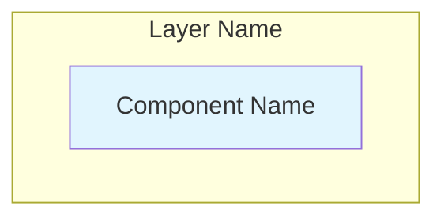

# BC-Utils Documentation Best Practices

**Version:** 1.0  
**Date:** 2025-01-08  

## 📋 Documentation Standards

### Document Structure

#### High-Level Design (HLD) Documents
HLD documents focus on **architectural decisions** and **design patterns**:

✅ **Include:**
- System architecture and component relationships  
- Design patterns and architectural principles
- Interface contracts and abstractions
- Quality attributes (performance, security, scalability)
- Cross-cutting concerns and system-wide decisions
- Mermaid diagrams for architectural visualization

❌ **Avoid:**
- Detailed code implementations
- Specific library configurations
- Unit test specifications
- Database schemas and file formats
- Implementation algorithms

#### Low-Level Design (LLD) Documents  
LLD documents contain **implementation details** and **technical specifications**:

✅ **Include:**
- Detailed code implementations and algorithms
- Specific library configurations and parameters
- Error handling implementation details
- Performance optimization techniques
- Database schemas and file formats
- Unit test specifications and mock implementations

❌ **Avoid:**
- High-level architectural decisions
- Business requirements
- Deployment topology (belongs in HLD)

### Cross-Reference Standards

#### Linking Between Document Types
- **HLD → LLD:** `*Detailed implementation available in [Component Implementation](../lld/01-component-implementation.md)*`
- **LLD → HLD:** `**Related:** [Component Architecture](../hld/02-component-architecture.md)`
- **Within same level:** `[Storage Architecture](05-storage-architecture.md)`

#### Section Anchors
Use descriptive anchors for section linking:
```markdown
[Storage Layer](05-storage-architecture.md#storage-interface-architecture)
```

#### External References
Reference PRD requirements with specific IDs:
```markdown
See [REQ-001](../../requirements/prd/product-requirements.md#req-001)
```

### Diagram Standards

#### Mermaid Diagrams
Use Mermaid for architectural diagrams:


#### Styling Conventions
- **Primary components:** `fill:#e1f5fe` (light blue)
- **Secondary components:** `fill:#e8f5e8` (light green)  
- **External systems:** `fill:#fff3e0` (light orange)
- **Error states:** `fill:#ffcdd2` (light red)

### Version Control

#### Document Headers
All documents must include:
```markdown
**Version:** 1.0  
**Date:** 2025-01-08  
**Related:** [Link to related docs]
```

#### Document Status Tracking
Maintain status tables in README files:
```markdown
| Document | Status | Last Updated | Reviewers |
|----------|--------|--------------|-----------|
| [Doc Name](doc.md) | ✅ Complete | 2025-01-08 | Role1, Role2 |
```

#### Review Schedule
Include review information at document end:
```markdown
---

**Next Review:** 2025-02-08  
**Reviewers:** Senior Developer, System Architect
```

## 🏗️ Architecture Documentation Guidelines

### Component Documentation

#### Component Responsibilities
Clearly define what each component does:
```markdown
#### Purpose
Central orchestrator that coordinates the entire data acquisition workflow.

#### Responsibilities  
- **Job Creation:** Convert configuration into download jobs
- **Provider Selection:** Choose appropriate data provider
- **Workflow Orchestration:** Manage download → validation → storage pipeline
```

#### Interface Documentation
Document interfaces with design principles:
```markdown
**Interface Design Principles:**
- **Format Agnostic:** Common interface abstracts format details
- **CRUD Operations:** Complete Create, Read, Update, Delete functionality
- **Error Handling:** Consistent error reporting across implementations
```

### Design Pattern Documentation

#### Pattern Identification
Explicitly identify design patterns used:
```markdown
**Architecture Pattern:** Strategy Pattern enables runtime provider selection

**Design Patterns:**
- **Factory Pattern:** Dynamic provider creation and configuration
- **Template Method:** Common workflow with format-specific implementations
- **Observer Pattern:** Event-driven monitoring and alerting
```

#### Pattern Rationale
Explain why patterns were chosen:
```markdown
**Pattern Benefits:**
- **Extensibility:** Add new providers without modifying existing code
- **Reliability:** Graceful fallback when providers are unavailable
- **Testability:** Mock providers for comprehensive testing
```

## 🔧 Implementation Documentation Guidelines

### Code Documentation

#### Code Examples
Provide concise, focused examples (10-30 lines max):
```python
class DataProvider(ABC):
    """Abstract base class for all data providers"""
    
    @abstractmethod
    def authenticate(self, credentials: Dict[str, str]) -> bool:
        """Provider-specific authentication"""
    
    @abstractmethod
    def get_data(self, instrument, date_range) -> pd.DataFrame:
        """Retrieve data for instrument and date range"""
```

**Code Length Guidelines:**
- **Interface definitions:** Show key methods only (5-15 lines)
- **Algorithms:** Core logic only (10-30 lines)
- **Configuration examples:** Minimal working config (5-10 lines)
- **Test patterns:** Essential structure (10-20 lines)

**Avoid in LLD:**
- Complete class implementations (use source references)
- Boilerplate code (imports, logging setup)
- Repetitive methods (show one example)
- Full error handling (show pattern only)

#### Error Handling
Document comprehensive error handling:
```python
try:
    result = self.provider.get_data(instrument, date_range)
except RateLimitError as e:
    self.logger.warning(f"Rate limited, retry in {e.retry_after}s")
    self.scheduler.schedule_retry(job, delay=e.retry_after)
except AuthenticationError:
    self.logger.error("Authentication failed, manual intervention required")
    raise
```

#### Configuration Examples
Provide realistic configuration examples:
```python
config = {
    "provider": {
        "type": "barchart",
        "daily_limit": 150,
        "timeout_seconds": 60
    },
    "storage": {
        "primary_format": "csv",
        "backup_format": "parquet"
    }
}
```

### Testing Documentation

#### Test Structure
Document testing approach:
```python
class TestDataProviderInterface(BCUtilsTestCase):
    """Test data provider interface compliance"""
    
    def test_provider_interface_compliance(self):
        """Test that all providers implement required interface"""
        # Test implementation
```

#### Mock Implementation
Provide reusable mock implementations:
```python
class MockDataProvider:
    """Mock data provider for testing"""
    
    def __init__(self, return_data: pd.DataFrame = None):
        self.return_data = return_data
        self.call_history = []
```

## 📝 Writing Style Guidelines

### Technical Writing

#### Clarity and Concision
- Use active voice: "The system processes data" not "Data is processed"
- Be specific: "150 downloads/day" not "limited downloads"
- Use parallel structure in lists and procedures

#### Terminology Consistency  
- **Provider** (not data source, API, service)
- **Storage** (not persistence, database, repository)
- **Configuration** (not settings, parameters, options)
- **Instrument** (not symbol, asset, security)

#### Section Structure
Follow consistent section patterns:
1. **Purpose/Overview** - What and why
2. **Design Principles** - How and constraints  
3. **Implementation Details** - Specific technical details
4. **Examples** - Concrete usage scenarios

### Markdown Formatting

#### Headers
Use descriptive headers with consistent numbering:
```markdown
## 1. Storage Architecture Overview
### 1.1 Design Philosophy
### 1.2 Storage Objectives
```

#### Code Blocks
Always specify language for syntax highlighting:
```markdown
```python
def example_function():
    pass
```

#### Lists
Use consistent bullet formatting:
```markdown
**Design Principles:**
- **Extensibility:** Add new providers without code changes
- **Reliability:** Graceful fallback when providers fail
- **Testability:** Mock providers for unit testing
```

#### Tables
Include headers and maintain alignment:
```markdown
| Component | Responsibility | Dependencies |
|-----------|----------------|--------------|
| **Download Manager** | Orchestrate workflow | Storage, Providers |
| **Data Providers** | External data access | HTTP, Authentication |
```

## 🔍 Review Process

### Review Checklist

#### Architecture Review
- [ ] Design patterns clearly identified and justified
- [ ] Component responsibilities well-defined
- [ ] Interface contracts documented
- [ ] Cross-cutting concerns addressed
- [ ] Quality attributes considered

#### Implementation Review  
- [ ] Code examples complete and runnable
- [ ] Error handling comprehensive
- [ ] Performance considerations documented
- [ ] Security implications addressed
- [ ] Testing approach defined

#### Documentation Review
- [ ] Structure follows best practices
- [ ] Cross-references are accurate
- [ ] Diagrams are clear and consistent
- [ ] Writing is clear and concise
- [ ] Version information updated

### Change Management

#### Document Updates
When making changes:
1. Update version and date in document header
2. Update status table in relevant README
3. Review and update cross-references
4. Notify stakeholders of significant changes

#### Breaking Changes
For architectural changes:
1. Document rationale for change
2. Update all affected documents
3. Review impact on implementation
4. Plan migration strategy if needed

---

**Document Level:** Process Documentation  
**Last Updated:** 2025-01-08  
**Reviewers:** Documentation Lead, System Architect