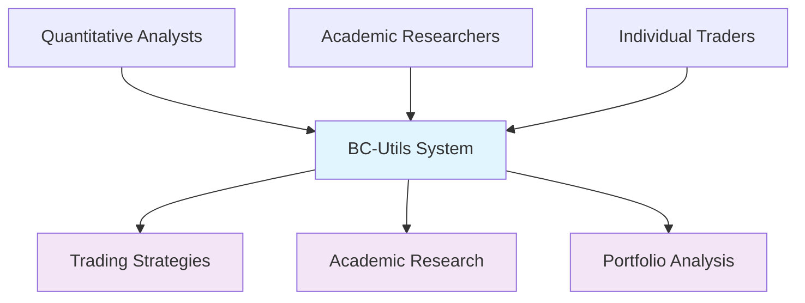
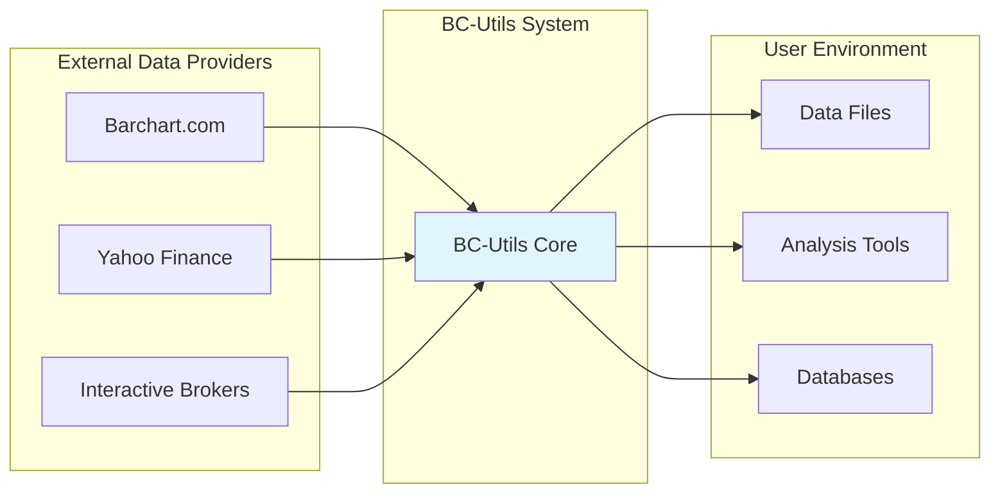
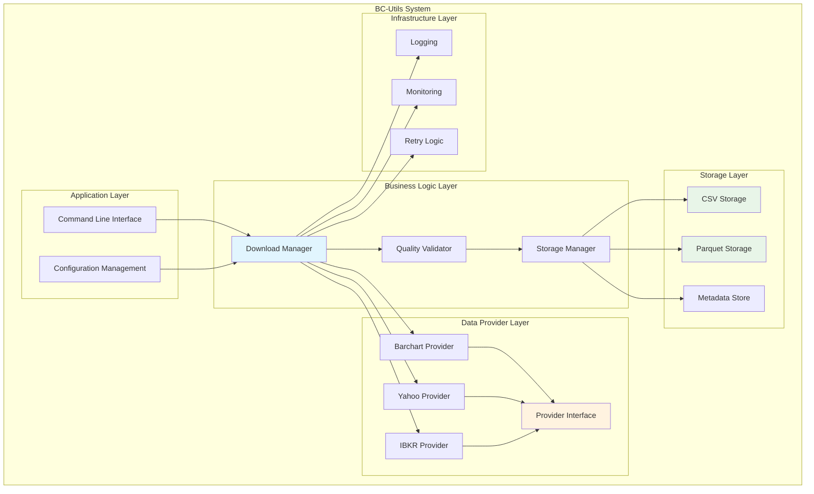
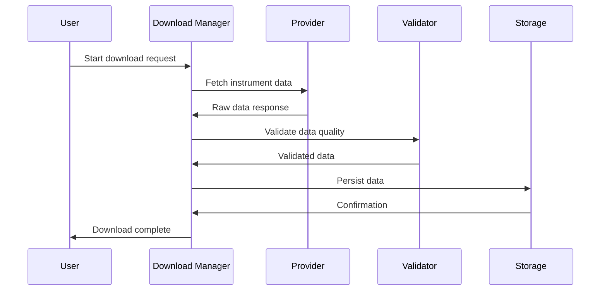
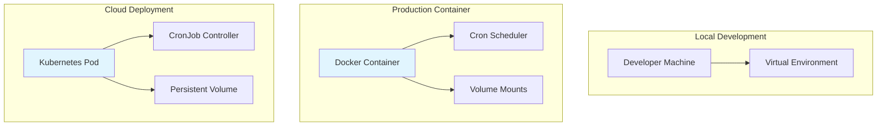
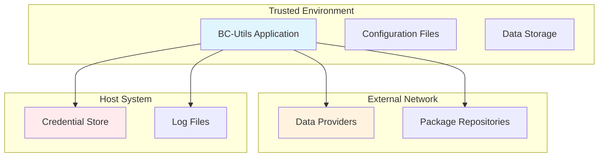

# BC-Utils System Overview

**Version:** 1.0  
**Date:** 2025-01-08  
**Status:** Active  

## 1. Executive Summary

BC-Utils is an automated financial data acquisition pipeline that transforms manual, time-intensive data collection into a reliable, scalable system. The architecture follows modern Python packaging standards with a modular, extensible design supporting multiple data providers and deployment scenarios.

### 1.1 System Purpose
- **Automate** historic financial data downloads from multiple sources
- **Standardize** data formats across different providers  
- **Ensure** data quality and completeness through validation
- **Scale** from individual research to institutional data operations

### 1.2 Key Quality Attributes
- **Reliability:** 99.5% uptime with automatic retry mechanisms
- **Extensibility:** Plugin architecture for new data providers
- **Performance:** Handle 1M+ data points per hour
- **Security:** Secure credential management and audit trails

## 2. System Context

### 2.1 Business Context

### 2.2 Technical Context

### 2.3 Stakeholders
| Stakeholder | Interest | Influence |
|-------------|----------|-----------|
| **Quantitative Analysts** | Reliable, comprehensive data | High |
| **DevOps Engineers** | Operational stability, monitoring | Medium |
| **Academic Researchers** | Cost-effective, broad coverage | Medium |
| **Security Teams** | Data protection, compliance | Medium |
| **Data Providers** | API usage compliance | Low |

## 3. High-Level Architecture

### 3.1 System Overview

### 3.2 Core Components
| Component | Responsibility | Implementation |
|-----------|----------------|----------------|
| **Download Manager** | Orchestrates data acquisition workflow | `downloaders/updating_downloader.py` |
| **Provider Interface** | Abstracts data source implementations | `data_providers/data_provider.py` |
| **Storage Manager** | Handles data persistence and retrieval | `data_storage/` modules |
| **Quality Validator** | Ensures data integrity and completeness | `instruments/price_series.py` |
| **Configuration** | Manages system and instrument settings | `initialization/` modules |

### 3.3 Data Flow Overview

## 4. Architectural Principles

### 4.1 Design Principles
1. **Separation of Concerns:** Clear boundaries between data acquisition, validation, and storage
2. **Provider Abstraction:** Uniform interface regardless of data source
3. **Fail-Safe Operation:** Graceful degradation when components fail
4. **Configuration-Driven:** Behavior controlled through configuration, not code changes
5. **Observability:** Comprehensive logging and monitoring at all levels

### 4.2 Technology Choices
| Aspect | Choice | Rationale |
|--------|--------|-----------|
| **Language** | Python 3.8+ | Ecosystem compatibility, data science tools |
| **Packaging** | src/ layout with setuptools | Modern Python standards |
| **Data Formats** | CSV + Parquet | Human-readable + performance optimized |
| **Configuration** | JSON + Environment Variables | Simple, version-controllable |
| **Deployment** | Docker containers | Consistent, isolated environments |

### 4.3 Quality Attributes Implementation
| Quality | Strategy | Implementation |
|---------|----------|----------------|
| **Reliability** | Retry logic, fallback providers | `retrying` library, exception handling |
| **Security** | Credential externalization | Environment variables, no hardcoded secrets |
| **Performance** | Efficient data structures | Pandas, NumPy for data processing |
| **Maintainability** | Modular design, comprehensive tests | Package structure, pytest framework |
| **Scalability** | Stateless operations | No shared state between downloads |

## 5. Deployment Overview

### 5.1 Deployment Scenarios

### 5.2 Runtime Environment
- **Python Runtime:** 3.8+ with virtual environment isolation
- **System Dependencies:** Minimal (curl for health checks)
- **Resource Requirements:** <1GB RAM, <10GB storage typical
- **Network:** HTTPS outbound to data provider APIs

## 6. Integration Points

### 6.1 External Systems
| System | Integration Type | Purpose |
|--------|------------------|---------|
| **Barchart.com** | REST API | Primary futures and options data |
| **Yahoo Finance** | Web scraping | Free stock and forex data |
| **Interactive Brokers** | TWS API | Professional trading platform data |
| **File System** | Direct I/O | Data persistence and configuration |
| **Container Runtime** | Process management | Deployment and scaling |

### 6.2 Data Exchange Formats
- **Input:** JSON configuration, environment variables
- **Output:** CSV and Parquet data files
- **Internal:** Python objects with pandas DataFrames
- **Logging:** Structured JSON for operational visibility

## 7. Security Overview

### 7.1 Security Boundaries

### 7.2 Security Controls
- **Authentication:** API keys and credentials externalized
- **Authorization:** Read-only access to data provider APIs
- **Data Protection:** No sensitive data in logs or configuration files
- **Network Security:** HTTPS for all external communications
- **Audit Logging:** Access and operation tracking

## 8. Operational Considerations

### 8.1 Monitoring and Observability
- **Health Checks:** HTTP endpoint for container orchestration
- **Metrics:** Download success rates, data quality scores
- **Logging:** Structured logs with correlation IDs
- **Alerting:** Configurable notifications for failures

### 8.2 Backup and Recovery
- **Data Backup:** Dual format storage (CSV + Parquet)
- **Configuration Backup:** Version controlled in git
- **Recovery:** Stateless design enables fast restart
- **Disaster Recovery:** Re-download capability for data loss

## 9. Performance Characteristics

### 9.1 Scalability
- **Vertical Scaling:** Multi-threaded downloads within rate limits
- **Horizontal Scaling:** Multiple instances with different instrument sets
- **Data Volume:** Tested with 10GB+ datasets per instrument
- **Concurrent Users:** Stateless design supports multiple deployments

### 9.2 Performance Metrics
| Metric | Target | Measurement |
|--------|--------|-------------|
| **Download Speed** | <5 seconds per contract | End-to-end timing |
| **Data Validation** | <10 seconds per 100K points | Processing time |
| **Memory Usage** | <1GB typical operation | Runtime monitoring |
| **Storage Efficiency** | 60% compression with Parquet | File size comparison |

## 10. Future Architecture Considerations

### 10.1 Evolutionary Architecture
- **Real-time Data:** Streaming data support for live feeds
- **Cloud-Native:** Kubernetes operators for scaled deployments
- **Machine Learning:** Data quality anomaly detection
- **Multi-Tenancy:** Shared infrastructure with isolation

### 10.2 Technical Debt Management
- **Legacy Support:** Gradual migration from absolute to relative imports
- **Dependency Management:** Regular updates with security scanning
- **Code Quality:** Continuous refactoring with test coverage
- **Documentation:** Keep architecture docs current with implementation

## Related Documents

- **[Component Architecture](02-component-architecture.md)** - Detailed component design
- **[Data Flow Design](03-data-flow-design.md)** - Data processing pipeline
- **[Deployment Architecture](07-deployment-architecture.md)** - Production deployment
- **[Product Requirements](../../requirements/prd/product-requirements.md)** - Business requirements
- **[User Stories](../../requirements/prd/user-stories.md)** - Functional scenarios

---

**Next Review:** 2025-02-08  
**Reviewers:** System Architect, Lead Developer, DevOps Lead