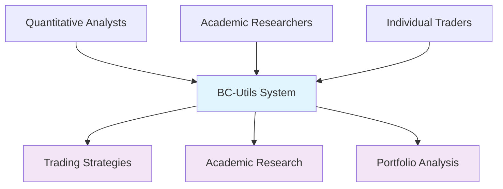
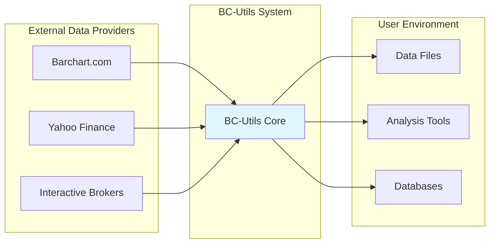
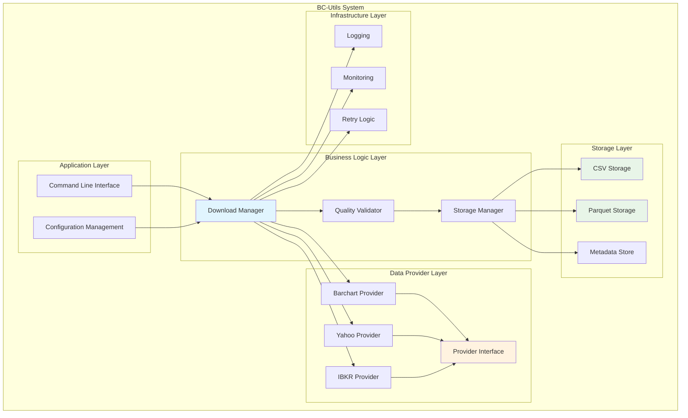
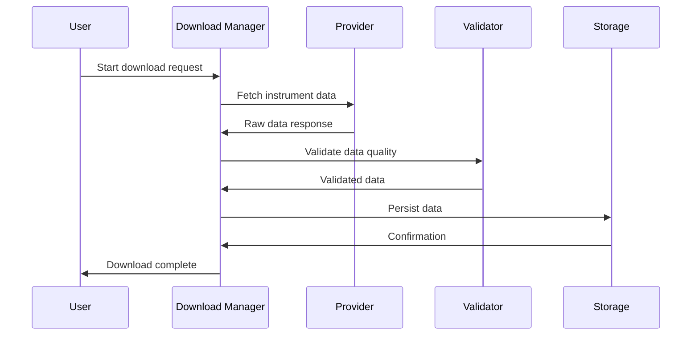
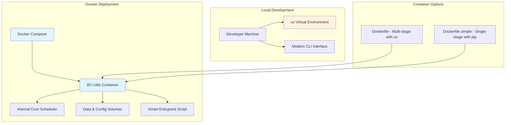
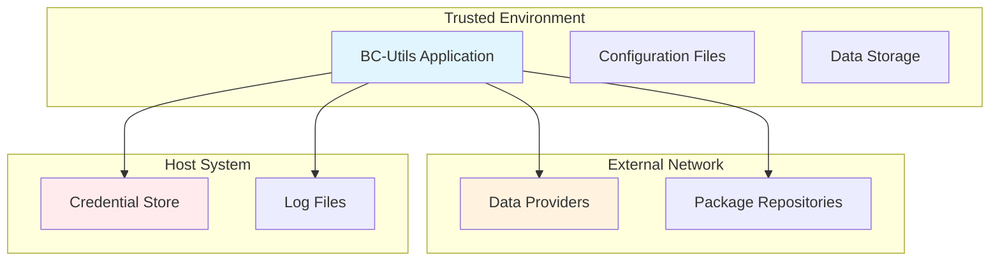

# BC-Utils System Overview

**Version:** 2.0  
**Date:** 2025-08-03  
**Status:** Active  

## 1. Executive Summary

BC-Utils is an automated financial data acquisition pipeline that transforms manual, time-intensive data collection into a reliable, scalable system. The architecture follows modern Python packaging standards with a modular, extensible design supporting multiple data providers, modern CLI interface with Click framework, and comprehensive Docker deployment scenarios.

### 1.1 System Purpose
- **Automate** historic financial data downloads from multiple sources (Barchart, Yahoo Finance, Interactive Brokers)
- **Standardize** data formats across different providers using pandas DataFrames and CSV/Parquet storage
- **Ensure** data quality and completeness through validation and intelligent data merging
- **Scale** from individual research to institutional data operations with Docker deployment
- **Provide** modern CLI interface with rich terminal output and configuration management

### 1.2 Key Quality Attributes
- **Reliability:** Robust error handling with retry mechanisms and graceful failure modes
- **Extensibility:** Strategy pattern for data providers, extensible storage backends, and CLI command structure
- **Performance:** Efficient data processing with pandas, intelligent data merging to avoid duplicates
- **Security:** TOML-based credential management, no hardcoded secrets, secure Docker deployment
- **Usability:** Modern CLI with Rich terminal output, comprehensive help system, and configuration management

## 2. System Context

### 2.1 Business Context

### 2.2 Technical Context

### 2.3 Stakeholders
| Stakeholder | Interest | Influence |
|-------------|----------|-----------|
| **Quantitative Analysts** | Reliable, comprehensive data | High |
| **DevOps Engineers** | Operational stability, monitoring | Medium |
| **Academic Researchers** | Cost-effective, broad coverage | Medium |
| **Security Teams** | Data protection, compliance | Medium |
| **Data Providers** | API usage compliance | Low |

## 3. High-Level Architecture

### 3.1 System Overview

### 3.2 Core Components
| Component | Responsibility | Implementation |
|-----------|----------------|----------------|
| **CLI Interface** | Modern command-line interface with Click framework | `cli/main.py`, `cli/commands/` |
| **Configuration Manager** | TOML-based configuration with provider-specific sections | `cli/utils/config_manager.py` |
| **Download Orchestrator** | Coordinates download jobs with intelligent scheduling | `downloaders/updating_downloader.py` |
| **Data Provider Strategy** | Pluggable data source implementations with single dispatch | `data_providers/data_provider.py` |
| **Storage Bridge** | Dual-format storage with metadata management | `data_storage/csv_storage.py`, `data_storage/parquet_storage.py` |
| **Instrument Models** | Domain objects for futures, stocks, and forex | `instruments/instrument.py`, `instruments/future.py` |
| **Session Configuration** | Runtime configuration with validation | `initialization/session_config.py` |

### 3.3 Data Flow Overview

## 4. Architectural Principles

### 4.1 Design Principles
1. **Separation of Concerns:** Clear boundaries between data acquisition, validation, and storage
2. **Provider Abstraction:** Uniform interface regardless of data source
3. **Fail-Safe Operation:** Graceful degradation when components fail
4. **Configuration-Driven:** Behavior controlled through configuration, not code changes
5. **Observability:** Comprehensive logging and monitoring at all levels

### 4.2 Technology Choices
| Aspect | Choice | Rationale |
|--------|--------|-----------|
| **Language** | Python 3.8+ | Ecosystem compatibility, data science tools |
| **Packaging** | src/ layout with pyproject.toml | Modern Python standards with uv support |
| **CLI Framework** | Click with Rich | Professional CLI with enhanced terminal output |
| **Data Processing** | pandas + NumPy | Industry standard for financial data analysis |
| **Data Formats** | CSV (primary) + Parquet (backup) | Human-readable + performance optimized |
| **Configuration** | TOML + JSON assets | Structured configuration with instrument definitions |
| **Deployment** | Docker with Docker Compose | Consistent, isolated environments with orchestration |
| **Container Build** | Multi-stage with uv | Fast dependency installation and optimized images |

### 4.3 Quality Attributes Implementation
| Quality | Strategy | Implementation |
|---------|----------|----------------|
| **Reliability** | Retry with backoff, graceful error handling | Custom retry decorators, comprehensive exception hierarchy |
| **Security** | Credential externalization, secure defaults | TOML config files, Docker secrets support |
| **Performance** | Efficient data structures, intelligent merging | pandas DataFrames, avoid duplicate downloads |
| **Maintainability** | Clean architecture, design patterns | Strategy, Template Method, Single Dispatch patterns |
| **Scalability** | Stateless design, containerization | Docker deployment, volume mounts for data persistence |
| **Usability** | Rich CLI, configuration management | Click framework, interactive config setup, progress bars |

## 5. Deployment Overview

### 5.1 Deployment Scenarios

### 5.2 Runtime Environment
- **Python Runtime:** 3.11 in Docker containers, 3.8+ for local development
- **Package Management:** uv for fast dependency installation (10-100x faster than pip)
- **System Dependencies:** tini (init system), cron (scheduling), build-essential (for compilation)
- **Container Architecture:** Multi-stage builds with optimized final images
- **Resource Requirements:** <1GB RAM, <10GB storage typical, configurable limits
- **Network:** HTTPS outbound to data provider APIs, no inbound ports required
- **Scheduling:** Internal cron daemon for automated downloads
- **Health Monitoring:** Built-in health checks and log management

## 6. Integration Points

### 6.1 External Systems
| System | Integration Type | Purpose |
|--------|------------------|---------|
| **Barchart.com** | REST API | Primary futures and options data |
| **Yahoo Finance** | Web scraping | Free stock and forex data |
| **Interactive Brokers** | TWS API | Professional trading platform data |
| **File System** | Direct I/O | Data persistence and configuration |
| **Container Runtime** | Process management | Deployment and scaling |

### 6.2 Data Exchange Formats
- **Input:** JSON configuration, environment variables
- **Output:** CSV and Parquet data files
- **Internal:** Python objects with pandas DataFrames
- **Logging:** Structured JSON for operational visibility

## 7. Security Overview

### 7.1 Security Boundaries

### 7.2 Security Controls
- **Authentication:** API keys and credentials externalized
- **Authorization:** Read-only access to data provider APIs
- **Data Protection:** No sensitive data in logs or configuration files
- **Network Security:** HTTPS for all external communications
- **Audit Logging:** Access and operation tracking

## 8. Operational Considerations

### 8.1 Monitoring and Observability
- **Health Checks:** HTTP endpoint for container orchestration
- **Metrics:** Download success rates, data quality scores
- **Logging:** Structured logs with correlation IDs
- **Alerting:** Configurable notifications for failures

### 8.2 Backup and Recovery
- **Data Backup:** Dual format storage (CSV + Parquet)
- **Configuration Backup:** Version controlled in git
- **Recovery:** Stateless design enables fast restart
- **Disaster Recovery:** Re-download capability for data loss

## 9. Performance Characteristics

### 9.1 Scalability
- **Vertical Scaling:** Multi-threaded downloads within rate limits
- **Horizontal Scaling:** Multiple instances with different instrument sets
- **Data Volume:** Tested with 10GB+ datasets per instrument
- **Concurrent Users:** Stateless design supports multiple deployments

### 9.2 Performance Metrics
| Metric | Target | Measurement |
|--------|--------|-------------|
| **Download Speed** | <5 seconds per contract | End-to-end timing |
| **Data Validation** | <10 seconds per 100K points | Processing time |
| **Memory Usage** | <1GB typical operation | Runtime monitoring |
| **Storage Efficiency** | 60% compression with Parquet | File size comparison |

## 10. Future Architecture Considerations

### 10.1 Evolutionary Architecture
- **Real-time Data:** WebSocket support for live market feeds
- **Cloud-Native:** Kubernetes CronJobs and operators for scaled deployments
- **Machine Learning:** Data quality anomaly detection and smart scheduling
- **API Gateway:** REST API for programmatic access to data and system control
- **Multi-Provider Orchestration:** Intelligent provider switching and fallback strategies

### 10.2 Technical Debt Management
- **Modern Python:** Continued adoption of Python 3.10+ features (pattern matching, type hints)
- **Dependency Management:** Regular uv.lock updates with automated security scanning
- **Code Quality:** Comprehensive test coverage with pytest, static analysis with mypy
- **Container Security:** Regular base image updates, vulnerability scanning
- **Documentation:** Keep architecture docs synchronized with implementation changes

## Related Documents

- **[Component Architecture](02-component-architecture.md)** - Detailed component design
- **[Data Flow Design](03-data-flow-design.md)** - Data processing pipeline
- **[Deployment Architecture](07-deployment-architecture.md)** - Production deployment
- **[Product Requirements](../../requirements/prd/product-requirements.md)** - Business requirements
- **[User Stories](../../requirements/prd/user-stories.md)** - Functional scenarios

---

**Next Review:** 2025-09-03  
**Reviewers:** System Architect, Lead Developer, DevOps Lead