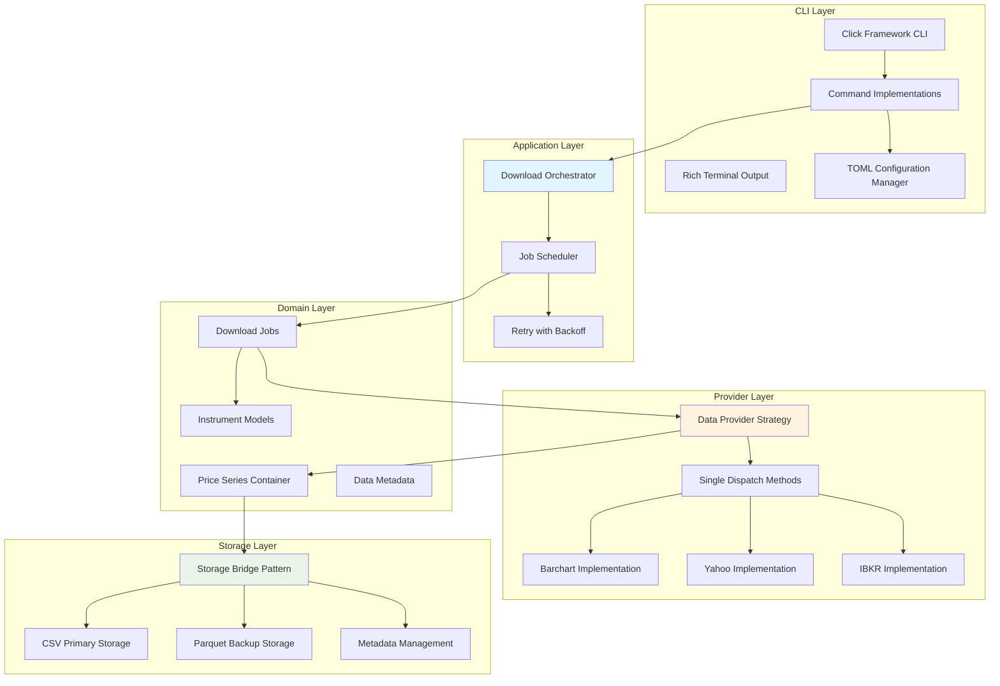
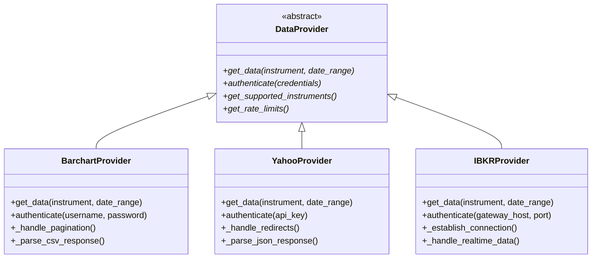
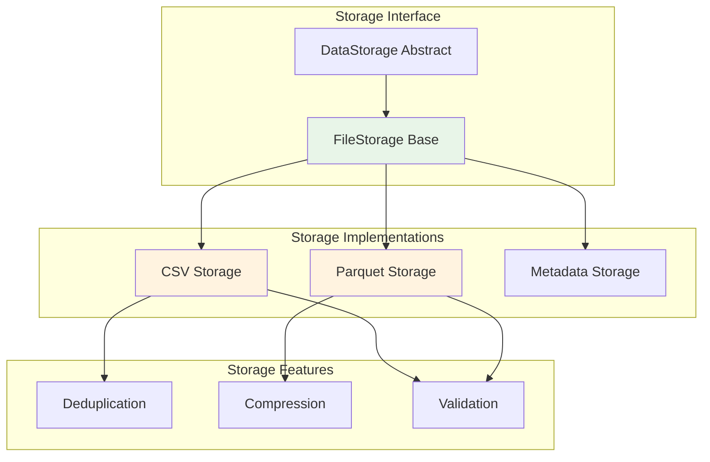
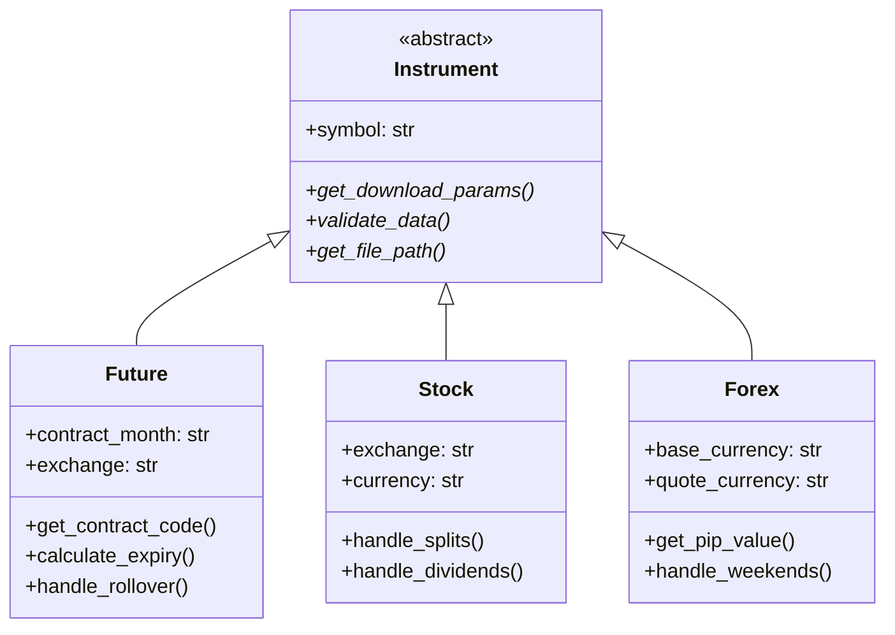
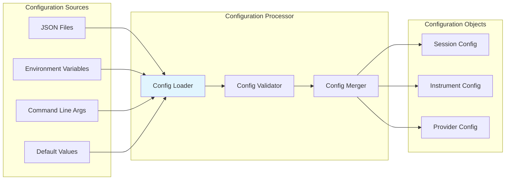
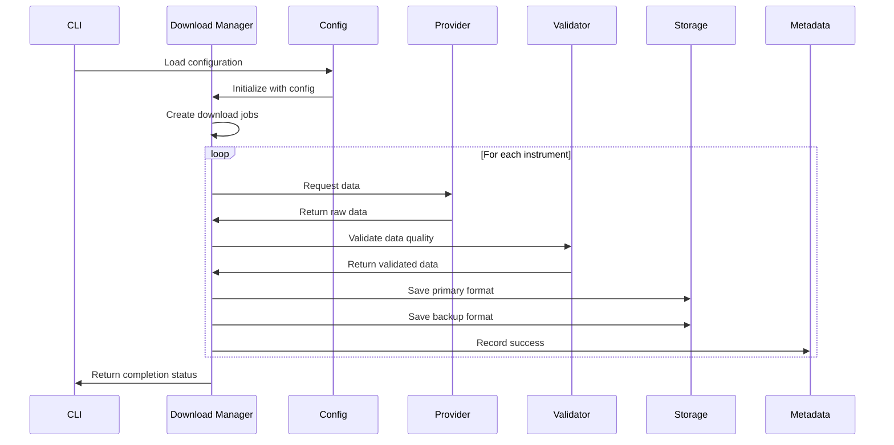
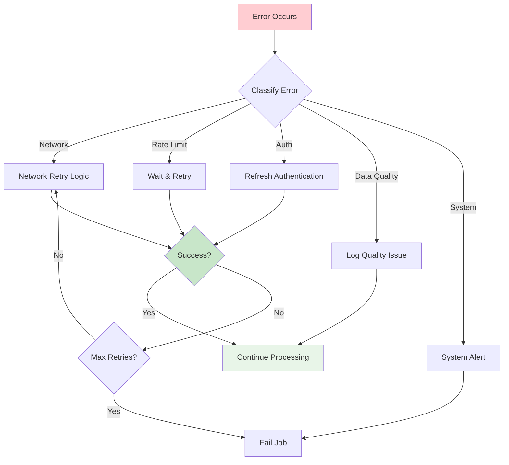
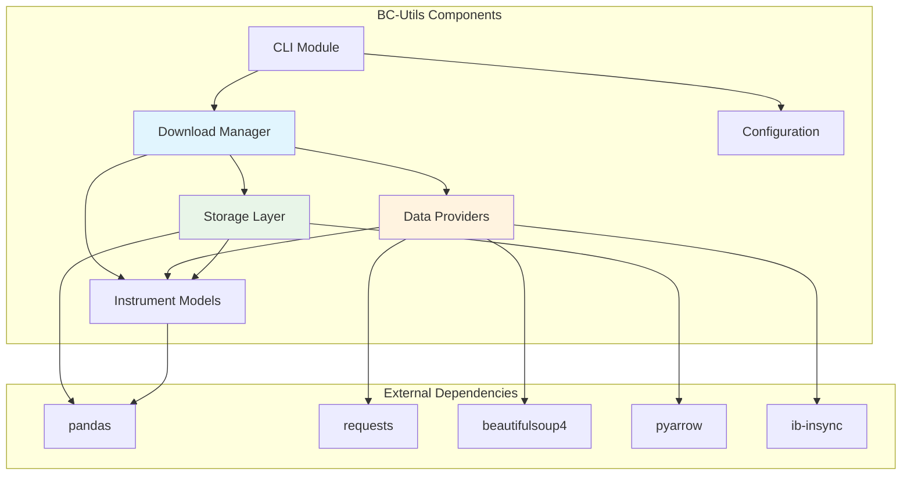

# Vortex Component Architecture

**Version:** 2.0  
**Date:** 2025-08-03  
**Related:** [System Overview](01-system-overview.md) | [Data Flow Design](03-data-flow-design.md)

## 1. Component Overview

### 1.1 System Decomposition
Vortex follows a modern layered architecture with clear separation of concerns using established design patterns. The architecture emphasizes extensibility through strategy patterns and single dispatch methods.



### 1.2 Component Responsibilities
| Layer | Components | Responsibility |
|-------|------------|----------------|
| **Presentation** | CLI, Configuration | User interaction and system setup |
| **Application** | Download Manager, Job Control | Business workflow orchestration |
| **Domain** | Instruments, Validation | Core business logic and rules |
| **Infrastructure** | Providers, Storage, Logging | External integrations and persistence |

## 2. Core Components

### 2.1 Download Manager (`downloaders/updating_downloader.py`)

#### Purpose
Central orchestrator that coordinates the entire data acquisition workflow from configuration to storage.

#### Responsibilities
- **Job Creation:** Convert configuration into download jobs
- **Provider Selection:** Choose appropriate data provider for each instrument
- **Workflow Orchestration:** Manage download → validation → storage pipeline
- **Error Handling:** Coordinate retries and fallback strategies
- **Progress Tracking:** Monitor and report download progress

#### Key Interface Design
The Download Manager exposes a clean interface that abstracts the complexity of the data acquisition workflow:

**Primary Interface Responsibilities:**
- **Single Instrument Processing:** Execute complete download workflow for individual instruments
- **Batch Processing:** Handle multiple instruments with coordinated scheduling
- **Progress Reporting:** Provide real-time status and statistics for monitoring
- **Configuration Integration:** Accept and validate configuration parameters

#### Dependencies
- **Data Providers:** Abstract interface for data acquisition
- **Storage Engines:** Primary and backup data persistence
- **Validation Service:** Data quality assurance
- **Configuration:** Instrument and system settings

#### Workflow Overview
The Download Manager orchestrates a five-stage process:
1. **Job Creation** - Convert configuration to executable download jobs
2. **Data Acquisition** - Fetch data from appropriate provider
3. **Quality Validation** - Ensure data meets business rules
4. **Storage Operations** - Persist to primary and backup storage
5. **Metadata Management** - Track download history and status

*Detailed implementation specifications available in [Component Implementation](../lld/01-component-implementation.md)*

### 2.2 Data Provider Interface (`data_providers/data_provider.py`)

#### Purpose
Abstract interface that standardizes data acquisition across different external providers.

#### Architecture Pattern
**Strategy Pattern:** Enables runtime selection of data provider based on configuration.



#### Provider Implementation Requirements
Each provider must implement:
1. **Authentication:** Handle provider-specific credential types
2. **Rate Limiting:** Respect API limits and implement backoff
3. **Data Formatting:** Convert to standard OHLCV schema
4. **Error Handling:** Classify and handle provider-specific errors
5. **Metadata Extraction:** Capture provider-specific attributes

#### Provider Implementation Patterns
Each provider implements the common interface but handles provider-specific concerns:

**Barchart Provider:**
- Session-based authentication with CSRF protection
- Rate limiting (150 downloads/day default)
- CSV response parsing and standardization

**Yahoo Provider:**
- No authentication required for basic data
- JSON API with automatic retry logic
- Real-time and historical data support

**IBKR Provider:**
- TWS Gateway connection management
- Binary protocol handling
- Contract specification and market data

*Detailed provider implementations available in [Provider Implementation](../lld/03-provider-implementation.md)*

### 2.3 Storage Architecture (`data_storage/`)

#### Purpose
Provides pluggable storage backends with dual-format persistence for different use cases.

#### Component Structure


#### Storage Implementation Strategy
The storage layer uses a dual-format approach:

**CSV Storage:**
- Human-readable format for debugging and manual analysis
- Atomic write operations with temporary files
- Automatic data merging and deduplication
- UTF-8 encoding with proper escaping

**Parquet Storage:**
- Columnar format optimized for analytical workloads
- Snappy compression for space efficiency
- Date-based partitioning for query performance
- Schema evolution support

**Common Features:**
- Pluggable backend architecture
- Metadata tracking and integrity verification
- Backup and recovery capabilities
- Transaction-like semantics with rollback

*Detailed storage implementations available in [Storage Implementation](../lld/04-storage-implementation.md)*

### 2.4 Instrument Model (`instruments/`)

#### Purpose
Domain models that encapsulate business logic for different financial instrument types.

#### Class Hierarchy


#### Instrument Model Hierarchy
The instrument models encapsulate business logic for different financial instrument types:

**Future Contracts:**
- Contract cycle management (GJMQVZ months)
- Expiry date calculation with exchange-specific rules
- Active contract generation for date ranges
- Rollover handling and chain construction

**Stock Instruments:**
- Corporate action handling (splits, dividends)
- Exchange-specific symbol mapping
- Currency conversion support
- Sector and industry classification

**Forex Pairs:**
- Base/quote currency management
- Pip value calculations
- Market hours and weekend gap handling
- Central bank intervention periods

*Detailed instrument implementations available in [Component Implementation](../lld/01-component-implementation.md)*

### 2.5 Configuration Management (`initialization/`)

#### Purpose
Centralized configuration loading and validation with support for multiple sources.

#### Configuration Sources


#### Configuration Architecture
The configuration system supports multiple input sources with a clear precedence hierarchy:

**Configuration Sources (in precedence order):**
1. Command-line arguments (highest priority)
2. Environment variables
3. Configuration files (JSON)
4. Default values (lowest priority)

**Configuration Categories:**
- **Provider Settings:** Authentication and connection parameters
- **Download Settings:** Date ranges, limits, and output locations
- **Operational Settings:** Logging, dry-run mode, backup preferences
- **Instrument Settings:** Symbol definitions and data requirements

**Validation and Defaults:**
- Schema validation for all configuration inputs
- Automatic directory creation for output paths
- Credential validation before data operations
- Comprehensive error reporting for invalid configurations

*Detailed configuration implementation available in [Component Implementation](../lld/01-component-implementation.md)*

## 3. Component Interactions

### 3.1 Download Workflow Sequence


### 3.2 Error Handling Flow


## 4. Component Dependencies

### 4.1 Dependency Graph


### 4.2 Package Dependencies
| Component | Internal Dependencies | External Dependencies |
|-----------|----------------------|----------------------|
| **Download Manager** | Storage, Providers, Instruments | pandas, logging |
| **Data Providers** | Instruments, Validation | requests, beautifulsoup4, ib-insync |
| **Storage Layer** | Instruments, Metadata | pandas, pyarrow |
| **Instruments** | Price Series, Periods | pandas, pytz |
| **Configuration** | Utilities | json, os |

### 4.3 Architectural Dependency Management
The system employs several design patterns to prevent circular dependencies and maintain clean architectural boundaries:

**Dependency Management Patterns:**
- **Dependency Injection:** Constructor-based dependency provision for testability and flexibility
- **Interface Segregation:** Small, focused interfaces that prevent unnecessary coupling
- **Event-Driven Architecture:** Loose coupling through publish-subscribe patterns where appropriate
- **Factory Pattern:** Centralized component creation and dependency wiring

## 5. Component Configuration

### 5.1 Configuration Architecture
The component configuration system supports multiple input sources with a clear precedence hierarchy and validation framework:

**Configuration Source Hierarchy:**
- **Environment Variables:** System-level configuration for deployment environments
- **Configuration Files:** Structured settings for complex component parameters
- **Command Line Arguments:** Runtime overrides for operational flexibility
- **Default Values:** Sensible defaults for optional configuration parameters

**Configuration Design Patterns:**
- **Hierarchical Override:** Higher precedence sources override lower precedence values
- **Template Expansion:** Variable substitution for environment-specific values
- **Schema Validation:** Type checking and constraint validation for all configuration
- **Hot Reload:** Runtime configuration updates without system restart

### 5.2 Component Assembly
The system uses dependency injection and factory patterns for component assembly:

**Factory Responsibilities:**
- Create configured component instances
- Wire dependencies between components
- Apply configuration settings to components
- Handle provider-specific initialization

**Dependency Injection Pattern:**
- Components receive dependencies through constructors
- Interfaces used instead of concrete classes where possible
- Configuration drives component selection and setup
- Testable design with easy mock injection

**Component Lifecycle:**
1. Configuration loading and validation
2. Factory creates component instances
3. Dependencies injected during construction
4. Components initialized and ready for use
5. Cleanup and resource disposal on shutdown

*Detailed factory implementations available in [Component Implementation](../lld/01-component-implementation.md)*

## 6. Testing Strategy

### 6.1 Component Test Structure
```
tests/
├── unit/                    # Component isolation tests
│   ├── test_downloaders/
│   ├── test_providers/
│   ├── test_storage/
│   └── test_instruments/
├── integration/             # Component interaction tests
│   ├── test_download_workflow/
│   └── test_provider_storage/
└── fixtures/               # Test data and mocks
    ├── sample_data/
    └── mock_providers/
```

### 6.2 Component Testing Strategy
The testing approach emphasizes component isolation and integration validation:

**Unit Testing:**
- Component isolation through dependency injection
- Mock implementations for external dependencies
- Interface contract validation
- Error condition testing

**Integration Testing:**
- Component interaction validation
- End-to-end workflow testing
- Provider integration testing with test accounts
- Storage system integration testing

**Test Infrastructure:**
- Mock provider implementations for reliable testing
- Test data fixtures for various scenarios
- Automated test data generation
- Test environment isolation

*Detailed testing implementations available in [Testing Implementation](../lld/06-testing-implementation.md)*

## Related Documents

- **[Data Flow Design](03-data-flow-design.md)** - Detailed data processing pipeline
- **[Provider Abstraction](04-provider-abstraction.md)** - Data provider interface details
- **[Storage Architecture](05-storage-architecture.md)** - Storage implementation details
- **[System Overview](01-system-overview.md)** - High-level system context

---

**Next Review:** 2025-02-08  
**Reviewers:** Lead Developer, Senior Engineer, QA Lead