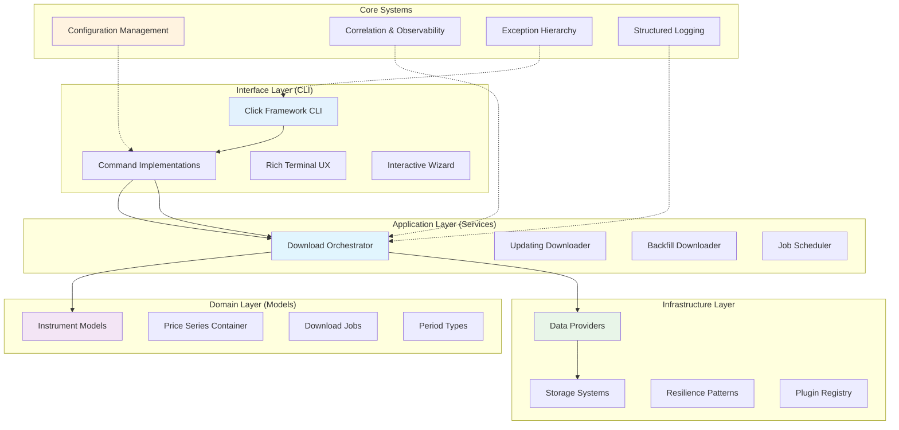
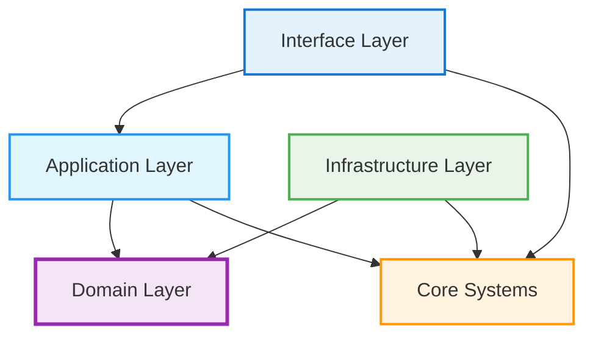

# Vortex Component Architecture

**Version:** 3.0  
**Date:** 2025-08-05  
**Related:** [System Overview](01-system-overview.md) | [Data Flow Design](03-data-flow-design.md)

## 1. Component Overview

### 1.1 Clean Architecture Implementation
Vortex implements Clean Architecture principles with strict layer separation and dependency inversion. The architecture ensures that business logic is independent of external frameworks and infrastructure concerns.

### 1.2 Clean Architecture Layer Responsibilities

| Layer | Directory | Components | Responsibility |
|-------|-----------|------------|----------------|
| **Interface** | `vortex/cli/` | CLI Commands, UX, Wizard | User interaction and command handling |
| **Application** | `vortex/services/` | Downloaders, Orchestration | Business use cases and workflow coordination |
| **Domain** | `vortex/models/` | Instruments, PriceSeries, Jobs | Core business entities and rules |
| **Core Systems** | `vortex/core/` | Config, Correlation, Exceptions | Cross-cutting concerns and shared utilities |
| **Infrastructure** | `vortex/infrastructure/` | Providers, Storage, Resilience | External integrations and technical concerns |

## 2. Core Components

### 2.1 Download Services (`vortex/services/`)

#### Application Layer Services
The application layer contains the business use case implementations that orchestrate domain entities and infrastructure components.

**UpdatingDownloader** (`services/updating_downloader.py`):
- **Purpose:** Incremental data downloads with existing data checking
- **Responsibilities:** 
  - Intelligent update detection to avoid duplicate downloads
  - Coordinate download → validation → storage pipeline
  - Progress tracking and error handling
  - Integration with correlation system for request tracing

**BackfillDownloader** (`services/backfill_downloader.py`):
- **Purpose:** Historical data range downloads
- **Responsibilities:**
  - Large historical dataset acquisition
  - Date range processing and validation
  - Batch job coordination with rate limiting

### 2.2 Core Systems (`vortex/core/`)

#### Configuration Management (`core/config/`)
**Purpose:** Centralized configuration system with validation and environment support.

**Key Components:**
- **VortexConfig:** Pydantic-based configuration models with comprehensive validation
- **ConfigManager:** TOML file management with environment variable overrides
- **Provider Configs:** Specialized configuration for each data provider
- **Interactive Setup:** Guided configuration wizard for user-friendly setup

**Design Patterns:**
- Strategy pattern for different configuration sources
- Builder pattern for complex configuration construction
- Validation decorator pattern for configuration validation

#### Correlation & Observability (`core/correlation/`)
**Purpose:** Request tracking, performance monitoring, and distributed tracing.

**Key Components:**
- **CorrelationIdManager:** Thread-local correlation ID management
- **RequestTracker:** Performance metrics and operation timing
- **Correlation Decorators:** Automatic correlation injection for operations
- **Context Managers:** Operation scoping and resource management

### 2.3 Infrastructure Layer (`vortex/infrastructure/`)

#### Data Providers (`infrastructure/providers/`)
**Purpose:** External data source integrations with unified interface.

**Provider Implementations:**
- **BarchartDataProvider:** Premium web scraping with authentication and session management
- **YahooDataProvider:** Free Yahoo Finance API integration with rate limiting
- **IbkrDataProvider:** Interactive Brokers TWS/Gateway connection

**Common Features:**
- Unified DataProvider interface with consistent error handling
- Automatic retry mechanisms with exponential backoff
- Rate limiting and quota management
- Authentication and session persistence

#### Storage Systems (`infrastructure/storage/`)
**Purpose:** Data persistence with multiple format support and atomic operations.

**Storage Implementations:**
- **CsvStorage:** Primary CSV format storage with metadata tracking
- **ParquetStorage:** Backup Parquet format for efficient data access
- **FileStorage:** Base file operations with atomic write guarantees

#### Resilience Patterns (`infrastructure/resilience/`)
**Purpose:** Failure handling, circuit breakers, and system reliability.

**Key Components:**
- **CircuitBreaker:** Failure isolation with configurable thresholds
- **RetryManager:** Configurable retry strategies with backoff
- **ErrorRecoveryManager:** Automated recovery procedures

## 3. Dependency Flow and Clean Architecture Compliance

### 3.1 Dependency Direction
The architecture strictly follows Clean Architecture dependency rules:

### 3.2 Interface Contracts
Each layer defines clear interfaces that enforce the dependency inversion principle:

- **DataProvider Interface:** Abstracts external data sources
- **DataStorage Interface:** Abstracts persistence mechanisms  
- **ConfigManager Interface:** Abstracts configuration sources
- **CorrelationManager Interface:** Abstracts observability concerns

### 3.3 Plugin Architecture
The system supports extensibility through a plugin registry pattern:

- **Provider Plugins:** Add new data sources without core changes
- **Storage Plugins:** Add new persistence formats
- **Command Plugins:** Extend CLI functionality

## 4. Architecture Benefits and Design Decisions

### 4.1 Clean Architecture Benefits

**Maintainability:**
- Clear separation of concerns reduces coupling between components
- Business logic isolated from external dependencies
- Changes to infrastructure don't affect domain models

**Testability:**
- Each layer can be tested in isolation
- Mock implementations easily injected at layer boundaries
- Business logic tested without external dependencies

**Extensibility:**
- New providers can be added without core changes
- Plugin architecture supports runtime extensibility
- Interface contracts enable easy substitution

### 4.2 Key Design Decisions

**Configuration Management:**
- Centralized configuration system with unified validation
- TOML format for human-readable configuration files
- Environment variable overrides for deployment flexibility

**Observability:**
- Unified correlation system for request tracking
- Structured logging across all components
- Performance metrics and operation timing

**Error Handling:**
- Comprehensive exception hierarchy with actionable messages
- Circuit breaker patterns for external service failures
- Automatic retry with exponential backoff

## Related Documents

- **[Data Flow Design](03-data-flow-design.md)** - Detailed data processing pipeline
- **[Provider Abstraction](04-provider-abstraction.md)** - Data provider interface details  
- **[Storage Architecture](05-storage-architecture.md)** - Storage implementation details
- **[System Overview](01-system-overview.md)** - High-level system context
- **[Component Implementation](../lld/01-component-implementation.md)** - Low-level implementation details

---

**Next Review:** 2025-09-05  
**Reviewers:** Lead Developer, Senior Engineer, QA Lead

*This document has been updated to reflect the Clean Architecture implementation completed on 2025-08-05*
