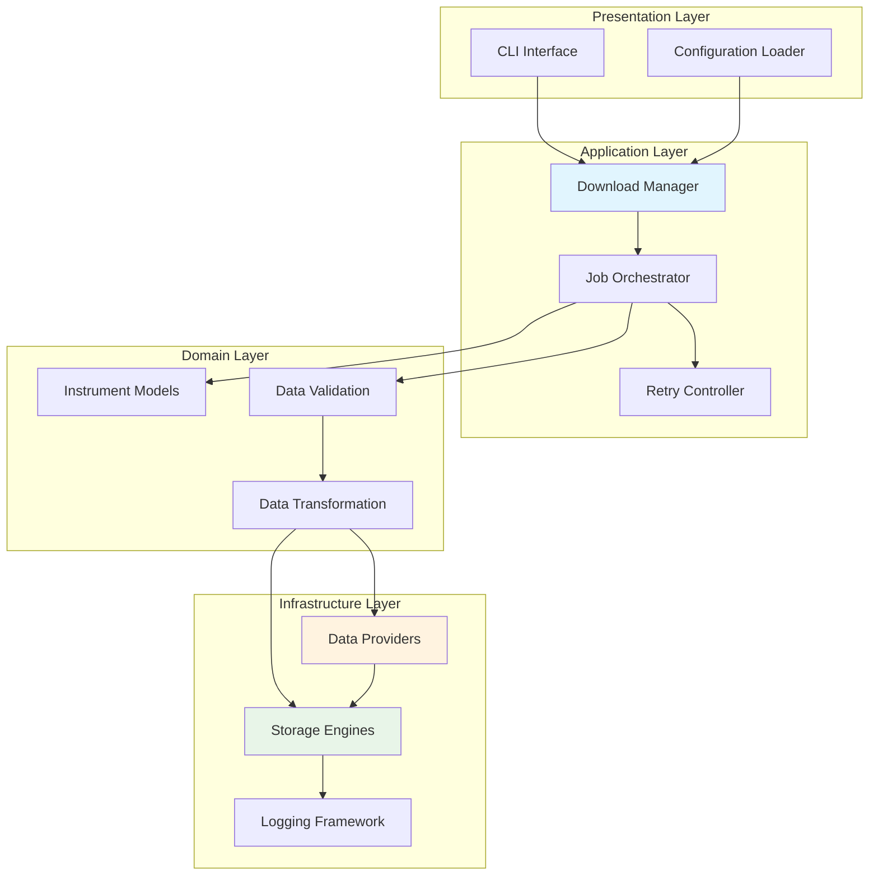
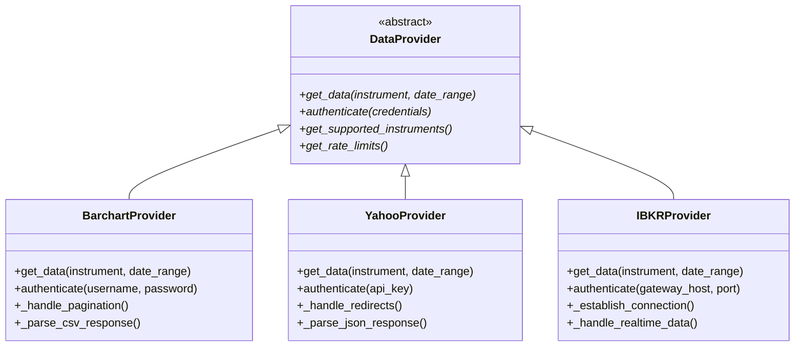
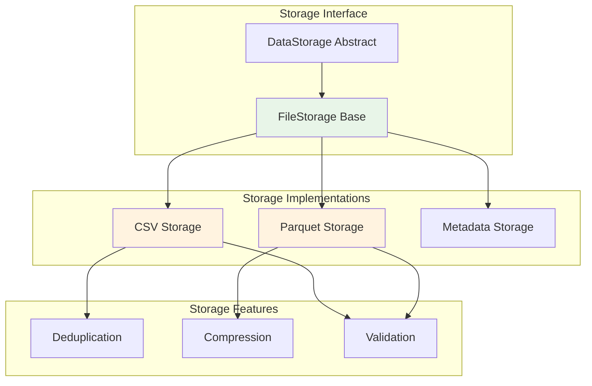
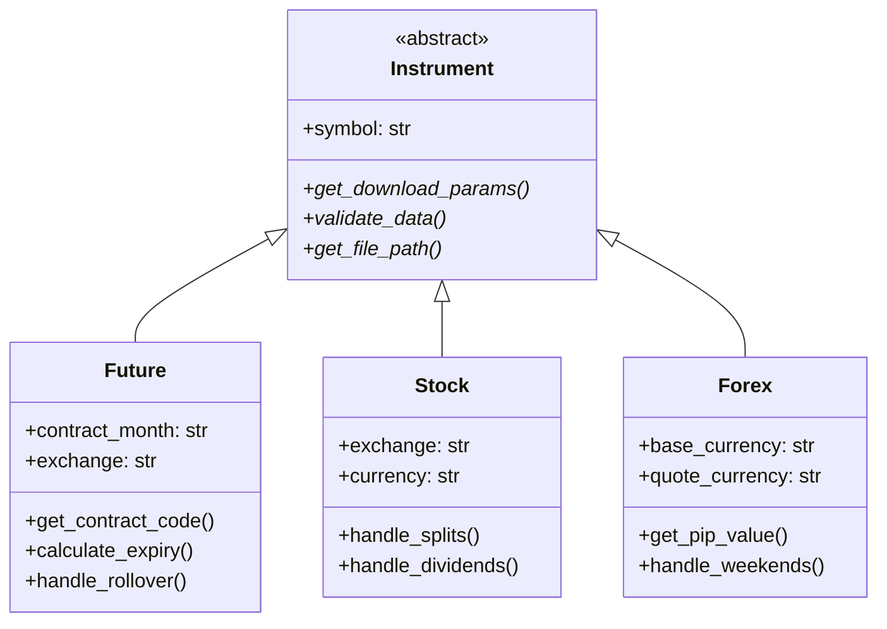
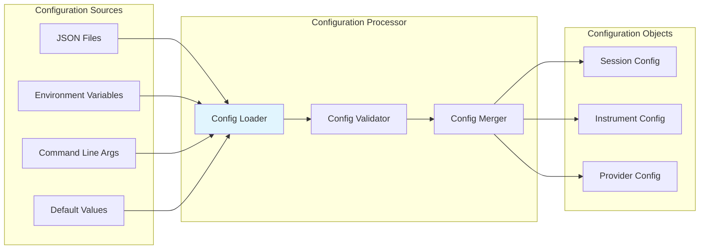
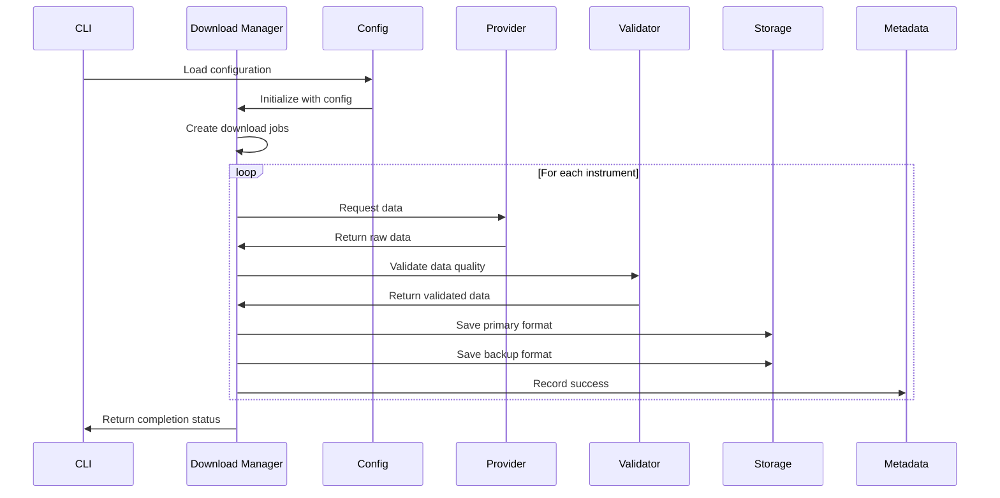
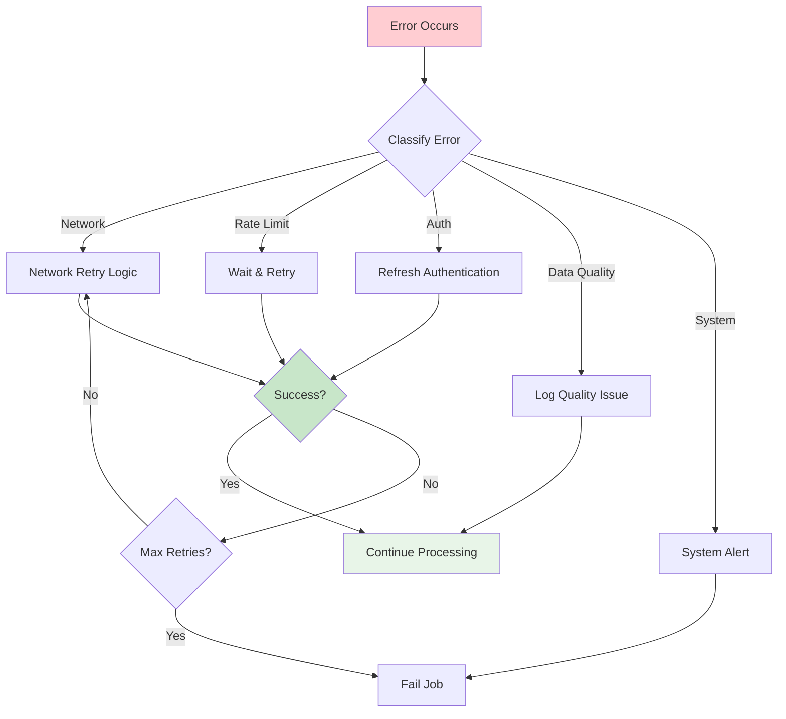
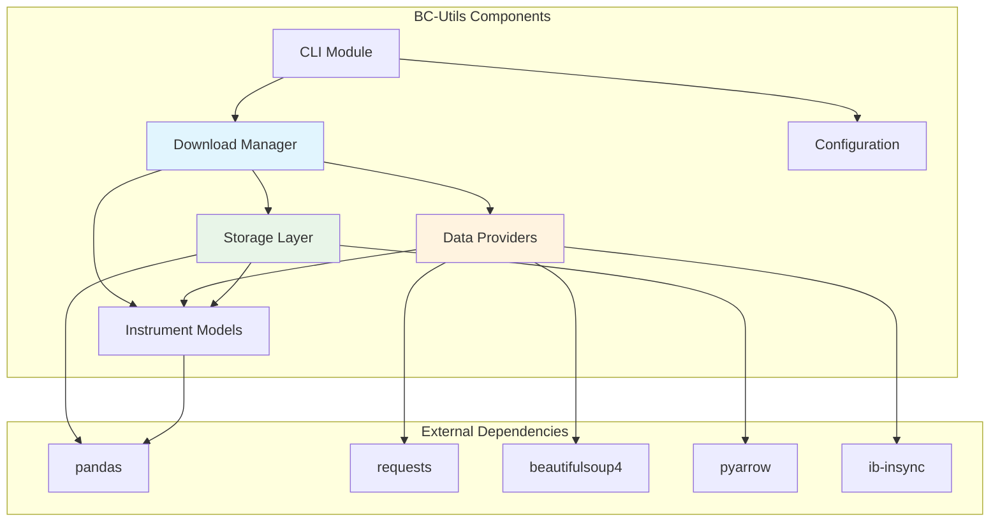

# BC-Utils Component Architecture

**Version:** 1.0  
**Date:** 2025-01-08  
**Related:** [System Overview](01-system-overview.md) | [Data Flow Design](03-data-flow-design.md)

## 1. Component Overview

### 1.1 System Decomposition
BC-Utils follows a layered architecture with clear separation of concerns. Each layer has specific responsibilities and well-defined interfaces.



### 1.2 Component Responsibilities
| Layer | Components | Responsibility |
|-------|------------|----------------|
| **Presentation** | CLI, Configuration | User interaction and system setup |
| **Application** | Download Manager, Job Control | Business workflow orchestration |
| **Domain** | Instruments, Validation | Core business logic and rules |
| **Infrastructure** | Providers, Storage, Logging | External integrations and persistence |

## 2. Core Components

### 2.1 Download Manager (`downloaders/updating_downloader.py`)

#### Purpose
Central orchestrator that coordinates the entire data acquisition workflow from configuration to storage.

#### Responsibilities
- **Job Creation:** Convert configuration into download jobs
- **Provider Selection:** Choose appropriate data provider for each instrument
- **Workflow Orchestration:** Manage download → validation → storage pipeline
- **Error Handling:** Coordinate retries and fallback strategies
- **Progress Tracking:** Monitor and report download progress

#### Key Interfaces
```python
class UpdatingDownloader:
    def __init__(self, data_storage, data_provider, backup_storage=None)
    
    def download_instrument_data(self, instrument_config: InstrumentConfig) -> bool
    def download_multiple_instruments(self, configs: Dict[str, InstrumentConfig])
    def get_download_stats(self) -> DownloadStats
```

#### Dependencies
- **Data Providers:** Abstract interface for data acquisition
- **Storage Engines:** Primary and backup data persistence
- **Validation Service:** Data quality assurance
- **Configuration:** Instrument and system settings

#### Implementation Details
```python
# Core workflow implementation
def download_instrument_data(self, config):
    try:
        # 1. Create download job
        job = DownloadJob.from_config(config)
        
        # 2. Check for existing data
        if self.storage.has_recent_data(job):
            return self._handle_incremental_update(job)
        
        # 3. Fetch from provider
        raw_data = self.provider.get_data(job.instrument, job.date_range)
        
        # 4. Validate data quality
        validated_data = self.validator.validate(raw_data)
        
        # 5. Store data
        self.storage.save(validated_data, job.output_path)
        
        # 6. Update metadata
        self.metadata.record_download(job, success=True)
        
        return True
        
    except Exception as e:
        self._handle_download_error(job, e)
        return False
```

### 2.2 Data Provider Interface (`data_providers/data_provider.py`)

#### Purpose
Abstract interface that standardizes data acquisition across different external providers.

#### Architecture Pattern
**Strategy Pattern:** Enables runtime selection of data provider based on configuration.



#### Provider Implementation Requirements
Each provider must implement:
1. **Authentication:** Handle provider-specific credential types
2. **Rate Limiting:** Respect API limits and implement backoff
3. **Data Formatting:** Convert to standard OHLCV schema
4. **Error Handling:** Classify and handle provider-specific errors
5. **Metadata Extraction:** Capture provider-specific attributes

#### Barchart Provider Implementation
```python
class BarchartDataProvider(DataProvider):
    def __init__(self, username, password, daily_download_limit=150):
        self.session = self._create_authenticated_session(username, password)
        self.rate_limiter = RateLimiter(daily_download_limit)
    
    def get_data(self, instrument, date_range):
        # 1. Check rate limits
        self.rate_limiter.check_availability()
        
        # 2. Build request URL
        url = self._build_download_url(instrument, date_range)
        
        # 3. Get CSRF tokens for security
        csrf_token = self._get_csrf_token(url)
        
        # 4. Submit download request
        response = self._submit_download_request(url, csrf_token, instrument)
        
        # 5. Parse and validate response
        data = self._parse_csv_data(response.content)
        
        # 6. Convert to standard format
        return self._standardize_format(data)
```

### 2.3 Storage Architecture (`data_storage/`)

#### Purpose
Provides pluggable storage backends with dual-format persistence for different use cases.

#### Component Structure


#### CSV Storage Implementation
```python
class CsvStorage(FileStorage):
    def save(self, data: pd.DataFrame, filepath: str):
        # 1. Validate data schema
        self._validate_schema(data)
        
        # 2. Check for existing data
        if self.file_exists(filepath) and not self.overwrite:
            existing_data = self.load(filepath)
            data = self._merge_with_existing(existing_data, data)
        
        # 3. Apply data transformations
        data = self._standardize_columns(data)
        data = self._sort_by_timestamp(data)
        
        # 4. Write atomically
        temp_file = f"{filepath}.tmp"
        data.to_csv(temp_file, index=False, encoding='utf-8')
        os.rename(temp_file, filepath)
        
        # 5. Update metadata
        self.metadata.record_save(filepath, len(data))
```

#### Parquet Storage Implementation
```python
class ParquetStorage(FileStorage):
    def save(self, data: pd.DataFrame, filepath: str):
        # 1. Optimize data types
        data = self._optimize_dtypes(data)
        
        # 2. Add partitioning columns
        data['year'] = data['timestamp'].dt.year
        data['month'] = data['timestamp'].dt.month
        
        # 3. Write with compression
        data.to_parquet(
            filepath,
            compression='snappy',
            partition_cols=['year', 'month'],
            engine='pyarrow'
        )
```

### 2.4 Instrument Model (`instruments/`)

#### Purpose
Domain models that encapsulate business logic for different financial instrument types.

#### Class Hierarchy


#### Future Contract Implementation
```python
class Future(Instrument):
    def __init__(self, symbol, code, cycle, tick_date, exchange):
        super().__init__(symbol)
        self.code = code  # e.g., "GC" for Gold
        self.cycle = cycle  # e.g., "GJMQVZ"
        self.tick_date = tick_date
        self.exchange = exchange
    
    def get_active_contracts(self, start_date, end_date):
        """Generate list of active contracts in date range"""
        contracts = []
        for month_code in self.cycle:
            for year in range(start_date.year, end_date.year + 1):
                contract = FutureContract(
                    symbol=f"{self.code}{month_code}{year%100:02d}",
                    expiry=self._calculate_expiry(month_code, year)
                )
                if self._is_active_during(contract, start_date, end_date):
                    contracts.append(contract)
        return contracts
    
    def _calculate_expiry(self, month_code, year):
        """Calculate contract expiry based on exchange rules"""
        month_map = {'F': 1, 'G': 2, 'H': 3, 'J': 4, 'K': 5, 'M': 6,
                    'N': 7, 'Q': 8, 'U': 9, 'V': 10, 'X': 11, 'Z': 12}
        month = month_map[month_code]
        # Exchange-specific expiry logic
        return datetime(year, month, self._get_expiry_day(month))
```

### 2.5 Configuration Management (`initialization/`)

#### Purpose
Centralized configuration loading and validation with support for multiple sources.

#### Configuration Sources


#### Session Configuration
```python
@dataclass
class SessionConfig:
    # Provider settings
    username: str = None
    password: str = None
    provider_host: str = None
    provider_port: str = "8888"
    
    # Download settings
    download_directory: str = DEFAULT_DOWNLOAD_DIRECTORY
    start_year: int = DEFAULT_START_YEAR
    end_year: int = DEFAULT_END_YEAR
    daily_download_limit: int = DEFAULT_DAILY_DOWNLOAD_LIMIT
    
    # Operational settings
    dry_run: bool = DEFAULT_DRY_RUN
    backup_data: bool = False
    force_backup: bool = False
    random_sleep_in_sec: int = DEFAULT_RANDOM_SLEEP_IN_SEC
    log_level: str = DEFAULT_LOGGING_LEVEL
    
    def validate(self):
        """Validate configuration completeness and correctness"""
        if not self.username and not self.provider_host:
            raise ValueError("Either username or provider_host must be specified")
        
        if self.start_year > self.end_year:
            raise ValueError("start_year must be <= end_year")
        
        Path(self.download_directory).mkdir(parents=True, exist_ok=True)
```

## 3. Component Interactions

### 3.1 Download Workflow Sequence


### 3.2 Error Handling Flow


## 4. Component Dependencies

### 4.1 Dependency Graph


### 4.2 Package Dependencies
| Component | Internal Dependencies | External Dependencies |
|-----------|----------------------|----------------------|
| **Download Manager** | Storage, Providers, Instruments | pandas, logging |
| **Data Providers** | Instruments, Validation | requests, beautifulsoup4, ib-insync |
| **Storage Layer** | Instruments, Metadata | pandas, pyarrow |
| **Instruments** | Price Series, Periods | pandas, pytz |
| **Configuration** | Utilities | json, os |

### 4.3 Circular Dependency Prevention
- **Dependency Injection:** Components receive dependencies through constructors
- **Interface Segregation:** Small, focused interfaces prevent tight coupling
- **Event-Driven Communication:** Loose coupling through events where appropriate
- **Factory Pattern:** Central factories create component graphs

## 5. Component Configuration

### 5.1 Runtime Configuration
Each component supports configuration through multiple mechanisms:

```python
# Environment variables
BCU_PROVIDER_HOST=localhost
BCU_PROVIDER_PORT=7497
BCU_DOWNLOAD_DIRECTORY=/data/futures

# Configuration file
{
  "barchart": {
    "username": "${BCU_USERNAME}",
    "password": "${BCU_PASSWORD}",
    "daily_limit": 150
  },
  "storage": {
    "primary_format": "csv",
    "backup_format": "parquet",
    "compression": "snappy"
  }
}
```

### 5.2 Component Factory
```python
class ComponentFactory:
    @staticmethod
    def create_downloader(config: SessionConfig) -> UpdatingDownloader:
        # Create storage components
        primary_storage = CsvStorage(config.download_directory, config.dry_run)
        backup_storage = ParquetStorage(config.download_directory, config.dry_run) \
            if config.backup_data else None
        
        # Create data provider
        provider = ComponentFactory._create_provider(config)
        
        # Create downloader with dependencies
        return UpdatingDownloader(
            data_storage=primary_storage,
            data_provider=provider,
            backup_data_storage=backup_storage,
            force_backup=config.force_backup,
            random_sleep_in_sec=config.random_sleep_in_sec,
            dry_run=config.dry_run
        )
    
    @staticmethod
    def _create_provider(config: SessionConfig) -> DataProvider:
        provider_type = config.downloader_factory
        
        if provider_type == "create_barchart_downloader":
            return BarchartDataProvider(
                username=config.username,
                password=config.password,
                daily_download_limit=config.daily_download_limit
            )
        elif provider_type == "create_yahoo_downloader":
            return YahooDataProvider()
        elif provider_type == "create_ibkr_downloader":
            return IbkrDataProvider(
                ipaddress=config.provider_host,
                port=config.provider_port
            )
        else:
            raise ValueError(f"Unknown provider type: {provider_type}")
```

## 6. Testing Strategy

### 6.1 Component Test Structure
```
tests/
├── unit/                    # Component isolation tests
│   ├── test_downloaders/
│   ├── test_providers/
│   ├── test_storage/
│   └── test_instruments/
├── integration/             # Component interaction tests
│   ├── test_download_workflow/
│   └── test_provider_storage/
└── fixtures/               # Test data and mocks
    ├── sample_data/
    └── mock_providers/
```

### 6.2 Component Mocking Strategy
```python
class MockDataProvider(DataProvider):
    def __init__(self, mock_data: Dict[str, pd.DataFrame]):
        self.mock_data = mock_data
        self.call_count = 0
    
    def get_data(self, instrument, date_range):
        self.call_count += 1
        if instrument.symbol in self.mock_data:
            return self.mock_data[instrument.symbol]
        raise NotFoundError(f"No mock data for {instrument.symbol}")

# Usage in tests
@pytest.fixture
def mock_provider():
    sample_data = {
        "GOLD": pd.DataFrame({
            'timestamp': pd.date_range('2024-01-01', periods=100, freq='D'),
            'open': np.random.uniform(1800, 1900, 100),
            'high': np.random.uniform(1900, 2000, 100),
            'low': np.random.uniform(1700, 1800, 100),
            'close': np.random.uniform(1800, 1900, 100),
            'volume': np.random.randint(1000, 10000, 100)
        })
    }
    return MockDataProvider(sample_data)
```

## Related Documents

- **[Data Flow Design](03-data-flow-design.md)** - Detailed data processing pipeline
- **[Provider Abstraction](04-provider-abstraction.md)** - Data provider interface details
- **[Storage Architecture](05-storage-architecture.md)** - Storage implementation details
- **[System Overview](01-system-overview.md)** - High-level system context

---

**Next Review:** 2025-02-08  
**Reviewers:** Lead Developer, Senior Engineer, QA Lead