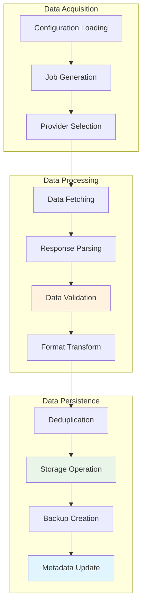
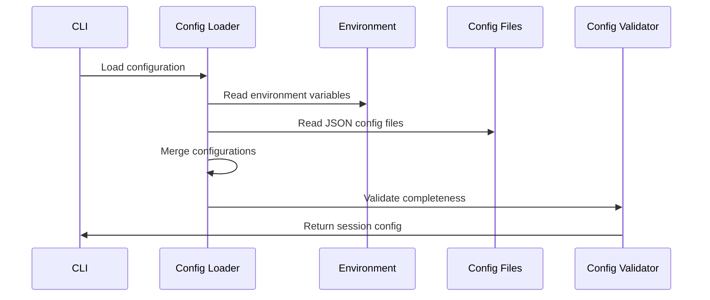
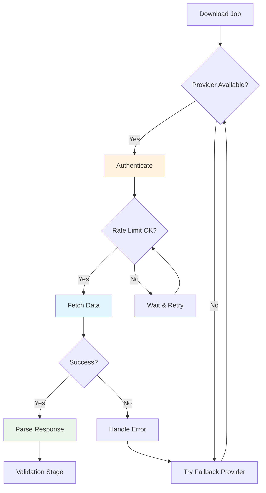
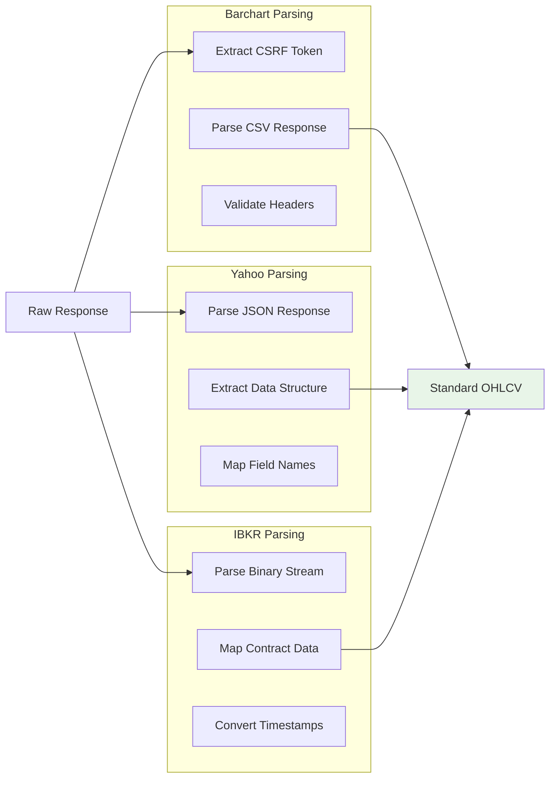
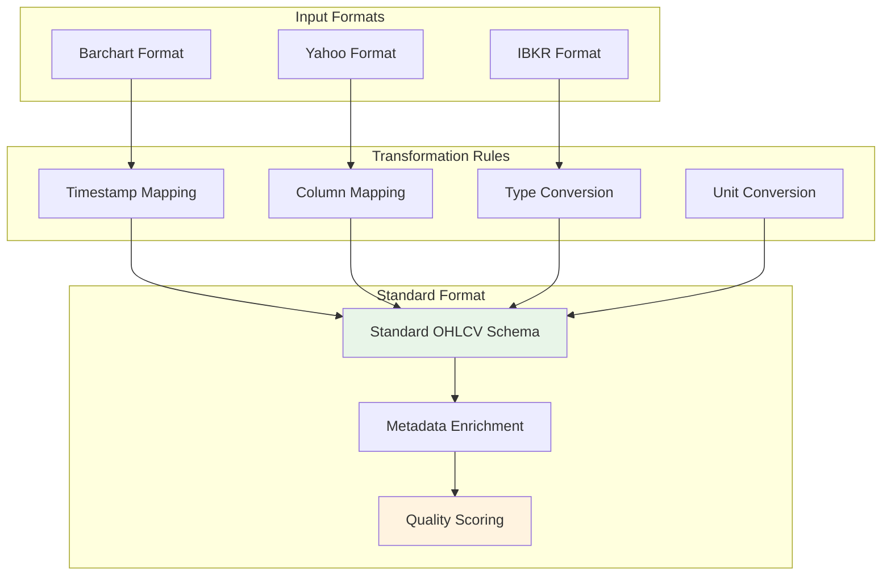
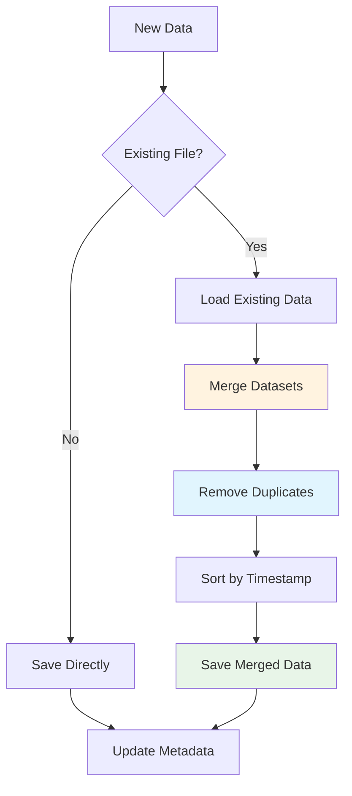
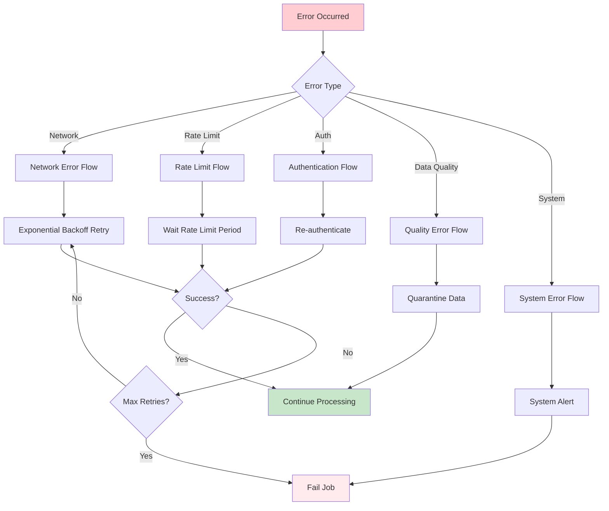
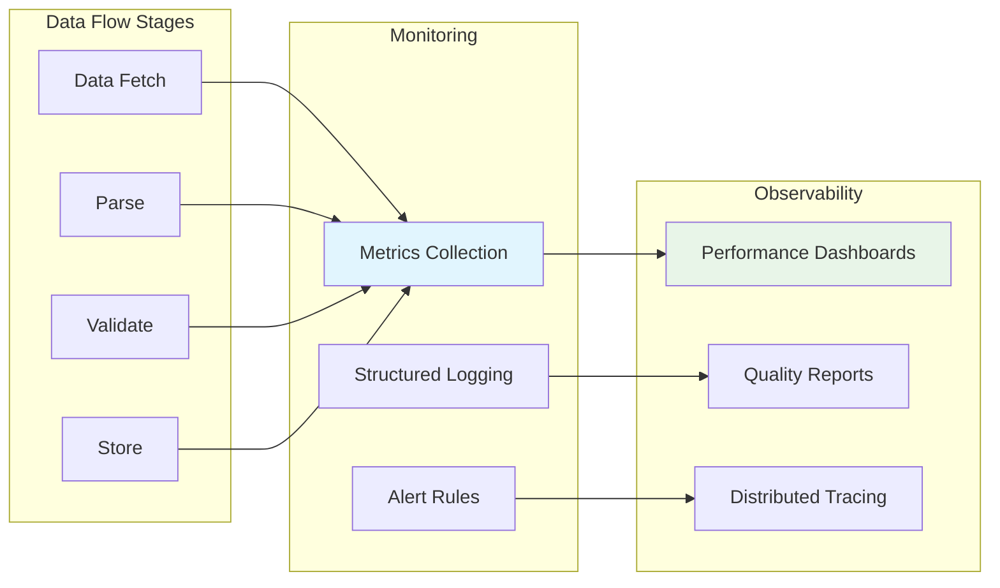

# BC-Utils Data Flow Design

**Version:** 1.0  
**Date:** 2025-01-08  
**Related:** [Component Architecture](02-component-architecture.md) | [Provider Abstraction](04-provider-abstraction.md)

## 1. Data Flow Overview

### 1.1 End-to-End Pipeline
BC-Utils implements a linear data processing pipeline with clear stages, error handling, and validation checkpoints at each transformation.



### 1.2 Data States and Transformations
| State | Format | Location | Purpose |
|-------|--------|----------|---------|
| **Raw** | Provider-specific | Memory buffer | Initial API response |
| **Parsed** | Python objects | Memory | Structured data objects |
| **Validated** | pandas DataFrame | Memory | Quality-assured data |
| **Standardized** | Standard OHLCV | Memory | Unified format |
| **Persisted** | CSV/Parquet | File system | Long-term storage |

## 2. Detailed Data Flow Stages

### 2.1 Configuration and Job Generation

#### Configuration Loading Flow


#### Job Generation Process
```python
def generate_download_jobs(config: SessionConfig) -> List[DownloadJob]:
    """Generate individual download jobs from configuration"""
    jobs = []
    
    for instrument_name, instrument_config in config.instruments.items():
        # 1. Create instrument object
        instrument = create_instrument(instrument_config)
        
        # 2. Generate date ranges
        date_ranges = generate_date_ranges(
            start_date=config.start_date,
            end_date=config.end_date,
            chunk_size=config.chunk_size_days
        )
        
        # 3. Create jobs for each date range
        for date_range in date_ranges:
            job = DownloadJob(
                instrument=instrument,
                date_range=date_range,
                provider=config.provider,
                output_path=generate_output_path(instrument, date_range),
                retry_config=config.retry_config
            )
            jobs.append(job)
    
    return jobs
```

### 2.2 Provider Selection and Data Fetching

#### Provider Selection Logic


#### Data Fetching Strategy
The data fetching process implements several resilience patterns:

**Rate Limit Management:**
- Check provider limits before requests
- Automatic retry with appropriate delays
- Daily and hourly quota tracking

**Authentication Handling:**
- Automatic re-authentication on failures
- Session management for session-based providers
- Token refresh for OAuth providers

**Error Recovery:**
- Exponential backoff for transient errors
- Provider fallback for critical failures
- Graceful degradation when possible

*Detailed data fetching implementation available in [Data Processing Implementation](../lld/02-data-processing-implementation.md)*

### 2.3 Data Parsing and Validation

#### Parsing Flow by Provider


#### Data Validation Strategy
The validation pipeline applies multiple layers of data quality checks:

**Schema Validation:**
- Required column presence verification
- Data type consistency checking
- Format validation (timestamps, numeric ranges)

**Business Rule Validation:**
- OHLC price relationship consistency
- Volume non-negativity constraints
- Instrument-specific business rules
- Market hours and trading calendar validation

**Statistical Validation:**
- Outlier detection using statistical methods
- Price movement reasonableness checks
- Volume pattern analysis
- Data completeness assessment

**Temporal Validation:**
- Timestamp monotonicity verification
- Duplicate timestamp detection
- Market schedule compliance
- Data freshness validation

*Detailed validation implementation available in [Data Processing Implementation](../lld/02-data-processing-implementation.md)*

### 2.4 Data Transformation and Standardization

#### Format Standardization Process


#### Data Transformation Architecture
The transformation layer converts provider-specific formats into the standard OHLCV schema:

**Column Standardization:**
- Provider-specific column mapping to standard names
- Data type normalization (float64 for prices, int64 for volume)
- Unit conversion where necessary

**Timestamp Standardization:**
- All timestamps converted to UTC
- Provider-specific timezone handling
- ISO 8601 format enforcement

**Metadata Enrichment:**
- Provider attribution for audit trails
- Symbol normalization across providers
- Data quality scoring

**Output Format:**
- Standard OHLCV columns: timestamp, open, high, low, close, volume
- Metadata columns: symbol, provider
- Sorted by timestamp for consistency

*Detailed transformation implementation available in [Data Processing Implementation](../lld/02-data-processing-implementation.md)*

### 2.5 Deduplication and Storage

#### Deduplication Logic


#### Storage Operation Strategy
The storage layer implements several patterns for data integrity and performance:

**Deduplication Strategy:**
- Timestamp and symbol-based duplicate detection
- Conflict resolution using provider preference
- Last-update-wins for conflicting data points

**Atomic Operations:**
- Temporary file staging for atomic writes
- Rollback capability on storage failures
- Metadata consistency with data files

**Data Validation:**
- Minimum data threshold enforcement
- Pre-storage validation checks
- Quality gate before persistence

**Metadata Management:**
- Automatic metadata generation and updates
- Dataset statistics tracking
- Audit trail maintenance

*Detailed storage implementation available in [Storage Implementation](../lld/04-storage-implementation.md)*

## 3. Error Handling and Recovery

### 3.1 Error Classification


### 3.2 Recovery Strategies
| Error Type | Strategy | Implementation |
|------------|----------|----------------|
| **Network Timeout** | Exponential backoff | Retry with 2^n second delays |
| **Rate Limit** | Wait and retry | Sleep for provider-specified duration |
| **Authentication** | Token refresh | Re-authenticate and retry request |
| **Data Quality** | Quarantine | Save to separate location for review |
| **Disk Full** | Cleanup and retry | Remove old temp files, then retry |

## 4. Performance Optimization

### 4.1 Processing Pipeline Optimization
- **Streaming Processing:** Process data chunks instead of loading entire datasets
- **Parallel Downloads:** Concurrent provider requests within rate limits
- **Memory Management:** Explicit DataFrame cleanup after processing
- **Disk I/O Optimization:** Batch writes and temporary file management

### 4.2 Performance Optimization Strategy
The data flow pipeline implements several optimization patterns:

**Caching Strategy:**
- Intelligent memory-based caching with LRU eviction
- TTL-based cache invalidation for data freshness
- Size-aware cache management to prevent memory issues

**Parallel Processing:**
- Concurrent provider requests within rate limits
- Parallel data transformation and validation
- Asynchronous storage operations

**Memory Management:**
- Streaming data processing for large datasets
- Explicit DataFrame cleanup after processing
- Memory usage monitoring and alerting

**I/O Optimization:**
- Batch storage operations to reduce overhead
- Temporary file management for atomic writes
- Efficient file format selection (CSV vs Parquet)

*Detailed performance implementation available in [Data Processing Implementation](../lld/02-data-processing-implementation.md)*

## 5. Data Flow Monitoring

### 5.1 Flow Monitoring Strategy
The data flow monitoring provides comprehensive visibility into system performance:

**Performance Metrics:**
- Stage-level timing for bottleneck identification
- Throughput metrics (rows per second, MB per second)
- Error rates and failure pattern analysis
- Resource utilization (CPU, memory, disk I/O)

**Quality Metrics:**
- Data validation success rates
- Quality score distributions
- Provider-specific reliability metrics
- Data completeness and accuracy tracking

**Operational Metrics:**
- Job completion rates and durations
- Provider availability and response times
- Storage performance and capacity utilization
- System health and alerting thresholds

*Detailed monitoring implementation available in [Data Processing Implementation](../lld/02-data-processing-implementation.md)*

### 5.2 Flow Observability


## 6. Integration Points

### 6.1 Upstream Dependencies
- **Configuration System:** Provides job parameters and settings
- **Provider Authenticator:** Supplies valid credentials
- **Scheduler:** Triggers data flow execution

### 6.2 Downstream Consumers
- **Analytics Pipeline:** Consumes standardized data files
- **Backup System:** Replicates data to secondary storage
- **Monitoring System:** Tracks flow health and performance

## Related Documents

- **[Component Architecture](02-component-architecture.md)** - Implementation details for flow components
- **[Provider Abstraction](04-provider-abstraction.md)** - Data provider interface design
- **[Storage Architecture](05-storage-architecture.md)** - Storage layer implementation
- **[Data Requirements](../../requirements/prd/data-requirements.md)** - Data format specifications

---

**Next Review:** 2025-02-08  
**Reviewers:** Senior Developer, Data Engineer, QA Lead