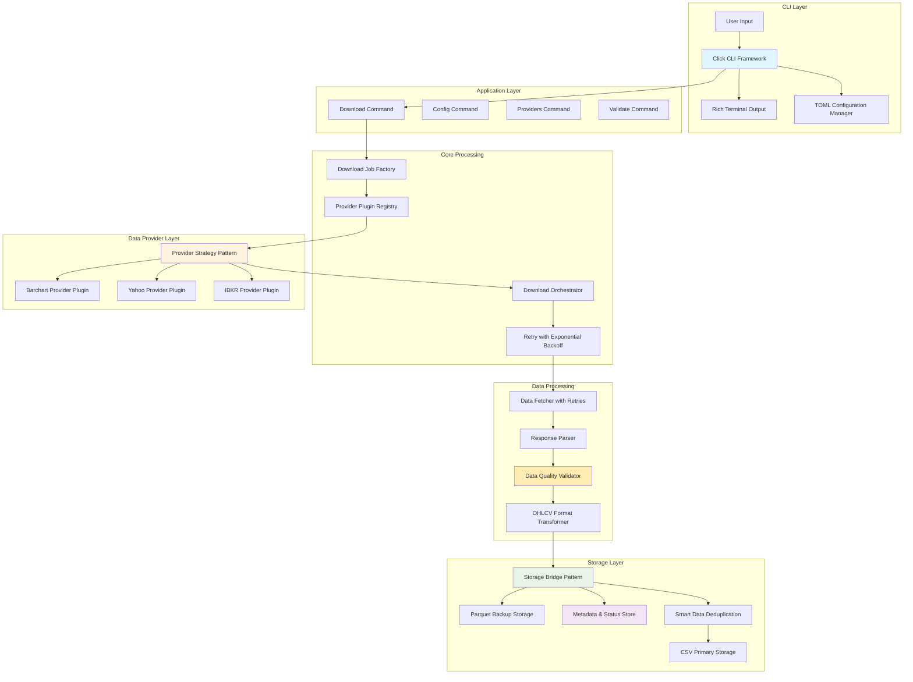
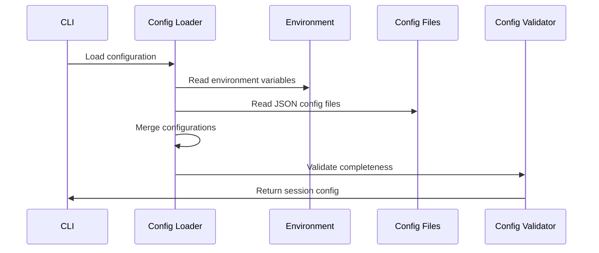
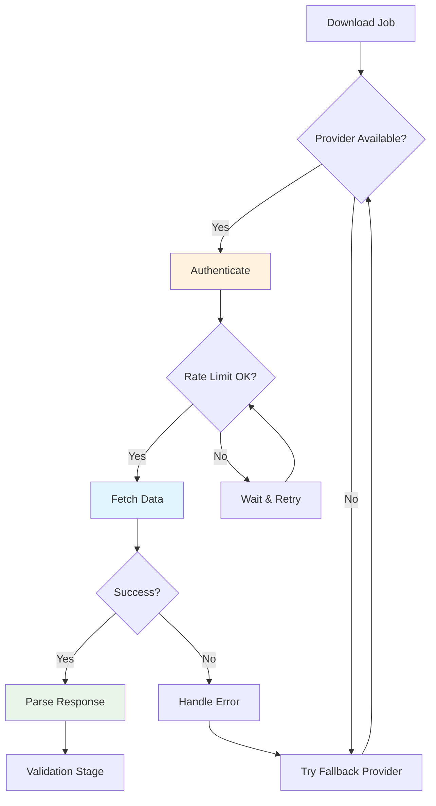
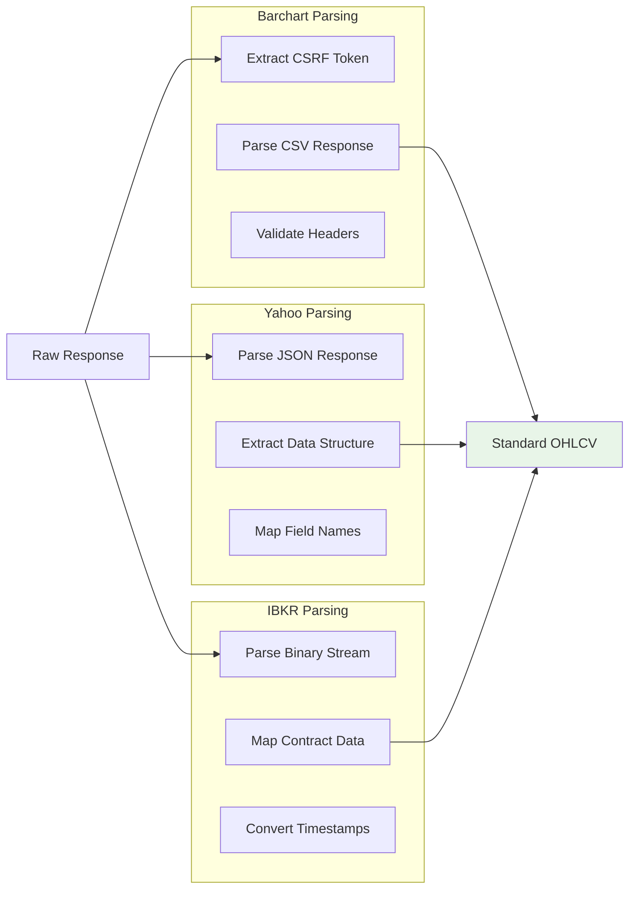
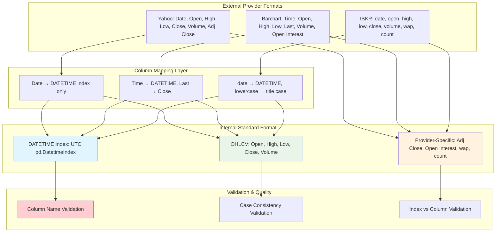
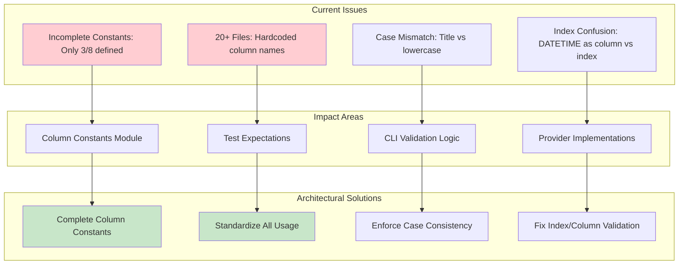
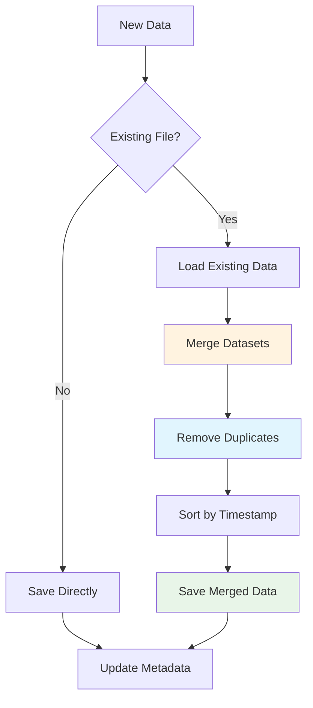
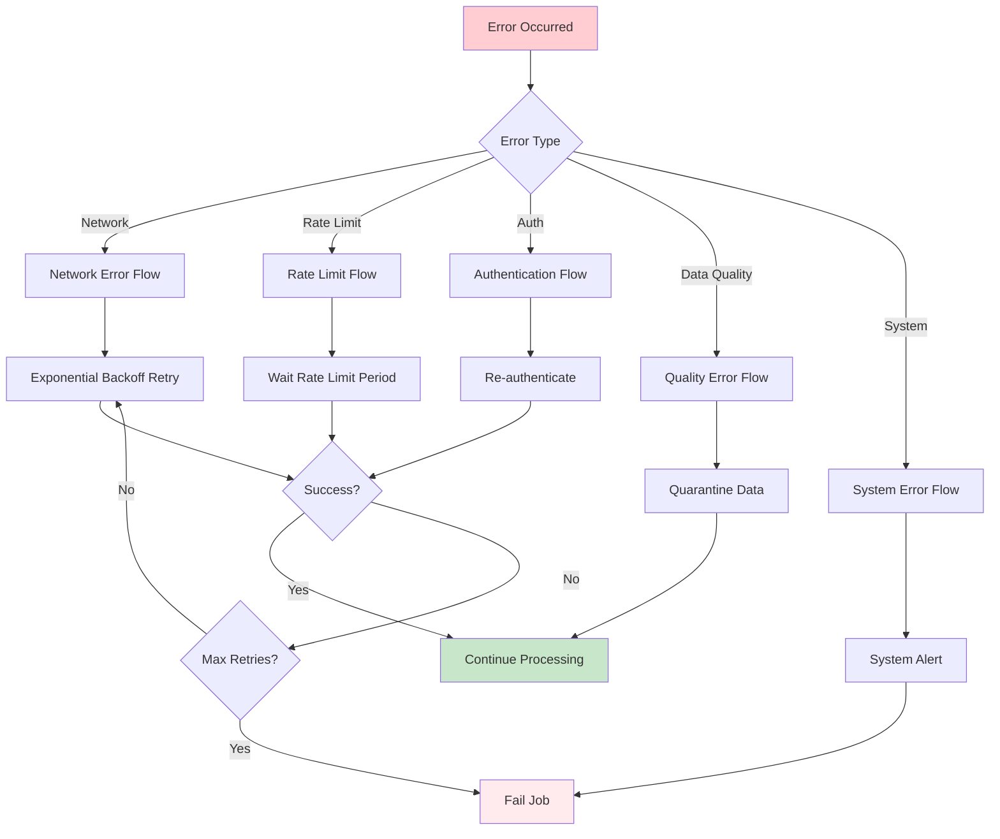
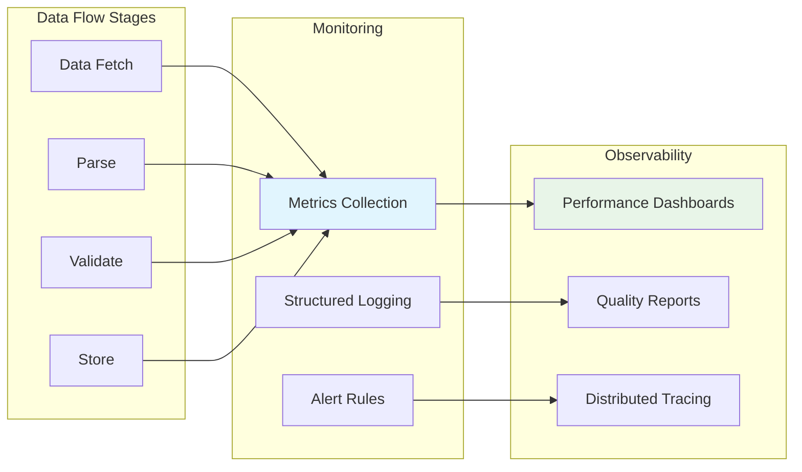

# Vortex Data Flow Design

**Version:** 2.0  
**Date:** 2025-08-04  
**Related:** [Component Architecture](02-component-architecture.md) | [Provider Abstraction](04-provider-abstraction.md)

## 1. Data Flow Overview

### 1.1 Modern CLI-Driven Pipeline
Vortex implements a sophisticated data processing pipeline with modern CLI interface, plugin architecture, comprehensive error handling, and dual-format storage with validation checkpoints.



### 1.2 Data Flow Architecture Principles

**Plugin-Based Extensibility:** Modern plugin architecture using registry pattern enables adding new data providers without modifying core system components.

**CLI-First Design:** Rich Click-based CLI provides professional user experience with progress bars, colored output, and comprehensive help system.

**Configuration-Driven Operation:** TOML-based configuration with environment variable overrides and interactive setup wizards.

**Dual Storage Strategy:** Primary CSV storage for human readability and analytics, with Parquet backup for performance and compression.

**Comprehensive Error Handling:** Hierarchical exception system with provider-specific error handling and user-friendly error messages.

### 1.3 Data States and Transformations
| State | Format | Location | Purpose |
|-------|--------|----------|---------|
| **Raw** | Provider-specific | Memory buffer | Initial API response |
| **Parsed** | Python objects | Memory | Structured data objects |
| **Validated** | pandas DataFrame | Memory | Quality-assured data |
| **Standardized** | Standard OHLCV | Memory | Unified format |
| **Persisted** | CSV/Parquet | File system | Long-term storage |

## 2. Detailed Data Flow Stages

### 2.1 Configuration and Job Generation

#### Configuration Loading Flow


#### Job Generation Architecture
The job generation process transforms high-level configuration into executable download tasks through a systematic decomposition strategy:

**Job Generation Design Patterns:**
- **Configuration Transformation:** Convert user-defined parameters into structured job definitions
- **Date Range Segmentation:** Break large date ranges into manageable chunks for processing
- **Instrument Mapping:** Transform configuration symbols into typed instrument objects
- **Path Generation:** Create standardized output file paths based on instrument and date patterns

**Job Generation Strategy:**
- **Batch Processing:** Generate all jobs upfront for scheduling optimization
- **Resource Planning:** Consider rate limits and provider constraints during job creation
- **Dependency Management:** Ensure job order respects data dependencies
- **Error Isolation:** Structure jobs to minimize failure impact scope

### 2.2 Provider Selection and Data Fetching

#### Provider Selection Logic


#### Data Fetching Strategy
The data fetching process implements several resilience patterns:

**Rate Limit Management:**
- Check provider limits before requests
- Automatic retry with appropriate delays
- Daily and hourly quota tracking

**Authentication Handling:**
- Automatic re-authentication on failures
- Session management for session-based providers
- Token refresh for OAuth providers

**Error Recovery:**
- Exponential backoff for transient errors
- Provider fallback for critical failures
- Graceful degradation when possible

*Detailed data fetching implementation available in [Data Processing Implementation](../lld/02-data-processing-implementation.md)*

### 2.3 Data Parsing and Validation

#### Parsing Flow by Provider


#### Data Validation Strategy
The validation pipeline applies multiple layers of data quality checks:

**Schema Validation:**
- Required column presence verification
- Data type consistency checking
- Format validation (timestamps, numeric ranges)

**Business Rule Validation:**
- OHLC price relationship consistency
- Volume non-negativity constraints
- Instrument-specific business rules
- Market hours and trading calendar validation

**Statistical Validation:**
- Outlier detection using statistical methods
- Price movement reasonableness checks
- Volume pattern analysis
- Data completeness assessment

**Temporal Validation:**
- Timestamp monotonicity verification
- Duplicate timestamp detection
- Market schedule compliance
- Data freshness validation

*Detailed validation implementation available in [Data Processing Implementation](../lld/02-data-processing-implementation.md)*

### 2.4 Data Transformation and Standardization

#### Format Standardization Process


#### Data Transformation Architecture
The transformation layer converts provider-specific formats into the standard OHLCV schema through a comprehensive column mapping system:

**Column Standardization Process:**
- **External Format Preservation:** Provider-specific column names maintained during ingestion
- **Mapping Layer:** Each provider implements explicit column transformation rules
- **Internal Standard:** All providers output consistent DATETIME index + title-case OHLCV columns
- **Provider-Specific Preservation:** Additional columns (Adj Close, WAP, Open Interest) preserved as-is

**Column Transformation Rules by Provider:**

| Provider | External Format | Transformation | Internal Standard |
|----------|----------------|----------------|-------------------|
| **Yahoo** | `Date` (index), `Open`, `High`, `Low`, `Close`, `Volume`, `Adj Close` | `Date` → `DATETIME` (index only) | `DATETIME` (index), `Open`, `High`, `Low`, `Close`, `Volume`, `Adj Close` |
| **Barchart** | `Time`, `Open`, `High`, `Low`, `Last`, `Volume`, `Open Interest` | `Time` → `DATETIME`, `Last` → `Close` | `DATETIME` (index), `Open`, `High`, `Low`, `Close`, `Volume`, `Open Interest` |
| **IBKR** | `date`, `open`, `high`, `low`, `close`, `volume`, `wap`, `count` | All OHLCV: lowercase → title case, `date` → `DATETIME` | `DATETIME` (index), `Open`, `High`, `Low`, `Close`, `Volume`, `wap`, `count` |

**Data Type Standardization:**
- float64 for all price columns (Open, High, Low, Close)
- int64 for Volume column
- Provider-specific columns maintain original data types

**Timestamp Standardization:**
- All timestamps converted to UTC pandas DatetimeIndex
- Provider-specific timezone handling (Yahoo: Date, Barchart: Time, IBKR: date)
- ISO 8601 format enforcement with timezone awareness

**Metadata Enrichment:**
- Provider attribution for audit trails
- Symbol normalization across providers
- Data quality scoring and validation flags

**Final Output Schema:**
- **Index:** `DATETIME` (pd.DatetimeIndex, UTC timezone)
- **Standard Columns:** `Open`, `High`, `Low`, `Close`, `Volume` (title case)
- **Metadata Columns:** `symbol`, `provider`
- **Provider-Specific:** Preserved with original names and casing
- **Sorting:** Chronologically sorted by DATETIME index

*Detailed transformation implementation available in [Data Processing Implementation](../lld/02-data-processing-implementation.md)*

#### Column Standardization Challenges & Solutions

**Critical Architecture Issue Identified:**
Comprehensive analysis revealed severe column name inconsistencies throughout the system affecting maintainability and reliability.

**Problem Analysis:**


**Required Architecture Fixes:**
1. **Complete Column Constants Module** (`models/columns.py`):
   ```python
   # Missing constants that must be added:
   OPEN_COLUMN = "Open"
   HIGH_COLUMN = "High" 
   LOW_COLUMN = "Low"
   DATE_COLUMN = "Date"  # For Yahoo provider mapping
   ```

2. **Standardize Column Usage Across Codebase:**
   - Update 20+ files using hardcoded column names
   - Fix CLI validation logic case sensitivity
   - Correct test expectations (lowercase → title case)
   - Update provider mapping implementations

3. **Validation Logic Architecture:**
   - **Index Validation:** `df.index.name == 'DATETIME'` (not `'DATETIME' in df.columns`)
   - **Column Validation:** Exact case matching for `['Open', 'High', 'Low', 'Close', 'Volume']`
   - **Provider Column Preservation:** Flexible handling of additional columns

**Data Flow Impact:**
This standardization is critical for the transformation layer reliability. Without proper column constants and validation, the data pipeline becomes fragile and error-prone during provider integration and data quality validation phases.

*Detailed transformation implementation available in [Data Processing Implementation](../lld/02-data-processing-implementation.md)*

### 2.5 Deduplication and Storage

#### Deduplication Logic


#### Storage Operation Strategy
The storage layer implements several patterns for data integrity and performance:

**Deduplication Strategy:**
- Timestamp and symbol-based duplicate detection
- Conflict resolution using provider preference
- Last-update-wins for conflicting data points

**Atomic Operations:**
- Temporary file staging for atomic writes
- Rollback capability on storage failures
- Metadata consistency with data files

**Data Validation:**
- Minimum data threshold enforcement
- Pre-storage validation checks
- Quality gate before persistence

**Metadata Management:**
- Automatic metadata generation and updates
- Dataset statistics tracking
- Audit trail maintenance

*Detailed storage implementation available in [Storage Implementation](../lld/04-storage-implementation.md)*

## 3. Error Handling and Recovery

### 3.1 Error Classification


### 3.2 Recovery Strategies
| Error Type | Strategy | Implementation |
|------------|----------|----------------|
| **Network Timeout** | Exponential backoff | Retry with 2^n second delays |
| **Rate Limit** | Wait and retry | Sleep for provider-specified duration |
| **Authentication** | Token refresh | Re-authenticate and retry request |
| **Data Quality** | Quarantine | Save to separate location for review |
| **Disk Full** | Cleanup and retry | Remove old temp files, then retry |

## 4. Performance Optimization

### 4.1 Performance Architecture Strategy
The data flow pipeline implements a multi-layered performance optimization approach that balances throughput, memory efficiency, and system stability:

**Performance Design Principles:**
- **Resource Efficiency:** Minimize memory footprint through streaming and chunked processing
- **Concurrent Execution:** Maximize throughput within provider rate limits
- **Intelligent Caching:** Strategic data caching to reduce redundant operations
- **I/O Optimization:** Efficient storage patterns and atomic operations

### 4.2 Performance Optimization Patterns
The system employs several architectural patterns to achieve optimal performance across different workload scenarios:

**Caching Architecture:**
- **Multi-Level Caching:** Memory and disk-based caching with intelligent eviction policies
- **Cache Coherency:** TTL-based invalidation and freshness validation
- **Adaptive Sizing:** Dynamic cache size management based on available resources

**Concurrency Architecture:**
- **Bounded Parallelism:** Controlled concurrent execution within provider constraints
- **Asynchronous Processing:** Non-blocking I/O operations for improved throughput
- **Load Balancing:** Even distribution of work across available resources

**Memory Management Architecture:**
- **Streaming Processing:** Process large datasets without loading entirely into memory
- **Resource Monitoring:** Active memory usage tracking and cleanup
- **Garbage Collection:** Proactive cleanup of intermediate processing artifacts

**Storage Optimization Architecture:**
- **Batch Operations:** Grouped storage operations to reduce I/O overhead
- **Format Selection:** Optimal file format choice based on usage patterns
- **Atomic Transactions:** Safe storage operations with rollback capabilities

*Detailed performance implementation available in [Data Processing Implementation](../lld/02-data-processing-implementation.md)*

## 5. Data Flow Monitoring

### 5.1 Monitoring Architecture Strategy
The data flow monitoring system provides comprehensive observability into system performance, data quality, and operational health through a multi-dimensional metrics framework:

**Monitoring Design Framework:**
- **Performance Observability:** Real-time visibility into processing throughput and bottlenecks
- **Quality Assurance:** Continuous monitoring of data integrity and validation success
- **Operational Intelligence:** System health tracking and predictive alerting
- **Provider Analytics:** External dependency performance and reliability tracking

**Monitoring Architecture Patterns:**
- **Metrics Collection:** Multi-layered metric aggregation from all system components
- **Real-Time Alerting:** Threshold-based notification system for operational issues
- **Historical Analysis:** Trend analysis and capacity planning through metric retention
- **Dashboard Visualization:** Executive and operational dashboards for different stakeholder needs

**Observability Categories:**
- **System Performance:** Processing speed, resource utilization, and capacity metrics
- **Data Quality:** Validation rates, error patterns, and data completeness tracking
- **Provider Reliability:** External service availability, response times, and error rates
- **Business Metrics:** Download success rates, data coverage, and user satisfaction

*Detailed monitoring implementation available in [Data Processing Implementation](../lld/02-data-processing-implementation.md)*

### 5.2 Flow Observability


## 6. Integration Points

### 6.1 Upstream Dependencies
- **Configuration System:** Provides job parameters and settings
- **Provider Authenticator:** Supplies valid credentials
- **Scheduler:** Triggers data flow execution

### 6.2 Downstream Consumers
- **Analytics Pipeline:** Consumes standardized data files
- **Backup System:** Replicates data to secondary storage
- **Monitoring System:** Tracks flow health and performance

## Related Documents

- **[Component Architecture](02-component-architecture.md)** - Implementation details for flow components
- **[Provider Abstraction](04-provider-abstraction.md)** - Data provider interface design
- **[Storage Architecture](05-storage-architecture.md)** - Storage layer implementation
- **[Data Requirements](../../requirements/prd/data-requirements.md)** - Data format specifications

---

**Next Review:** 2025-09-04  
**Reviewers:** Senior Developer, Data Engineer, QA Lead