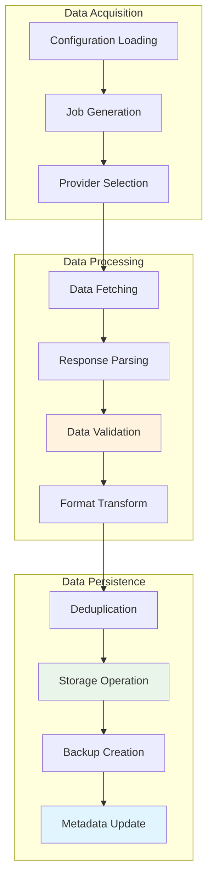
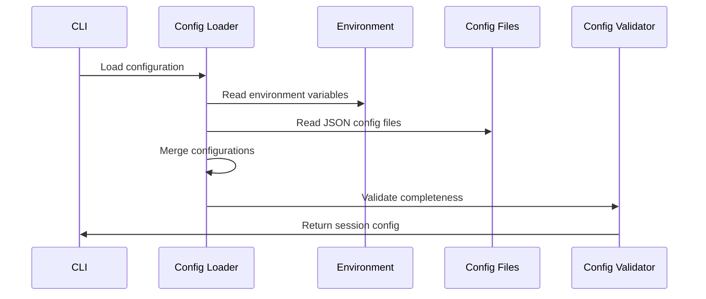
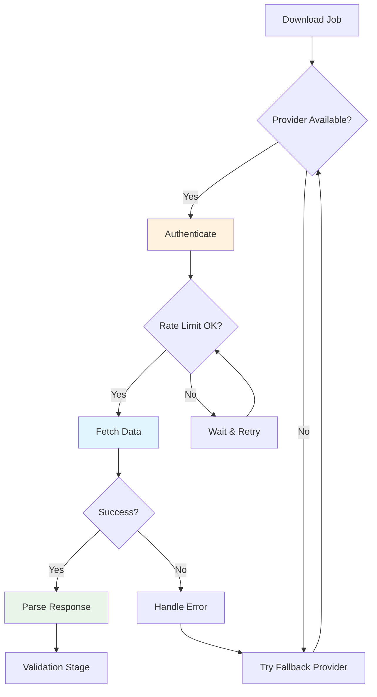
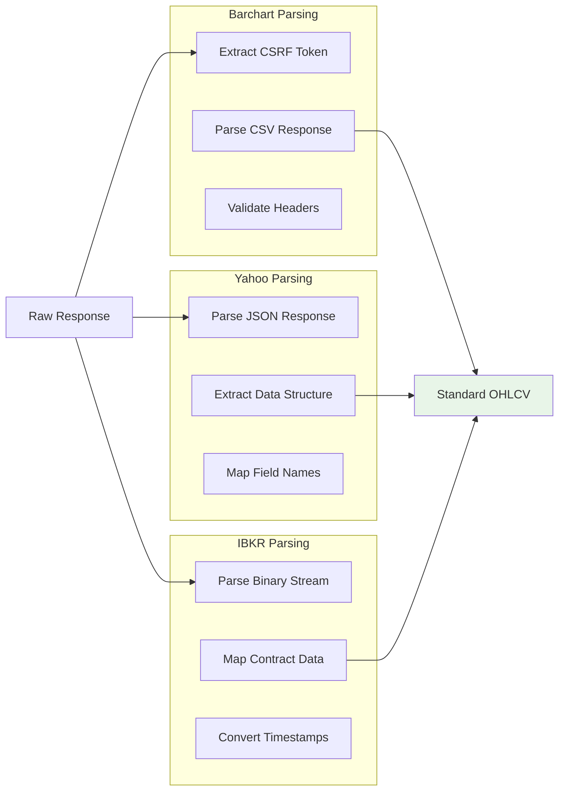
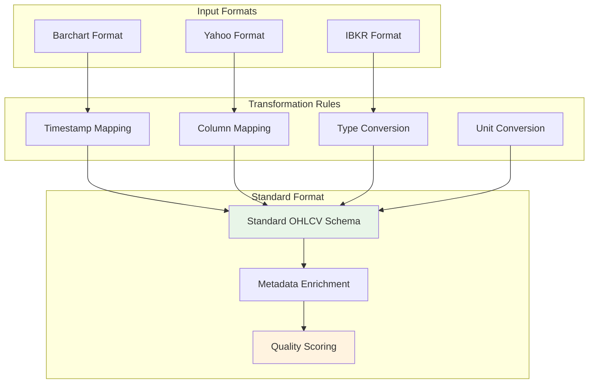
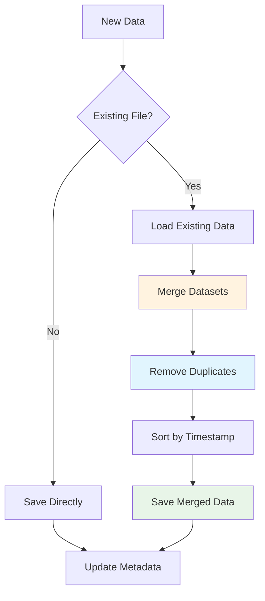
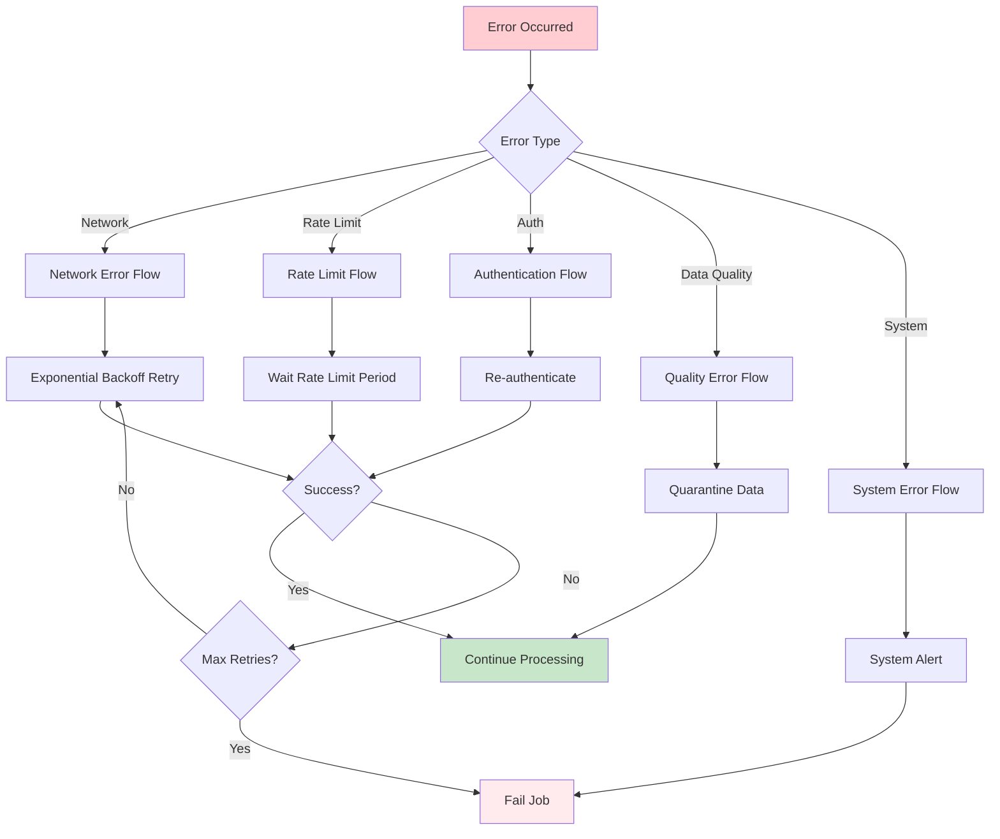
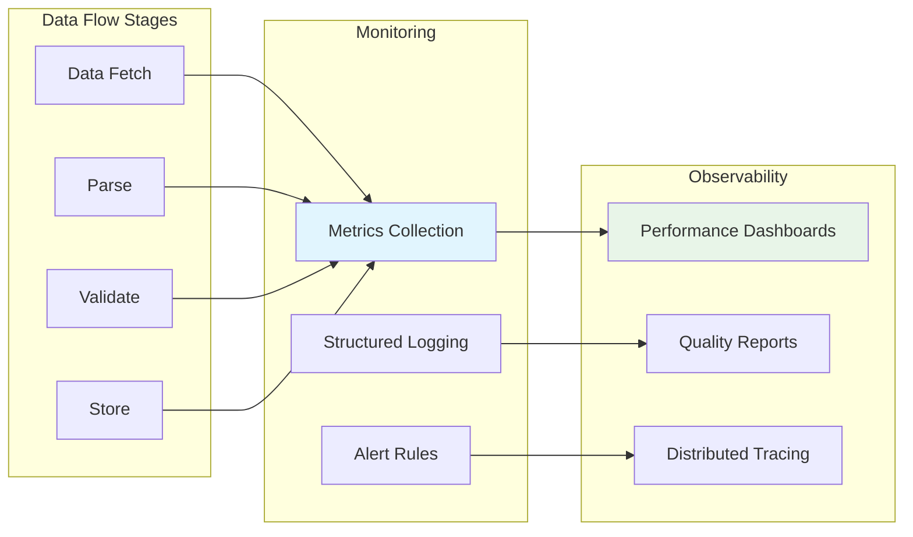

# BC-Utils Data Flow Design

**Version:** 1.0  
**Date:** 2025-01-08  
**Related:** [Component Architecture](02-component-architecture.md) | [Provider Abstraction](04-provider-abstraction.md)

## 1. Data Flow Overview

### 1.1 End-to-End Pipeline
BC-Utils implements a linear data processing pipeline with clear stages, error handling, and validation checkpoints at each transformation.



### 1.2 Data States and Transformations
| State | Format | Location | Purpose |
|-------|--------|----------|---------|
| **Raw** | Provider-specific | Memory buffer | Initial API response |
| **Parsed** | Python objects | Memory | Structured data objects |
| **Validated** | pandas DataFrame | Memory | Quality-assured data |
| **Standardized** | Standard OHLCV | Memory | Unified format |
| **Persisted** | CSV/Parquet | File system | Long-term storage |

## 2. Detailed Data Flow Stages

### 2.1 Configuration and Job Generation

#### Configuration Loading Flow


#### Job Generation Process
```python
def generate_download_jobs(config: SessionConfig) -> List[DownloadJob]:
    """Generate individual download jobs from configuration"""
    jobs = []
    
    for instrument_name, instrument_config in config.instruments.items():
        # 1. Create instrument object
        instrument = create_instrument(instrument_config)
        
        # 2. Generate date ranges
        date_ranges = generate_date_ranges(
            start_date=config.start_date,
            end_date=config.end_date,
            chunk_size=config.chunk_size_days
        )
        
        # 3. Create jobs for each date range
        for date_range in date_ranges:
            job = DownloadJob(
                instrument=instrument,
                date_range=date_range,
                provider=config.provider,
                output_path=generate_output_path(instrument, date_range),
                retry_config=config.retry_config
            )
            jobs.append(job)
    
    return jobs
```

### 2.2 Provider Selection and Data Fetching

#### Provider Selection Logic


#### Data Fetching Implementation
```python
def fetch_instrument_data(job: DownloadJob) -> RawDataResponse:
    """Fetch data from provider with error handling"""
    provider = job.provider
    
    try:
        # 1. Check rate limits
        provider.check_rate_limit()
        
        # 2. Build request parameters
        request_params = provider.build_request_params(
            instrument=job.instrument,
            start_date=job.date_range.start,
            end_date=job.date_range.end
        )
        
        # 3. Execute request with retry logic
        response = provider.execute_request(request_params)
        
        # 4. Validate response format
        if not provider.validate_response(response):
            raise DataProviderError("Invalid response format")
        
        return RawDataResponse(
            data=response.content,
            headers=response.headers,
            metadata=provider.extract_metadata(response),
            timestamp=datetime.utcnow()
        )
        
    except RateLimitError:
        # Wait and retry
        time.sleep(provider.get_rate_limit_wait_time())
        return fetch_instrument_data(job)  # Recursive retry
        
    except AuthenticationError:
        # Re-authenticate and retry
        provider.authenticate()
        return fetch_instrument_data(job)
        
    except Exception as e:
        # Log error and try fallback provider
        logger.error(f"Fetch failed for {job.instrument}: {e}")
        raise DataAcquisitionError(f"Failed to fetch data: {e}")
```

### 2.3 Data Parsing and Validation

#### Parsing Flow by Provider


#### Data Validation Pipeline
```python
class DataValidator:
    """Comprehensive data validation pipeline"""
    
    def validate_data(self, data: pd.DataFrame, instrument: Instrument) -> ValidationResult:
        """Apply all validation rules to dataset"""
        errors = []
        warnings = []
        
        # 1. Schema validation
        schema_result = self._validate_schema(data)
        errors.extend(schema_result.errors)
        
        # 2. Business logic validation
        business_result = self._validate_business_rules(data, instrument)
        errors.extend(business_result.errors)
        warnings.extend(business_result.warnings)
        
        # 3. Statistical validation
        stats_result = self._validate_statistical_properties(data)
        warnings.extend(stats_result.warnings)
        
        # 4. Temporal validation
        temporal_result = self._validate_temporal_consistency(data)
        errors.extend(temporal_result.errors)
        
        return ValidationResult(
            is_valid=len(errors) == 0,
            errors=errors,
            warnings=warnings,
            quality_score=self._calculate_quality_score(data, errors, warnings)
        )
    
    def _validate_business_rules(self, data: pd.DataFrame, instrument: Instrument):
        """Validate financial data business rules"""
        errors = []
        warnings = []
        
        # Price relationship validation
        invalid_prices = data[
            (data['high'] < data['open']) |
            (data['high'] < data['close']) |
            (data['low'] > data['open']) |
            (data['low'] > data['close'])
        ]
        
        if len(invalid_prices) > 0:
            errors.append(f"Invalid OHLC relationships in {len(invalid_prices)} rows")
        
        # Volume validation
        negative_volume = data[data['volume'] < 0]
        if len(negative_volume) > 0:
            errors.append(f"Negative volume in {len(negative_volume)} rows")
        
        # Price movement validation
        price_changes = data['close'].pct_change().abs()
        extreme_moves = price_changes > instrument.max_daily_move
        
        if extreme_moves.any():
            warnings.append(f"Extreme price movements detected: {extreme_moves.sum()} instances")
        
        return ValidationResult(errors=errors, warnings=warnings)
```

### 2.4 Data Transformation and Standardization

#### Format Standardization Process


#### Transformation Implementation
```python
class DataTransformer:
    """Transform provider-specific data to standard format"""
    
    STANDARD_COLUMNS = ['timestamp', 'open', 'high', 'low', 'close', 'volume', 'symbol', 'provider']
    
    def transform_to_standard(self, data: pd.DataFrame, provider: str, instrument: Instrument) -> pd.DataFrame:
        """Transform data to standard OHLCV format"""
        
        # 1. Apply provider-specific column mapping
        mapped_data = self._apply_column_mapping(data, provider)
        
        # 2. Standardize timestamps
        mapped_data['timestamp'] = self._standardize_timestamps(
            mapped_data['timestamp'], 
            provider
        )
        
        # 3. Convert data types
        mapped_data = self._convert_data_types(mapped_data)
        
        # 4. Add metadata columns
        mapped_data['symbol'] = instrument.symbol
        mapped_data['provider'] = provider
        
        # 5. Sort by timestamp
        mapped_data = mapped_data.sort_values('timestamp').reset_index(drop=True)
        
        # 6. Select only standard columns
        return mapped_data[self.STANDARD_COLUMNS]
    
    def _standardize_timestamps(self, timestamps: pd.Series, provider: str) -> pd.Series:
        """Convert timestamps to UTC ISO format"""
        if provider == 'barchart':
            # Barchart uses EST/EDT, convert to UTC
            return pd.to_datetime(timestamps).dt.tz_localize('US/Eastern').dt.tz_convert('UTC')
        elif provider == 'yahoo':
            # Yahoo already in UTC
            return pd.to_datetime(timestamps, utc=True)
        elif provider == 'ibkr':
            # IBKR uses Unix timestamps
            return pd.to_datetime(timestamps, unit='s', utc=True)
```

### 2.5 Deduplication and Storage

#### Deduplication Logic


#### Storage Operation Flow
```python
def save_with_deduplication(data: pd.DataFrame, filepath: str, storage: DataStorage) -> SaveResult:
    """Save data with automatic deduplication"""
    
    # 1. Check if file already exists
    if storage.file_exists(filepath):
        # Load existing data
        existing_data = storage.load(filepath)
        
        # Merge with new data
        combined_data = pd.concat([existing_data, data])
        
        # Remove duplicates (keep last occurrence)
        deduped_data = combined_data.drop_duplicates(
            subset=['timestamp', 'symbol'], 
            keep='last'
        )
        
        # Sort by timestamp
        final_data = deduped_data.sort_values('timestamp').reset_index(drop=True)
        
    else:
        final_data = data.sort_values('timestamp').reset_index(drop=True)
    
    # 2. Validate data before saving
    if len(final_data) < MIN_DATA_THRESHOLD:
        return SaveResult(success=False, reason="Insufficient data")
    
    # 3. Atomic save operation
    temp_filepath = f"{filepath}.tmp"
    storage.save(final_data, temp_filepath)
    storage.move_file(temp_filepath, filepath)
    
    # 4. Update metadata
    metadata = DatasetMetadata(
        filepath=filepath,
        row_count=len(final_data),
        date_range=(final_data['timestamp'].min(), final_data['timestamp'].max()),
        last_updated=datetime.utcnow()
    )
    storage.update_metadata(metadata)
    
    return SaveResult(success=True, row_count=len(final_data))
```

## 3. Error Handling and Recovery

### 3.1 Error Classification


### 3.2 Recovery Strategies
| Error Type | Strategy | Implementation |
|------------|----------|----------------|
| **Network Timeout** | Exponential backoff | Retry with 2^n second delays |
| **Rate Limit** | Wait and retry | Sleep for provider-specified duration |
| **Authentication** | Token refresh | Re-authenticate and retry request |
| **Data Quality** | Quarantine | Save to separate location for review |
| **Disk Full** | Cleanup and retry | Remove old temp files, then retry |

## 4. Performance Optimization

### 4.1 Processing Pipeline Optimization
- **Streaming Processing:** Process data chunks instead of loading entire datasets
- **Parallel Downloads:** Concurrent provider requests within rate limits
- **Memory Management:** Explicit DataFrame cleanup after processing
- **Disk I/O Optimization:** Batch writes and temporary file management

### 4.2 Caching Strategy
```python
class DataCache:
    """Intelligent caching for frequently accessed data"""
    
    def __init__(self, max_size_mb: int = 512):
        self.cache = {}
        self.max_size_mb = max_size_mb
        self.access_times = {}
    
    def get_cached_data(self, cache_key: str) -> Optional[pd.DataFrame]:
        """Retrieve cached data if available and fresh"""
        if cache_key in self.cache:
            # Update access time
            self.access_times[cache_key] = time.time()
            
            # Check if data is still fresh
            cached_item = self.cache[cache_key]
            if self._is_fresh(cached_item):
                return cached_item.data
        
        return None
    
    def cache_data(self, cache_key: str, data: pd.DataFrame, ttl_seconds: int = 3600):
        """Cache data with TTL and size management"""
        # Check cache size and evict if necessary
        self._manage_cache_size()
        
        self.cache[cache_key] = CachedItem(
            data=data.copy(),
            timestamp=time.time(),
            ttl=ttl_seconds
        )
        self.access_times[cache_key] = time.time()
```

## 5. Data Flow Monitoring

### 5.1 Flow Metrics
```python
@dataclass
class FlowMetrics:
    """Track data flow performance metrics"""
    job_id: str
    instrument: str
    start_time: datetime
    end_time: Optional[datetime] = None
    
    # Stage timings
    fetch_duration: Optional[float] = None
    parse_duration: Optional[float] = None
    validate_duration: Optional[float] = None
    save_duration: Optional[float] = None
    
    # Data metrics
    raw_data_size: Optional[int] = None
    processed_rows: Optional[int] = None
    validation_errors: int = 0
    quality_score: Optional[float] = None
    
    @property
    def total_duration(self) -> Optional[float]:
        if self.start_time and self.end_time:
            return (self.end_time - self.start_time).total_seconds()
        return None
```

### 5.2 Flow Observability


## 6. Integration Points

### 6.1 Upstream Dependencies
- **Configuration System:** Provides job parameters and settings
- **Provider Authenticator:** Supplies valid credentials
- **Scheduler:** Triggers data flow execution

### 6.2 Downstream Consumers
- **Analytics Pipeline:** Consumes standardized data files
- **Backup System:** Replicates data to secondary storage
- **Monitoring System:** Tracks flow health and performance

## Related Documents

- **[Component Architecture](02-component-architecture.md)** - Implementation details for flow components
- **[Provider Abstraction](04-provider-abstraction.md)** - Data provider interface design
- **[Storage Architecture](05-storage-architecture.md)** - Storage layer implementation
- **[Data Requirements](../../requirements/prd/data-requirements.md)** - Data format specifications

---

**Next Review:** 2025-02-08  
**Reviewers:** Senior Developer, Data Engineer, QA Lead