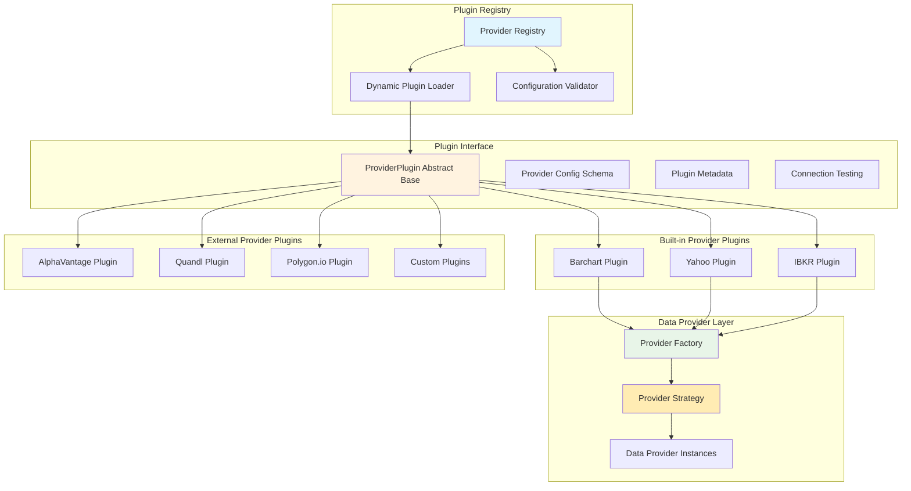
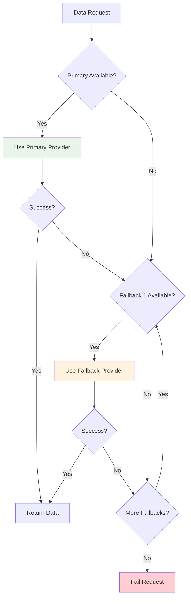

# Vortex Provider Abstraction Design

**Version:** 2.0  
**Date:** 2025-08-04  
**Related:** [Component Architecture](02-component-architecture.md) | [Data Flow Design](03-data-flow-design.md)

## 1. Modern Plugin Architecture Overview

### 1.1 Plugin-Based Provider System
Vortex implements a modern plugin-based provider architecture using the registry pattern, enabling dynamic provider discovery, configuration validation, and comprehensive error handling through a unified interface.

### 1.2 Architecture Benefits
- **Dynamic Loading:** Automatic provider discovery and registration at runtime
- **Configuration Validation:** Pydantic-based schema validation for provider configurations
- **Extensibility:** Add new providers through plugin system without modifying core code
- **Reliability:** Built-in error handling, retry logic, and graceful fallback mechanisms
- **Testability:** Mock provider plugins for comprehensive testing scenarios
- **Maintainability:** Clean separation of provider-specific logic in isolated plugin modules

### 1.3 Provider Plugin Architecture


## 2. Plugin Interface Design

### 2.1 Core Interface Design
The provider abstraction defines a unified contract that all data providers must implement, ensuring consistent behavior across different external data sources.

**Interface Responsibilities:**
- **Authentication Strategy:** Define provider-specific credential handling
- **Data Retrieval Contract:** Standardize data request and response patterns
- **Instrument Compatibility:** Validate and map instruments to provider capabilities
- **Rate Limit Management:** Abstract provider-specific throttling requirements
- **Health Monitoring:** Provide availability and status checking capabilities
- **Column Name Standardization:** Transform provider-specific formats to internal standard

**Interface Design Principles:**
- **Uniform API Surface:** All providers expose identical methods regardless of underlying implementation
- **Provider Agnostic:** Client code works with any provider without modification
- **Error Standardization:** Common error types and handling across all providers
- **State Encapsulation:** Each provider manages its own authentication and session state
- **Column Name Standardization:** All providers must output internal standard format

### 2.1.1 Internal Standard Format Requirements

**Mandatory Column Naming Convention:**
All providers must transform their native column formats to this exact internal standard:

- **Index Name:** `Datetime` (pandas DatetimeIndex, UTC timezone)
- **OHLCV Columns:** `Open`, `High`, `Low`, `Close`, `Volume` (exact title case)
- **Provider-Specific Columns:** Preserved with original casing (e.g., `Adj Close`, `Open Interest`, `wap`)

**Column Transformation Examples:**
```python
# Yahoo Provider (already title case)
External: Date (index), Open, High, Low, Close, Volume, Adj Close
Internal: Datetime (index), Open, High, Low, Close, Volume, Adj Close

# Barchart Provider (Last → Close mapping)
External: Time, Open, High, Low, Last, Volume, Open Interest
Internal: Datetime (index), Open, High, Low, Close, Volume, Open Interest

# IBKR Provider (lowercase → title case)
External: date, open, high, low, close, volume, wap, count
Internal: Datetime (index), Open, High, Low, Close, Volume, wap, count
```

*Detailed interface implementation available in [Provider Implementation](../lld/03-provider-implementation.md)*

### 2.2 Provider Registry Architecture
The provider registry implements a discovery and factory pattern that enables dynamic provider management and runtime selection.

**Registry Design Patterns:**
- **Service Registry:** Central catalog of available provider implementations
- **Factory Pattern:** On-demand creation of configured provider instances
- **Strategy Selection:** Runtime provider choice based on configuration or instrument requirements
- **Interface Validation:** Ensures all registered providers comply with the abstract interface

**Registry Capabilities:**
- **Dynamic Discovery:** Automatic registration of new provider implementations
- **Configuration Integration:** Provider-specific settings and credential management
- **Availability Tracking:** Real-time status of registered providers
- **Fallback Management:** Ordered provider chains for resilience

**Provider Categories:**
- **Premium Providers:** Subscription-based services with authentication requirements
- **Public Providers:** Free-access APIs with rate limiting
- **Professional Providers:** Trading platform integrations requiring local connections

*Detailed registry implementation available in [Provider Implementation](../lld/03-provider-implementation.md)*

## 3. Provider Architecture Patterns

### 3.1 Authentication Architecture Patterns
Different providers require distinct authentication strategies based on their business models and technical architectures:

**Session-Based Authentication Pattern:**
- Multi-step credential validation with state management
- CSRF protection and token-based security
- Session persistence across multiple requests
- Automatic re-authentication on session expiry

**API Key Authentication Pattern:**
- Simple credential-based access control
- Public API access with minimal authentication overhead
- Request identification through headers
- No session state management required

**Connection-Based Authentication Pattern:**
- Direct TCP connection to provider services
- Client-server handshake protocols
- Real-time connection state monitoring
- Local application integration requirements

### 3.2 Data Access Architecture Patterns
Providers implement different data delivery architectures based on their target audiences and technical capabilities:

**Form-Based Download Pattern:**
- Web scraping approach for premium data services
- Request/response cycle with structured forms
- Rate limiting through quotas and daily limits
- CSV/structured text response formats

**RESTful API Pattern:**
- Standard HTTP API with JSON responses
- URL-based parameter passing
- Stateless request/response model
- Automatic retry and error handling

**Binary Protocol Pattern:**
- High-performance binary communication
- Event-driven data delivery
- Real-time streaming capabilities
- Professional trading platform integration

### 3.3 Provider Capability Models
Each provider serves different market segments with distinct capabilities:

**Premium Data Services:**
- Subscription-based access model
- Specialized market data (futures, commodities)
- Exchange-quality data with minimal delays
- Professional trading and analysis focus

**Public Market Data:**
- Free access to basic market information
- Delayed data for retail investors
- Global market coverage
- Web-based accessibility

**Professional Trading Platforms:**
- Real-time data for active trading
- Multi-asset class support
- Trading account integration
- Institutional-grade infrastructure

## 4. Provider Selection Architecture

### 4.1 Factory Pattern Design
The provider factory implements a configuration-driven instantiation pattern that enables dynamic provider selection and management:

**Factory Design Principles:**
- **Configuration-Driven Creation:** Provider selection based on runtime configuration
- **Dependency Injection:** Automatic wiring of provider-specific dependencies
- **Validation Framework:** Configuration and capability validation before instantiation
- **Chain Construction:** Building ordered fallback provider sequences

**Factory Architecture Benefits:**
- **Loose Coupling:** Client code independent of specific provider implementations
- **Runtime Flexibility:** Provider switching without code changes
- **Testability:** Easy injection of mock providers for testing
- **Extensibility:** Simple addition of new providers through registration

### 4.2 Provider Selection Strategy


## 5. Rate Limiting Architecture

### 5.1 Rate Limiting Design Patterns
The rate limiting architecture implements a multi-tiered throttling strategy that adapts to each provider's specific requirements and terms of service:

**Hierarchical Rate Limiting:**
- **Daily Quotas:** Long-term resource allocation for subscription services
- **Hourly Limits:** Medium-term burst protection and fair usage
- **Real-time Throttling:** Short-term request rate control
- **Concurrent Limits:** Connection and session management

**Rate Limiting Implementation Patterns:**
- **Token Bucket Algorithm:** Smooth rate limiting with burst capability
- **Sliding Window:** Time-based request counting and validation
- **Adaptive Throttling:** Dynamic adjustment based on provider feedback
- **Distributed Limiting:** Multi-instance coordination for rate limits

### 5.2 Provider Rate Limiting Strategies
Different providers require distinct rate limiting approaches based on their business models and technical constraints:

**Subscription-Based Limiting:**
- Fixed daily quotas with hard enforcement
- Request tracking and quota management
- Fair usage policies and overage handling

**Public API Limiting:**
- Generous limits with exponential backoff
- Burst tolerance with gradual throttling
- Graceful degradation under heavy load

**Professional Platform Limiting:**
- Connection-based throttling
- Real-time rate adaptation
- Quality of service prioritization

## 6. Error Handling Architecture

### 6.1 Error Classification Framework
The error handling architecture implements a hierarchical classification system that enables appropriate recovery strategies for different failure modes:

**Error Category Architecture:**
- **Transient Errors:** Temporary failures that can be resolved through retry mechanisms
- **Authentication Errors:** Credential-related failures requiring re-authentication flows
- **Rate Limit Errors:** Quota exhaustion requiring wait-and-retry strategies
- **Permanent Errors:** Unrecoverable failures requiring immediate escalation

**Error Handling Design Patterns:**
- **Circuit Breaker:** Prevent cascading failures through provider circuit breakers
- **Bulkhead:** Isolate provider failures to prevent system-wide impact
- **Timeout:** Bounded waiting to prevent resource exhaustion
- **Fallback:** Graceful degradation through alternative providers

### 6.2 Recovery Architecture Framework
The recovery architecture implements a multi-level strategy that maximizes data acquisition success while maintaining system stability:

**Recovery Strategy Hierarchy:**
- **Local Recovery:** Same-provider retry with backoff strategies
- **Provider Fallback:** Alternative provider selection and switching
- **Graceful Degradation:** Partial success handling and user notification
- **System Protection:** Circuit breakers and resource limits

**Recovery Implementation Patterns:**
- **Exponential Backoff:** Progressive wait times for transient failures
- **Provider Rotation:** Ordered fallback through available providers
- **Context Preservation:** Maintain request state across recovery attempts
- **Reliability Tracking:** Provider performance monitoring and selection optimization

## 7. Testing Architecture

### 7.1 Provider Testing Strategy
The testing architecture ensures provider implementations maintain interface compliance and deliver consistent behavior across different data sources:

**Testing Framework Design:**
- **Mock Provider Architecture:** Configurable test doubles that simulate provider behavior
- **Contract Testing:** Interface compliance validation for all provider implementations
- **Behavior Verification:** Call patterns and state management validation
- **Error Simulation:** Comprehensive error condition testing

**Test Architecture Patterns:**
- **Test Double Strategy:** Mock, stub, and fake implementations for isolation
- **Property-Based Testing:** Automated test case generation for edge conditions
- **Integration Test Framework:** Real provider testing with controlled environments
- **Performance Testing:** Load and stress testing for provider implementations

### 7.2 Validation Architecture
The validation architecture ensures provider implementations deliver consistent, high-quality data that meets system requirements:

**Validation Strategy Framework:**
- **Interface Validation:** Contract compliance and method signature verification
- **Data Quality Validation:** Format, completeness, and accuracy verification
- **Performance Validation:** Response time and throughput requirements
- **Reliability Validation:** Error handling and recovery mechanism testing

**Validation Implementation Patterns:**
- **Automated Validation:** Continuous compliance checking through CI/CD pipelines
- **Real-World Testing:** Live provider testing with production-like scenarios
- **Regression Testing:** Change impact validation for provider implementations
- **Cross-Provider Testing:** Consistency validation across different data sources

*Detailed testing implementations available in [Testing Implementation](../lld/06-testing-implementation.md)*

## Related Documents

- **[Component Architecture](02-component-architecture.md)** - Overall component design
- **[Data Flow Design](03-data-flow-design.md)** - Data processing pipeline
- **[Integration Design](08-integration-design.md)** - External system interfaces
- **[Data Requirements](../../requirements/prd/data-requirements.md)** - Provider data specifications

---

**Next Review:** 2025-09-04  
**Reviewers:** Senior Developer, Integration Architect, QA Lead