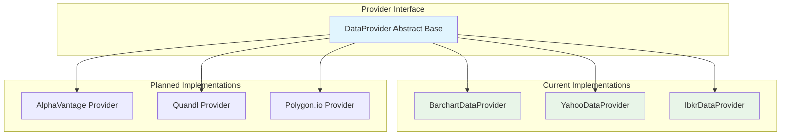
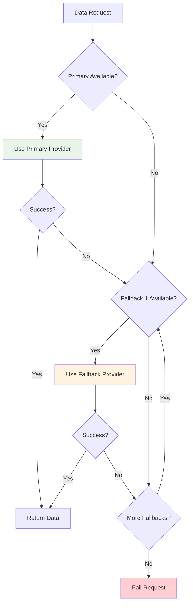

# BC-Utils Provider Abstraction Design

**Version:** 1.0  
**Date:** 2025-01-08  
**Related:** [Component Architecture](02-component-architecture.md) | [Data Flow Design](03-data-flow-design.md)

## 1. Provider Abstraction Overview

### 1.1 Design Rationale
The provider abstraction layer enables BC-Utils to integrate with multiple financial data sources through a unified interface. This design supports the Strategy pattern, allowing runtime provider selection and seamless addition of new data sources.

### 1.2 Key Benefits
- **Extensibility:** Add new providers without modifying existing code
- **Reliability:** Graceful fallback when providers are unavailable
- **Testability:** Mock providers for comprehensive testing
- **Maintainability:** Provider-specific logic isolated in dedicated modules

### 1.3 Supported Providers


## 2. Provider Interface Design

### 2.1 Core Interface Definition
```python
from abc import ABC, abstractmethod
from typing import Optional, Dict, List, Any
import pandas as pd

class DataProvider(ABC):
    """Abstract base class for all data providers"""
    
    def __init__(self, **config):
        self.config = config
        self.session = None
        self.rate_limiter = None
        self.authentication_state = AuthenticationState.UNAUTHENTICATED
    
    @abstractmethod
    def authenticate(self, credentials: Dict[str, str]) -> bool:
        """Authenticate with the data provider"""
        pass
    
    @abstractmethod
    def get_data(self, instrument: Instrument, date_range: DateRange) -> pd.DataFrame:
        """Retrieve data for specified instrument and date range"""
        pass
    
    @abstractmethod
    def get_supported_instruments(self) -> List[str]:
        """Return list of supported instrument types"""
        pass
    
    @abstractmethod
    def validate_instrument(self, instrument: Instrument) -> bool:
        """Validate if instrument is supported by this provider"""
        pass
    
    @abstractmethod
    def get_rate_limits(self) -> RateLimitInfo:
        """Return current rate limit information"""
        pass
    
    # Optional methods with default implementations
    def health_check(self) -> HealthStatus:
        """Check provider availability and health"""
        try:
            response = self._execute_health_check()
            return HealthStatus.HEALTHY if response else HealthStatus.DEGRADED
        except Exception:
            return HealthStatus.UNHEALTHY
    
    def get_metadata(self, instrument: Instrument) -> Dict[str, Any]:
        """Get provider-specific metadata for instrument"""
        return {}
    
    def cleanup(self):
        """Clean up resources (connections, sessions, etc.)"""
        if self.session:
            self.session.close()
```

### 2.2 Provider Registration System
```python
class ProviderRegistry:
    """Central registry for data provider implementations"""
    
    _providers: Dict[str, Type[DataProvider]] = {}
    _instances: Dict[str, DataProvider] = {}
    
    @classmethod
    def register_provider(cls, name: str, provider_class: Type[DataProvider]):
        """Register a new provider implementation"""
        if not issubclass(provider_class, DataProvider):
            raise TypeError("Provider must inherit from DataProvider")
        
        cls._providers[name] = provider_class
        logger.info(f"Registered provider: {name}")
    
    @classmethod
    def create_provider(cls, name: str, **config) -> DataProvider:
        """Create provider instance with configuration"""
        if name not in cls._providers:
            raise ValueError(f"Unknown provider: {name}")
        
        provider_class = cls._providers[name]
        instance = provider_class(**config)
        cls._instances[name] = instance
        
        return instance
    
    @classmethod
    def get_available_providers(cls) -> List[str]:
        """Get list of registered provider names"""
        return list(cls._providers.keys())

# Provider registration
ProviderRegistry.register_provider("barchart", BarchartDataProvider)
ProviderRegistry.register_provider("yahoo", YahooDataProvider)
ProviderRegistry.register_provider("ibkr", IbkrDataProvider)
```

## 3. Provider Implementations

### 3.1 Barchart Provider Implementation

#### Authentication and Session Management
```python
class BarchartDataProvider(DataProvider):
    """Barchart.com data provider implementation"""
    
    BASE_URL = "https://www.barchart.com"
    LOGIN_URL = f"{BASE_URL}/login"
    DOWNLOAD_URL = f"{BASE_URL}/futures/quotes/{{}}/download"
    
    def __init__(self, daily_download_limit: int = 150, **config):
        super().__init__(**config)
        self.daily_download_limit = daily_download_limit
        self.downloads_today = 0
        self.rate_limiter = RateLimiter(
            requests_per_day=daily_download_limit,
            requests_per_hour=50  # Conservative estimate
        )
        self.session = requests.Session()
        
    def authenticate(self, credentials: Dict[str, str]) -> bool:
        """Authenticate with Barchart using username/password"""
        try:
            # 1. Get login page to extract CSRF token
            login_page = self.session.get(self.LOGIN_URL)
            soup = BeautifulSoup(login_page.content, 'html.parser')
            csrf_token = soup.find('input', {'name': '_token'})['value']
            
            # 2. Submit login credentials
            login_data = {
                'email': credentials['username'],
                'password': credentials['password'],
                '_token': csrf_token
            }
            
            response = self.session.post(self.LOGIN_URL, data=login_data)
            
            # 3. Verify authentication success
            if 'dashboard' in response.url or response.status_code == 200:
                self.authentication_state = AuthenticationState.AUTHENTICATED
                logger.info("Barchart authentication successful")
                return True
            else:
                self.authentication_state = AuthenticationState.FAILED
                logger.error("Barchart authentication failed")
                return False
                
        except Exception as e:
            logger.error(f"Barchart authentication error: {e}")
            self.authentication_state = AuthenticationState.ERROR
            return False
    
    def get_data(self, instrument: Instrument, date_range: DateRange) -> pd.DataFrame:
        """Download futures data from Barchart"""
        
        # 1. Validate rate limits
        if not self.rate_limiter.can_make_request():
            raise RateLimitExceededError("Daily download limit reached")
        
        # 2. Build download URL
        download_url = self.DOWNLOAD_URL.format(instrument.symbol.lower())
        
        # 3. Get download page to extract CSRF token
        download_page = self.session.get(download_url)
        soup = BeautifulSoup(download_page.content, 'html.parser')
        csrf_token = soup.find('input', {'name': '_token'})['value']
        
        # 4. Submit download request
        download_data = {
            '_token': csrf_token,
            'submitForm': 'Download',
            'dateStart': date_range.start.strftime('%m/%d/%Y'),
            'dateEnd': date_range.end.strftime('%m/%d/%Y'),
            'frequency': 'daily'
        }
        
        response = self.session.post(download_url, data=download_data)
        
        # 5. Parse CSV response
        if response.status_code == 200:
            self.rate_limiter.record_request()
            self.downloads_today += 1
            return self._parse_csv_response(response.content, instrument)
        else:
            raise DataProviderError(f"Download failed: {response.status_code}")
    
    def _parse_csv_response(self, csv_content: bytes, instrument: Instrument) -> pd.DataFrame:
        """Parse Barchart CSV response to standard format"""
        try:
            # Read CSV with proper encoding
            df = pd.read_csv(io.StringIO(csv_content.decode('utf-8')))
            
            # Barchart column mapping
            column_mapping = {
                'Time': 'timestamp',
                'Open': 'open',
                'High': 'high',
                'Low': 'low',
                'Last': 'close',
                'Volume': 'volume'
            }
            
            # Rename columns to standard format
            df = df.rename(columns=column_mapping)
            
            # Convert timestamps
            df['timestamp'] = pd.to_datetime(df['timestamp'])
            
            # Add metadata
            df['symbol'] = instrument.symbol
            df['provider'] = 'barchart'
            
            return df[['timestamp', 'open', 'high', 'low', 'close', 'volume', 'symbol', 'provider']]
            
        except Exception as e:
            raise DataParsingError(f"Failed to parse Barchart CSV: {e}")
```

### 3.2 Yahoo Finance Provider Implementation

#### Free Data Access Strategy
```python
class YahooDataProvider(DataProvider):
    """Yahoo Finance data provider implementation"""
    
    BASE_URL = "https://query1.finance.yahoo.com/v8/finance/chart/{}"
    
    def __init__(self, **config):
        super().__init__(**config)
        self.session = requests.Session()
        self.session.headers.update({
            'User-Agent': 'Mozilla/5.0 (compatible; BC-Utils/1.0)'
        })
        
    def authenticate(self, credentials: Dict[str, str]) -> bool:
        """Yahoo Finance doesn't require authentication for basic data"""
        self.authentication_state = AuthenticationState.AUTHENTICATED
        return True
    
    def get_data(self, instrument: Instrument, date_range: DateRange) -> pd.DataFrame:
        """Download stock data from Yahoo Finance"""
        
        # 1. Build request URL
        url = self.BASE_URL.format(instrument.symbol)
        
        # 2. Set request parameters
        params = {
            'period1': int(date_range.start.timestamp()),
            'period2': int(date_range.end.timestamp()),
            'interval': '1d',
            'includePrePost': 'false',
            'events': 'div%2Csplit'
        }
        
        # 3. Execute request with retry logic
        response = self._execute_with_retry(url, params)
        
        # 4. Parse JSON response
        return self._parse_json_response(response.json(), instrument)
    
    def _parse_json_response(self, json_data: Dict, instrument: Instrument) -> pd.DataFrame:
        """Parse Yahoo Finance JSON response"""
        try:
            result = json_data['chart']['result'][0]
            timestamps = result['timestamp']
            quotes = result['indicators']['quote'][0]
            
            # Build DataFrame
            df = pd.DataFrame({
                'timestamp': pd.to_datetime(timestamps, unit='s', utc=True),
                'open': quotes['open'],
                'high': quotes['high'],
                'low': quotes['low'],
                'close': quotes['close'],
                'volume': quotes['volume']
            })
            
            # Clean data (remove NaN values)
            df = df.dropna()
            
            # Add metadata
            df['symbol'] = instrument.symbol
            df['provider'] = 'yahoo'
            
            return df
            
        except (KeyError, IndexError) as e:
            raise DataParsingError(f"Failed to parse Yahoo Finance JSON: {e}")
```

### 3.3 Interactive Brokers Provider Implementation

#### TWS API Integration
```python
class IbkrDataProvider(DataProvider):
    """Interactive Brokers data provider implementation"""
    
    def __init__(self, host: str = "127.0.0.1", port: int = 7497, **config):
        super().__init__(**config)
        self.host = host
        self.port = port
        self.ib_client = None
        self.connection_state = ConnectionState.DISCONNECTED
        
    def authenticate(self, credentials: Dict[str, str]) -> bool:
        """Connect to TWS/IB Gateway"""
        try:
            from ib_insync import IB, Contract
            
            self.ib_client = IB()
            self.ib_client.connect(self.host, self.port, clientId=1)
            
            if self.ib_client.isConnected():
                self.authentication_state = AuthenticationState.AUTHENTICATED
                self.connection_state = ConnectionState.CONNECTED
                logger.info(f"Connected to TWS at {self.host}:{self.port}")
                return True
            else:
                self.authentication_state = AuthenticationState.FAILED
                return False
                
        except Exception as e:
            logger.error(f"IBKR connection failed: {e}")
            self.authentication_state = AuthenticationState.ERROR
            return False
    
    def get_data(self, instrument: Instrument, date_range: DateRange) -> pd.DataFrame:
        """Request historical data from IBKR"""
        
        if not self.ib_client or not self.ib_client.isConnected():
            raise ConnectionError("Not connected to TWS")
        
        # 1. Create contract object
        contract = self._create_contract(instrument)
        
        # 2. Request historical data
        duration = self._calculate_duration(date_range)
        bar_size = '1 day'
        what_to_show = 'TRADES'
        use_rth = True  # Regular trading hours only
        
        bars = self.ib_client.reqHistoricalData(
            contract,
            endDateTime=date_range.end,
            durationStr=duration,
            barSizeSetting=bar_size,
            whatToShow=what_to_show,
            useRTH=use_rth
        )
        
        # 3. Convert to DataFrame
        return self._bars_to_dataframe(bars, instrument)
    
    def _create_contract(self, instrument: Instrument) -> Contract:
        """Create IB contract object from instrument"""
        from ib_insync import Contract, Future, Stock
        
        if isinstance(instrument, Future):
            contract = Future(
                symbol=instrument.code,
                lastTradeDateOrContractMonth=instrument.contract_month,
                exchange=instrument.exchange
            )
        elif isinstance(instrument, Stock):
            contract = Stock(
                symbol=instrument.symbol,
                exchange=instrument.exchange,
                currency=instrument.currency
            )
        else:
            raise ValueError(f"Unsupported instrument type: {type(instrument)}")
        
        return contract
    
    def _bars_to_dataframe(self, bars: List, instrument: Instrument) -> pd.DataFrame:
        """Convert IB bars to standard DataFrame format"""
        data = []
        for bar in bars:
            data.append({
                'timestamp': bar.date,
                'open': float(bar.open),
                'high': float(bar.high),
                'low': float(bar.low),
                'close': float(bar.close),
                'volume': int(bar.volume),
                'symbol': instrument.symbol,
                'provider': 'ibkr'
            })
        
        return pd.DataFrame(data)
```

## 4. Provider Factory and Selection

### 4.1 Provider Factory Implementation
```python
class ProviderFactory:
    """Factory for creating and configuring providers"""
    
    @staticmethod
    def create_provider(config: ProviderConfig) -> DataProvider:
        """Create provider instance based on configuration"""
        
        provider_type = config.type.lower()
        
        if provider_type == "barchart":
            return BarchartDataProvider(
                daily_download_limit=config.daily_limit,
                timeout_seconds=config.timeout
            )
        
        elif provider_type == "yahoo":
            return YahooDataProvider(
                timeout_seconds=config.timeout,
                max_retries=config.max_retries
            )
        
        elif provider_type == "ibkr":
            return IbkrDataProvider(
                host=config.host,
                port=config.port,
                timeout_seconds=config.timeout
            )
        
        else:
            raise ValueError(f"Unknown provider type: {provider_type}")
    
    @staticmethod
    def create_with_fallbacks(primary_config: ProviderConfig, 
                            fallback_configs: List[ProviderConfig]) -> FallbackProvider:
        """Create provider with fallback chain"""
        
        primary = ProviderFactory.create_provider(primary_config)
        fallbacks = [ProviderFactory.create_provider(config) for config in fallback_configs]
        
        return FallbackProvider(primary, fallbacks)
```

### 4.2 Provider Selection Strategy


## 5. Rate Limiting and Throttling

### 5.1 Rate Limiter Implementation
```python
class RateLimiter:
    """Provider-aware rate limiting system"""
    
    def __init__(self, requests_per_day: int = None, requests_per_hour: int = None):
        self.requests_per_day = requests_per_day
        self.requests_per_hour = requests_per_hour
        self.daily_requests = deque()
        self.hourly_requests = deque()
        self.lock = threading.Lock()
    
    def can_make_request(self) -> bool:
        """Check if request can be made within rate limits"""
        with self.lock:
            now = time.time()
            
            # Clean old requests
            self._clean_old_requests(now)
            
            # Check daily limit
            if self.requests_per_day and len(self.daily_requests) >= self.requests_per_day:
                return False
            
            # Check hourly limit
            if self.requests_per_hour and len(self.hourly_requests) >= self.requests_per_hour:
                return False
            
            return True
    
    def record_request(self):
        """Record a request for rate limiting"""
        with self.lock:
            now = time.time()
            self.daily_requests.append(now)
            self.hourly_requests.append(now)
    
    def get_wait_time(self) -> float:
        """Get time to wait before next request is allowed"""
        with self.lock:
            now = time.time()
            
            if self.requests_per_hour and len(self.hourly_requests) >= self.requests_per_hour:
                oldest_request = self.hourly_requests[0]
                return max(0, 3600 - (now - oldest_request))
            
            return 0
```

### 5.2 Provider-Specific Rate Limits
| Provider | Daily Limit | Hourly Limit | Burst Limit | Wait Strategy |
|----------|-------------|--------------|-------------|---------------|
| **Barchart** | 150 requests | 50 requests | 5 requests/min | Fixed wait |
| **Yahoo Finance** | No limit | 2000 requests | 10 requests/sec | Exponential backoff |
| **IBKR** | No limit | No limit | 50 requests/sec | Connection throttling |

## 6. Error Handling and Recovery

### 6.1 Provider Error Classification
```python
class ProviderError(Exception):
    """Base class for provider-specific errors"""
    pass

class AuthenticationError(ProviderError):
    """Authentication with provider failed"""
    pass

class RateLimitExceededError(ProviderError):
    """Provider rate limit exceeded"""
    pass

class DataNotAvailableError(ProviderError):
    """Requested data not available from provider"""
    pass

class DataParsingError(ProviderError):
    """Failed to parse provider response"""
    pass

class ConnectionError(ProviderError):
    """Connection to provider failed"""
    pass
```

### 6.2 Error Recovery Strategies
```python
class ProviderErrorHandler:
    """Centralized error handling for providers"""
    
    def handle_error(self, error: Exception, provider: DataProvider, 
                    retry_context: RetryContext) -> RecoveryAction:
        """Determine recovery action based on error type"""
        
        if isinstance(error, AuthenticationError):
            return RecoveryAction.REAUTHENTICATE
        
        elif isinstance(error, RateLimitExceededError):
            wait_time = provider.get_rate_limits().get_wait_time()
            return RecoveryAction.WAIT_AND_RETRY(wait_time)
        
        elif isinstance(error, ConnectionError):
            if retry_context.attempt_count < 3:
                return RecoveryAction.RETRY_WITH_BACKOFF
            else:
                return RecoveryAction.SWITCH_PROVIDER
        
        elif isinstance(error, DataNotAvailableError):
            return RecoveryAction.SWITCH_PROVIDER
        
        else:
            logger.error(f"Unhandled provider error: {error}")
            return RecoveryAction.FAIL_REQUEST
```

## 7. Testing and Validation

### 7.1 Provider Testing Framework
```python
class MockDataProvider(DataProvider):
    """Mock provider for testing"""
    
    def __init__(self, mock_responses: Dict[str, Any], **config):
        super().__init__(**config)
        self.mock_responses = mock_responses
        self.call_history = []
        
    def authenticate(self, credentials: Dict[str, str]) -> bool:
        self.call_history.append(('authenticate', credentials))
        return self.mock_responses.get('auth_success', True)
    
    def get_data(self, instrument: Instrument, date_range: DateRange) -> pd.DataFrame:
        self.call_history.append(('get_data', instrument.symbol, date_range))
        
        if 'data_error' in self.mock_responses:
            raise self.mock_responses['data_error']
        
        return self.mock_responses.get('data', pd.DataFrame())

# Test usage
@pytest.fixture
def mock_provider():
    mock_data = pd.DataFrame({
        'timestamp': pd.date_range('2024-01-01', periods=10),
        'open': range(100, 110),
        'high': range(105, 115),
        'low': range(95, 105),
        'close': range(102, 112),
        'volume': range(1000, 1010)
    })
    
    return MockDataProvider({
        'auth_success': True,
        'data': mock_data
    })
```

### 7.2 Provider Validation Tests
```python
class ProviderTestSuite:
    """Comprehensive test suite for providers"""
    
    def test_provider_compliance(self, provider: DataProvider):
        """Test provider compliance with interface contract"""
        
        # Test authentication
        assert hasattr(provider, 'authenticate')
        assert callable(provider.authenticate)
        
        # Test data retrieval
        assert hasattr(provider, 'get_data')
        assert callable(provider.get_data)
        
        # Test error handling
        with pytest.raises(AuthenticationError):
            provider.authenticate({'invalid': 'credentials'})
    
    def test_data_format_compliance(self, provider: DataProvider, test_instrument: Instrument):
        """Test that provider returns data in standard format"""
        
        date_range = DateRange(
            start=datetime(2024, 1, 1),
            end=datetime(2024, 1, 31)
        )
        
        data = provider.get_data(test_instrument, date_range)
        
        # Verify required columns
        required_columns = ['timestamp', 'open', 'high', 'low', 'close', 'volume', 'symbol', 'provider']
        assert all(col in data.columns for col in required_columns)
        
        # Verify data types
        assert data['timestamp'].dtype.kind == 'M'  # datetime
        assert data['open'].dtype.kind == 'f'       # float
        assert data['volume'].dtype.kind in ['i', 'u']  # integer
```

## Related Documents

- **[Component Architecture](02-component-architecture.md)** - Overall component design
- **[Data Flow Design](03-data-flow-design.md)** - Data processing pipeline
- **[Integration Design](08-integration-design.md)** - External system interfaces
- **[Data Requirements](../../requirements/prd/data-requirements.md)** - Provider data specifications

---

**Next Review:** 2025-02-08  
**Reviewers:** Senior Developer, Integration Architect, QA Lead