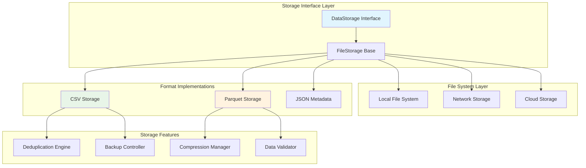

# BC-Utils Storage Architecture

**Version:** 1.0  
**Date:** 2025-01-08  
**Related:** [Component Architecture](02-component-architecture.md) | [Data Flow Design](03-data-flow-design.md)

## 1. Storage Architecture Overview

### 1.1 Design Philosophy
BC-Utils implements a dual-format storage strategy optimized for both human accessibility and analytical performance. The architecture supports pluggable storage backends with automatic format conversion and data lifecycle management.

### 1.2 Storage Objectives
- **Dual Format:** CSV for human readability, Parquet for performance
- **Data Integrity:** Atomic operations with rollback capability
- **Scalability:** Handle datasets from MB to multi-GB scale
- **Portability:** Standard formats compatible with analytical tools
- **Efficiency:** Compression and columnar storage optimization

### 1.3 Storage Components

## 2. Storage Interface Architecture

### 2.1 Abstract Storage Interface Design
The storage interface defines a unified contract for all storage implementations, enabling pluggable backends while maintaining consistent behavior across different storage formats.

**Interface Design Principles:**
- **Format Agnostic:** Common interface abstracts specific file format details
- **CRUD Operations:** Complete Create, Read, Update, Delete functionality
- **Metadata Integration:** Built-in metadata tracking and management
- **Dry Run Support:** Testing and validation mode without actual storage operations

**Core Interface Responsibilities:**
- **Data Persistence:** Save and retrieve structured financial data
- **File Management:** List, check existence, and delete stored files
- **Metadata Operations:** Track file statistics and storage information
- **Path Management:** Handle file paths and directory structure
- **Error Handling:** Consistent error reporting across implementations

**Interface Contract:**
All storage implementations must provide:
- Atomic save operations with rollback capability
- DataFrame-based data handling for structured financial data
- Pattern-based file discovery and listing
- Comprehensive metadata tracking
- Directory structure management

*Detailed interface implementation available in [Storage Implementation](../lld/04-storage-implementation.md)*

### 2.2 File Storage Base Architecture
The file storage base class provides common functionality for all file-based storage implementations, implementing shared patterns for atomic operations, directory management, and backup handling.

**Base Class Design Patterns:**
- **Template Method:** Common workflow with format-specific implementations
- **Atomic Operations:** Safe file operations with rollback capabilities
- **Directory Management:** Automatic directory creation and path validation
- **Backup Strategy:** Optional backup creation for data protection

**File Storage Architecture Features:**
- **Atomic Save Operations:** Temporary file staging with atomic moves
- **Backup Management:** Automatic backup creation and cleanup
- **Path Preparation:** Directory creation and validation
- **Metadata Integration:** Automatic metadata tracking and updates
- **Error Recovery:** Rollback capabilities on operation failures

**Common File Operations:**
- **Preparation Phase:** Path validation and directory creation
- **Staging Phase:** Write to temporary files for atomicity
- **Commit Phase:** Atomic move to final location
- **Metadata Phase:** Update tracking information
- **Cleanup Phase:** Remove temporary and backup files

**Error Handling Strategy:**
- **Rollback:** Restore from backup on save failures
- **Cleanup:** Remove temporary files on errors
- **Exception Translation:** Convert low-level errors to storage-specific exceptions
- **State Consistency:** Ensure storage remains in valid state after failures

*Detailed file storage implementation available in [Storage Implementation](../lld/04-storage-implementation.md)*

## 3. Format-Specific Storage Architectures

### 3.1 CSV Storage Architecture
The CSV storage implementation prioritizes human readability and universal compatibility while maintaining data integrity through structured validation.

**CSV Design Characteristics:**
- **Human Readable:** Plain text format for easy inspection and debugging
- **Universal Compatibility:** Works with spreadsheet applications and text editors
- **Encoding Standardization:** UTF-8 encoding with proper escaping
- **Header Consistency:** Standardized column naming and ordering

**CSV Storage Features:**
- **Delimiter Handling:** Configurable delimiter with automatic escaping
- **Quote Management:** Proper quoting of text fields containing delimiters
- **Type Preservation:** Consistent data type handling across save/load cycles
- **Large File Support:** Streaming operations for datasets exceeding memory

### 3.2 Parquet Storage Architecture
The Parquet storage implementation optimizes for analytical performance and storage efficiency through columnar compression and schema evolution.

**Parquet Design Characteristics:**
- **Columnar Format:** Column-oriented storage for analytical queries
- **Compression Efficiency:** Snappy compression for space optimization
- **Schema Evolution:** Forward and backward compatibility for changing data structures
- **Type Safety:** Strong typing with automatic type inference

**Parquet Storage Features:**
- **Predicate Pushdown:** Efficient filtering at the storage layer
- **Partition Support:** Date-based partitioning for query optimization
- **Metadata Caching:** Column statistics for query planning
- **Vectorized Operations:** Optimized reading for analytical workloads

*Detailed format implementations available in [Storage Implementation](../lld/04-storage-implementation.md)*

## 4. Data Deduplication Architecture

### 4.1 Deduplication Strategy
The deduplication system ensures data consistency by identifying and resolving duplicate records across different data sources and time periods.

**Deduplication Design Patterns:**
- **Composite Key Strategy:** Multi-column uniqueness based on timestamp and instrument
- **Conflict Resolution:** Provider priority-based resolution for conflicting data
- **Incremental Processing:** Efficient deduplication for new data additions
- **Memory Optimization:** Streaming deduplication for large datasets

**Deduplication Process Architecture:**
- **Detection Phase:** Identify duplicate records using composite keys
- **Analysis Phase:** Determine conflict resolution strategy
- **Resolution Phase:** Apply provider priority rules
- **Validation Phase:** Verify data integrity after deduplication

### 4.2 Conflict Resolution Framework
The conflict resolution framework handles data conflicts when multiple providers supply different values for the same instrument and timestamp.

**Resolution Strategy Hierarchy:**
- **Provider Priority:** Use configured provider preference order
- **Data Quality Metrics:** Select based on data completeness and validation scores
- **Timestamp Precision:** Prefer data with more precise timestamps
- **Source Reliability:** Consider historical provider reliability metrics

*Detailed deduplication implementation available in [Storage Implementation](../lld/04-storage-implementation.md)*

## 5. Storage Performance Architecture

### 5.1 Performance Optimization Strategy
The storage layer implements multiple optimization techniques to handle large datasets efficiently while maintaining data integrity guarantees.

**Performance Design Principles:**
- **Streaming Operations:** Process data in chunks to minimize memory usage
- **Asynchronous I/O:** Non-blocking operations for improved throughput
- **Compression Optimization:** Format-specific compression algorithms
- **Cache Management:** Intelligent caching with memory-aware eviction

**Performance Optimization Patterns:**
- **Batch Operations:** Group multiple operations for reduced overhead
- **Lazy Loading:** Load data on demand to minimize initial latency
- **Connection Pooling:** Reuse connections for network storage backends
- **Memory Mapping:** Use memory-mapped files for large dataset access

### 5.2 Scalability Architecture
The storage architecture supports horizontal and vertical scaling through modular design and configurable backends.

**Scalability Design Features:**
- **Pluggable Backends:** Support for local, network, and cloud storage
- **Partition Strategy:** Automatic data partitioning for large datasets
- **Load Distribution:** Distribute storage operations across multiple backends
- **Capacity Management:** Automatic capacity monitoring and alerting

*Detailed performance implementation available in [Storage Implementation](../lld/04-storage-implementation.md)*

## 6. Backup and Recovery Architecture

### 6.1 Backup Strategy Framework
The backup system ensures data durability through multiple backup strategies and automatic recovery capabilities.

**Backup Design Patterns:**
- **Incremental Backup:** Only backup changed data to minimize overhead
- **Multi-Format Backup:** Backup in different formats for redundancy
- **Automated Scheduling:** Regular backup operations without manual intervention
- **Remote Backup:** Support for offsite backup storage

**Backup Architecture Components:**
- **Backup Controller:** Coordinates backup operations across storage formats
- **Schedule Manager:** Manages backup timing and frequency
- **Integrity Checker:** Validates backup completeness and accuracy
- **Recovery Manager:** Handles restoration from backup sources

### 6.2 Recovery Architecture
The recovery system provides comprehensive data restoration capabilities with minimal downtime and data loss.

**Recovery Strategy Framework:**
- **Point-in-Time Recovery:** Restore data to specific timestamps
- **Partial Recovery:** Selective restoration of specific instruments or date ranges
- **Cross-Format Recovery:** Restore from alternative format backups
- **Automated Recovery:** Self-healing capabilities for common failure scenarios

*Detailed backup and recovery implementation available in [Storage Implementation](../lld/04-storage-implementation.md)*

## 7. Storage Testing Architecture

### 7.1 Testing Strategy Framework
The storage testing approach validates correctness, performance, and reliability across all storage implementations and scenarios.

**Testing Architecture Patterns:**
- **Mock Storage:** In-memory implementations for unit testing
- **Property-Based Testing:** Automated test generation for edge cases
- **Performance Testing:** Load testing for throughput and latency validation
- **Fault Injection:** Simulate failures for resilience testing

**Test Coverage Areas:**
- **Interface Compliance:** Verify all implementations follow the storage contract
- **Data Integrity:** Validate data consistency across save/load cycles
- **Error Handling:** Test failure scenarios and recovery mechanisms
- **Performance Benchmarks:** Measure and validate storage performance metrics

### 7.2 Validation Architecture
The validation system ensures storage implementations maintain data quality and system reliability under all operating conditions.

**Validation Framework:**
- **Automated Validation:** Continuous testing through CI/CD pipelines
- **Integration Testing:** End-to-end validation with real data workflows
- **Regression Testing:** Prevent performance and correctness regressions
- **Stress Testing:** Validate behavior under extreme load conditions

*Detailed testing implementation available in [Testing Implementation](../lld/06-testing-implementation.md)*

## Related Documents

- **[Component Architecture](02-component-architecture.md)** - Overall component design context
- **[Data Flow Design](03-data-flow-design.md)** - Data processing pipeline integration
- **[Provider Abstraction](04-provider-abstraction.md)** - Data source integration
- **[Security Design](06-security-design.md)** - Storage security considerations

---

**Next Review:** 2025-02-08  
**Reviewers:** Senior Developer, Storage Architect, QA Lead