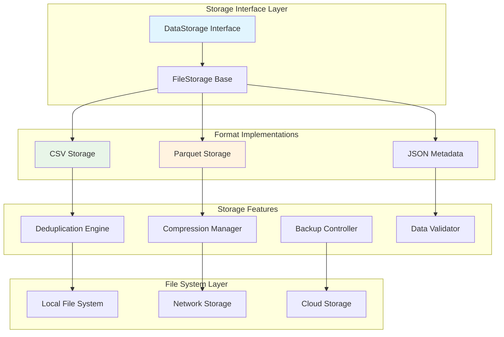
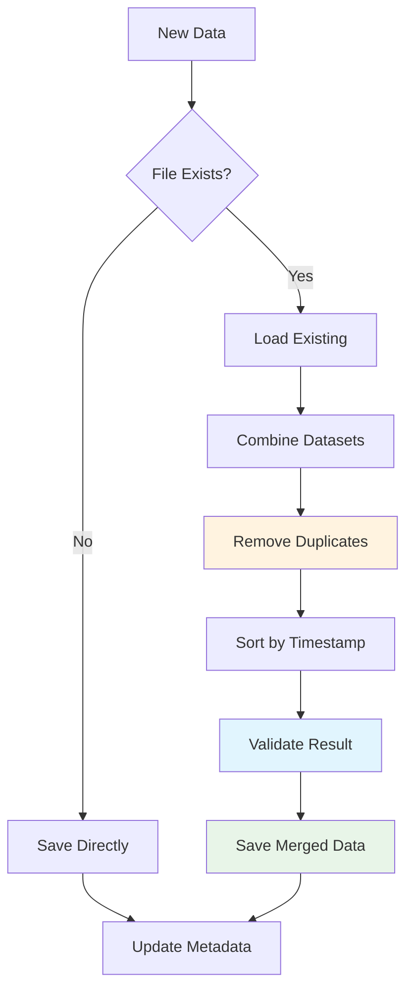
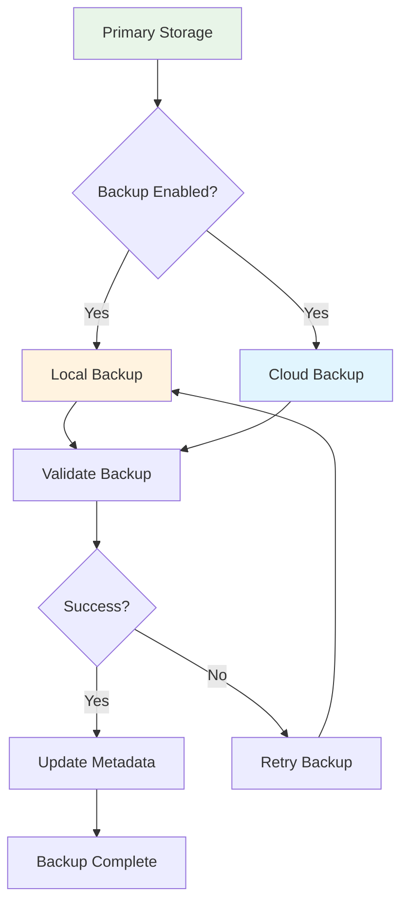

# BC-Utils Storage Architecture

**Version:** 1.0  
**Date:** 2025-01-08  
**Related:** [Component Architecture](02-component-architecture.md) | [Data Flow Design](03-data-flow-design.md)

## 1. Storage Architecture Overview

### 1.1 Design Philosophy
BC-Utils implements a dual-format storage strategy optimized for both human accessibility and analytical performance. The architecture supports pluggable storage backends with automatic format conversion and data lifecycle management.

### 1.2 Storage Objectives
- **Dual Format:** CSV for human readability, Parquet for performance
- **Data Integrity:** Atomic operations with rollback capability
- **Scalability:** Handle datasets from MB to multi-GB scale
- **Portability:** Standard formats compatible with analytical tools
- **Efficiency:** Compression and columnar storage optimization

### 1.3 Storage Components


## 2. Storage Interface Design

### 2.1 Core Storage Interface
```python
from abc import ABC, abstractmethod
from typing import Optional, Dict, List, Any
from pathlib import Path
import pandas as pd

class DataStorage(ABC):
    """Abstract base class for data storage implementations"""
    
    def __init__(self, base_directory: str, dry_run: bool = False):
        self.base_directory = Path(base_directory)
        self.dry_run = dry_run
        self.metadata_store = None
        
    @abstractmethod
    def save(self, data: pd.DataFrame, filepath: str, **kwargs) -> SaveResult:
        """Save DataFrame to storage with specified path"""
        pass
    
    @abstractmethod
    def load(self, filepath: str, **kwargs) -> pd.DataFrame:
        """Load DataFrame from storage"""
        pass
    
    @abstractmethod
    def exists(self, filepath: str) -> bool:
        """Check if file exists in storage"""
        pass
    
    @abstractmethod
    def delete(self, filepath: str) -> bool:
        """Delete file from storage"""
        pass
    
    @abstractmethod
    def list_files(self, pattern: str = "*") -> List[str]:
        """List files matching pattern"""
        pass
    
    # Common methods with default implementations
    def get_file_info(self, filepath: str) -> FileInfo:
        """Get detailed file information"""
        if not self.exists(filepath):
            raise FileNotFoundError(f"File not found: {filepath}")
        
        full_path = self.base_directory / filepath
        stat = full_path.stat()
        
        return FileInfo(
            path=filepath,
            size_bytes=stat.st_size,
            created=datetime.fromtimestamp(stat.st_ctime),
            modified=datetime.fromtimestamp(stat.st_mtime),
            format=self._detect_format(filepath)
        )
    
    def get_storage_stats(self) -> StorageStats:
        """Get overall storage statistics"""
        files = self.list_files()
        total_size = sum(self.get_file_info(f).size_bytes for f in files)
        
        return StorageStats(
            total_files=len(files),
            total_size_bytes=total_size,
            storage_type=self.__class__.__name__,
            base_directory=str(self.base_directory)
        )
```

### 2.2 File Storage Base Class
```python
class FileStorage(DataStorage):
    """Base implementation for file-based storage"""
    
    def __init__(self, base_directory: str, dry_run: bool = False, 
                 create_subdirs: bool = True, backup_enabled: bool = False):
        super().__init__(base_directory, dry_run)
        self.create_subdirs = create_subdirs
        self.backup_enabled = backup_enabled
        self.metadata_store = MetadataStore(self.base_directory / ".metadata")
        
        # Ensure base directory exists
        if not dry_run:
            self.base_directory.mkdir(parents=True, exist_ok=True)
    
    def _prepare_file_path(self, filepath: str) -> Path:
        """Prepare and validate file path"""
        full_path = self.base_directory / filepath
        
        # Create parent directories if needed
        if self.create_subdirs and not self.dry_run:
            full_path.parent.mkdir(parents=True, exist_ok=True)
        
        return full_path
    
    def _atomic_save(self, data: pd.DataFrame, filepath: str, 
                    save_func: callable) -> SaveResult:
        """Perform atomic save operation with backup"""
        full_path = self._prepare_file_path(filepath)
        temp_path = full_path.with_suffix(full_path.suffix + '.tmp')
        backup_path = full_path.with_suffix(full_path.suffix + '.backup')
        
        try:
            # 1. Save to temporary file
            if not self.dry_run:
                save_func(data, temp_path)
            
            # 2. Create backup if file exists
            if self.backup_enabled and full_path.exists() and not self.dry_run:
                shutil.copy2(full_path, backup_path)
            
            # 3. Atomic rename
            if not self.dry_run:
                temp_path.rename(full_path)
            
            # 4. Update metadata
            metadata = DatasetMetadata(
                filepath=filepath,
                row_count=len(data),
                column_count=len(data.columns),
                file_size=full_path.stat().st_size if not self.dry_run else 0,
                last_modified=datetime.utcnow(),
                checksum=self._calculate_checksum(full_path) if not self.dry_run else None
            )
            self.metadata_store.update(filepath, metadata)
            
            # 5. Clean up backup
            if backup_path.exists() and not self.dry_run:
                backup_path.unlink()
            
            return SaveResult(success=True, filepath=filepath, row_count=len(data))
            
        except Exception as e:
            # Rollback on error
            if temp_path.exists():
                temp_path.unlink()
            
            if backup_path.exists() and full_path.exists():
                backup_path.rename(full_path)
            
            raise StorageError(f"Failed to save {filepath}: {e}")
```

## 3. Format-Specific Implementations

### 3.1 CSV Storage Implementation
```python
class CsvStorage(FileStorage):
    """CSV format storage implementation"""
    
    def __init__(self, base_directory: str, **kwargs):
        super().__init__(base_directory, **kwargs)
        self.encoding = 'utf-8'
        self.delimiter = ','
        self.float_precision = 6
        
    def save(self, data: pd.DataFrame, filepath: str, **kwargs) -> SaveResult:
        """Save DataFrame as CSV file"""
        
        # Validate data before saving
        self._validate_data_for_csv(data)
        
        # Prepare data for CSV format
        csv_data = self._prepare_csv_data(data)
        
        # Define save function
        def save_csv(df: pd.DataFrame, path: Path):
            df.to_csv(
                path,
                index=False,
                encoding=self.encoding,
                sep=self.delimiter,
                float_format=f'%.{self.float_precision}f',
                date_format='%Y-%m-%d %H:%M:%S'
            )
        
        return self._atomic_save(csv_data, filepath, save_csv)
    
    def load(self, filepath: str, **kwargs) -> pd.DataFrame:
        """Load DataFrame from CSV file"""
        full_path = self._prepare_file_path(filepath)
        
        if not full_path.exists():
            raise FileNotFoundError(f"CSV file not found: {filepath}")
        
        try:
            df = pd.read_csv(
                full_path,
                encoding=self.encoding,
                sep=self.delimiter,
                parse_dates=['timestamp'],
                dtype={
                    'open': 'float64',
                    'high': 'float64',
                    'low': 'float64',
                    'close': 'float64',
                    'volume': 'int64',
                    'symbol': 'string',
                    'provider': 'string'
                }
            )
            
            return df
            
        except Exception as e:
            raise StorageError(f"Failed to load CSV {filepath}: {e}")
    
    def _validate_data_for_csv(self, data: pd.DataFrame):
        """Validate data is suitable for CSV storage"""
        
        # Check for required columns
        required_columns = ['timestamp', 'open', 'high', 'low', 'close', 'volume']
        missing_columns = set(required_columns) - set(data.columns)
        if missing_columns:
            raise ValueError(f"Missing required columns: {missing_columns}")
        
        # Check for problematic characters in string columns
        string_columns = data.select_dtypes(include=['object', 'string']).columns
        for col in string_columns:
            if data[col].astype(str).str.contains('[,\n\r"]').any():
                logger.warning(f"Column {col} contains CSV delimiter characters")
    
    def _prepare_csv_data(self, data: pd.DataFrame) -> pd.DataFrame:
        """Prepare data for CSV format"""
        df = data.copy()
        
        # Ensure timestamp is in ISO format
        if 'timestamp' in df.columns:
            df['timestamp'] = pd.to_datetime(df['timestamp']).dt.strftime('%Y-%m-%d %H:%M:%S')
        
        # Round float columns to specified precision
        float_columns = df.select_dtypes(include=['float64', 'float32']).columns
        for col in float_columns:
            df[col] = df[col].round(self.float_precision)
        
        return df
```

### 3.2 Parquet Storage Implementation
```python
class ParquetStorage(FileStorage):
    """Parquet format storage implementation"""
    
    def __init__(self, base_directory: str, **kwargs):
        super().__init__(base_directory, **kwargs)
        self.compression = 'snappy'
        self.engine = 'pyarrow'
        self.partition_cols = None
        
    def save(self, data: pd.DataFrame, filepath: str, **kwargs) -> SaveResult:
        """Save DataFrame as Parquet file"""
        
        # Optimize data types for Parquet
        parquet_data = self._optimize_data_types(data)
        
        # Add partitioning columns if configured
        if self.partition_cols:
            parquet_data = self._add_partition_columns(parquet_data)
        
        # Define save function
        def save_parquet(df: pd.DataFrame, path: Path):
            df.to_parquet(
                path,
                compression=self.compression,
                engine=self.engine,
                partition_cols=self.partition_cols,
                index=False
            )
        
        return self._atomic_save(parquet_data, filepath, save_parquet)
    
    def load(self, filepath: str, **kwargs) -> pd.DataFrame:
        """Load DataFrame from Parquet file"""
        full_path = self._prepare_file_path(filepath)
        
        if not full_path.exists():
            raise FileNotFoundError(f"Parquet file not found: {filepath}")
        
        try:
            df = pd.read_parquet(
                full_path,
                engine=self.engine
            )
            
            # Remove partitioning columns if they exist
            if self.partition_cols:
                df = df.drop(columns=self.partition_cols, errors='ignore')
            
            return df
            
        except Exception as e:
            raise StorageError(f"Failed to load Parquet {filepath}: {e}")
    
    def _optimize_data_types(self, data: pd.DataFrame) -> pd.DataFrame:
        """Optimize data types for Parquet storage"""
        df = data.copy()
        
        # Optimize numeric types
        for col in df.select_dtypes(include=['int64']).columns:
            if df[col].min() >= 0:
                if df[col].max() < 2**32:
                    df[col] = df[col].astype('uint32')
                else:
                    df[col] = df[col].astype('uint64')
            else:
                if df[col].min() >= -2**31 and df[col].max() < 2**31:
                    df[col] = df[col].astype('int32')
        
        # Optimize string columns
        for col in df.select_dtypes(include=['object']).columns:
            if df[col].nunique() / len(df) < 0.5:  # High cardinality threshold
                df[col] = df[col].astype('category')
        
        return df
    
    def _add_partition_columns(self, data: pd.DataFrame) -> pd.DataFrame:
        """Add partitioning columns for performance"""
        df = data.copy()
        
        if 'timestamp' in df.columns:
            df['year'] = pd.to_datetime(df['timestamp']).dt.year
            df['month'] = pd.to_datetime(df['timestamp']).dt.month
            df['day'] = pd.to_datetime(df['timestamp']).dt.day
            
            self.partition_cols = ['year', 'month']
        
        return df
```

## 4. Deduplication Engine

### 4.1 Deduplication Strategy


### 4.2 Deduplication Implementation
```python
class DeduplicationEngine:
    """Intelligent data deduplication system"""
    
    def __init__(self, strategy: str = 'timestamp_symbol'):
        self.strategy = strategy
        self.duplicate_threshold = 0.1  # 10% duplicate threshold for warnings
        
    def deduplicate(self, existing_data: pd.DataFrame, 
                   new_data: pd.DataFrame) -> DeduplicationResult:
        """Perform intelligent deduplication of datasets"""
        
        # 1. Combine datasets
        combined_data = pd.concat([existing_data, new_data], ignore_index=True)
        
        # 2. Identify duplicate criteria based on strategy
        duplicate_subset = self._get_duplicate_subset()
        
        # 3. Find duplicates
        duplicates_mask = combined_data.duplicated(subset=duplicate_subset, keep=False)
        duplicate_rows = combined_data[duplicates_mask]
        
        # 4. Resolve conflicts
        resolved_data = self._resolve_duplicates(duplicate_rows, duplicate_subset)
        
        # 5. Combine with unique rows
        unique_rows = combined_data[~duplicates_mask]
        final_data = pd.concat([unique_rows, resolved_data], ignore_index=True)
        
        # 6. Sort by timestamp
        final_data = final_data.sort_values('timestamp').reset_index(drop=True)
        
        # 7. Generate deduplication report
        result = DeduplicationResult(
            original_count=len(combined_data),
            final_count=len(final_data),
            duplicates_removed=len(combined_data) - len(final_data),
            conflicts_resolved=len(duplicate_rows),
            data=final_data
        )
        
        return result
    
    def _get_duplicate_subset(self) -> List[str]:
        """Get columns to use for duplicate detection"""
        if self.strategy == 'timestamp_symbol':
            return ['timestamp', 'symbol']
        elif self.strategy == 'timestamp_only':
            return ['timestamp']
        elif self.strategy == 'all_columns':
            return None  # Use all columns
        else:
            raise ValueError(f"Unknown deduplication strategy: {self.strategy}")
    
    def _resolve_duplicates(self, duplicate_rows: pd.DataFrame, 
                          subset: List[str]) -> pd.DataFrame:
        """Resolve conflicts in duplicate rows"""
        if len(duplicate_rows) == 0:
            return duplicate_rows
        
        # Group by duplicate criteria and resolve each group
        resolved_groups = []
        for name, group in duplicate_rows.groupby(subset):
            resolved_row = self._resolve_duplicate_group(group)
            resolved_groups.append(resolved_row)
        
        return pd.concat(resolved_groups, ignore_index=True)
    
    def _resolve_duplicate_group(self, group: pd.DataFrame) -> pd.DataFrame:
        """Resolve conflicts within a group of duplicate rows"""
        
        if len(group) == 1:
            return group
        
        # Strategy: Keep the row with the most recent data (latest provider timestamp)
        # If timestamps are identical, prefer certain providers
        provider_preference = ['ibkr', 'barchart', 'yahoo']
        
        if 'provider' in group.columns:
            # Sort by provider preference
            group['provider_rank'] = group['provider'].map(
                {p: i for i, p in enumerate(provider_preference)}
            ).fillna(999)
            best_row = group.loc[group['provider_rank'].idxmin()]
        else:
            # Fall back to keeping the last row
            best_row = group.iloc[-1]
        
        return pd.DataFrame([best_row])
```

## 5. Metadata Management

### 5.1 Metadata Store
```python
class MetadataStore:
    """Centralized metadata management for stored datasets"""
    
    def __init__(self, metadata_directory: Path):
        self.metadata_directory = metadata_directory
        self.metadata_directory.mkdir(parents=True, exist_ok=True)
        self.index_file = metadata_directory / "index.json"
        self._load_index()
    
    def update(self, filepath: str, metadata: DatasetMetadata):
        """Update metadata for a dataset"""
        metadata_file = self.metadata_directory / f"{self._hash_filepath(filepath)}.json"
        
        # Save metadata to file
        with open(metadata_file, 'w') as f:
            json.dump(metadata.to_dict(), f, indent=2, default=str)
        
        # Update index
        self.index[filepath] = {
            'metadata_file': str(metadata_file),
            'last_updated': datetime.utcnow().isoformat(),
            'row_count': metadata.row_count,
            'file_size': metadata.file_size
        }
        
        self._save_index()
    
    def get(self, filepath: str) -> Optional[DatasetMetadata]:
        """Get metadata for a dataset"""
        if filepath not in self.index:
            return None
        
        metadata_file = Path(self.index[filepath]['metadata_file'])
        if not metadata_file.exists():
            return None
        
        with open(metadata_file, 'r') as f:
            data = json.load(f)
        
        return DatasetMetadata.from_dict(data)
    
    def list_datasets(self) -> List[str]:
        """List all datasets with metadata"""
        return list(self.index.keys())
    
    def get_storage_summary(self) -> StorageSummary:
        """Get summary of all stored datasets"""
        total_files = len(self.index)
        total_size = sum(item['file_size'] for item in self.index.values())
        total_rows = sum(item['row_count'] for item in self.index.values())
        
        return StorageSummary(
            total_files=total_files,
            total_size_bytes=total_size,
            total_rows=total_rows,
            oldest_file=min(item['last_updated'] for item in self.index.values()) if self.index else None,
            newest_file=max(item['last_updated'] for item in self.index.values()) if self.index else None
        )
```

### 5.2 Data Lifecycle Management
```python
class DataLifecycleManager:
    """Manage data lifecycle and retention policies"""
    
    def __init__(self, storage: DataStorage, metadata_store: MetadataStore):
        self.storage = storage
        self.metadata_store = metadata_store
        self.retention_policies = {}
    
    def add_retention_policy(self, pattern: str, retention_days: int):
        """Add retention policy for files matching pattern"""
        self.retention_policies[pattern] = retention_days
    
    def cleanup_old_files(self) -> CleanupResult:
        """Remove files that exceed retention policies"""
        files_removed = []
        space_freed = 0
        
        for filepath in self.metadata_store.list_datasets():
            metadata = self.metadata_store.get(filepath)
            if not metadata:
                continue
            
            # Check if file exceeds retention policy
            retention_days = self._get_retention_days(filepath)
            if retention_days is None:
                continue
            
            days_old = (datetime.utcnow() - metadata.last_modified).days
            if days_old > retention_days:
                # Remove file and metadata
                if self.storage.delete(filepath):
                    files_removed.append(filepath)
                    space_freed += metadata.file_size
                    self.metadata_store.remove(filepath)
        
        return CleanupResult(
            files_removed=len(files_removed),
            space_freed_bytes=space_freed,
            removed_files=files_removed
        )
    
    def _get_retention_days(self, filepath: str) -> Optional[int]:
        """Get retention period for file based on policies"""
        for pattern, retention_days in self.retention_policies.items():
            if fnmatch.fnmatch(filepath, pattern):
                return retention_days
        return None
```

## 6. Storage Performance Optimization

### 6.1 Caching Strategy
```python
class StorageCache:
    """Intelligent caching for frequently accessed data"""
    
    def __init__(self, max_memory_mb: int = 512):
        self.max_memory_mb = max_memory_mb
        self.cache = {}
        self.access_times = {}
        self.memory_usage_mb = 0
        self.lock = threading.Lock()
    
    def get(self, filepath: str) -> Optional[pd.DataFrame]:
        """Get cached data if available"""
        with self.lock:
            if filepath in self.cache:
                self.access_times[filepath] = time.time()
                return self.cache[filepath].copy()
            return None
    
    def put(self, filepath: str, data: pd.DataFrame):
        """Cache data with memory management"""
        with self.lock:
            # Calculate memory usage
            data_memory_mb = data.memory_usage(deep=True).sum() / 1024 / 1024
            
            # Evict if necessary
            while (self.memory_usage_mb + data_memory_mb > self.max_memory_mb 
                   and self.cache):
                self._evict_least_recently_used()
            
            # Cache the data
            self.cache[filepath] = data.copy()
            self.access_times[filepath] = time.time()
            self.memory_usage_mb += data_memory_mb
    
    def _evict_least_recently_used(self):
        """Remove least recently used item from cache"""
        if not self.access_times:
            return
        
        lru_filepath = min(self.access_times.keys(), 
                          key=lambda k: self.access_times[k])
        
        if lru_filepath in self.cache:
            evicted_data = self.cache.pop(lru_filepath)
            self.access_times.pop(lru_filepath)
            
            evicted_memory_mb = evicted_data.memory_usage(deep=True).sum() / 1024 / 1024
            self.memory_usage_mb -= evicted_memory_mb
```

### 6.2 Parallel I/O Operations
```python
class ParallelStorageManager:
    """Manage parallel storage operations for performance"""
    
    def __init__(self, storage: DataStorage, max_workers: int = 4):
        self.storage = storage
        self.max_workers = max_workers
        self.executor = ThreadPoolExecutor(max_workers=max_workers)
    
    def save_multiple(self, data_files: Dict[str, pd.DataFrame]) -> Dict[str, SaveResult]:
        """Save multiple files in parallel"""
        futures = {}
        
        for filepath, data in data_files.items():
            future = self.executor.submit(self.storage.save, data, filepath)
            futures[filepath] = future
        
        # Collect results
        results = {}
        for filepath, future in futures.items():
            try:
                results[filepath] = future.result()
            except Exception as e:
                results[filepath] = SaveResult(success=False, error=str(e))
        
        return results
    
    def load_multiple(self, filepaths: List[str]) -> Dict[str, pd.DataFrame]:
        """Load multiple files in parallel"""
        futures = {}
        
        for filepath in filepaths:
            future = self.executor.submit(self.storage.load, filepath)
            futures[filepath] = future
        
        # Collect results
        results = {}
        for filepath, future in futures.items():
            try:
                results[filepath] = future.result()
            except Exception as e:
                logger.error(f"Failed to load {filepath}: {e}")
                results[filepath] = None
        
        return results
```

## 7. Backup and Recovery

### 7.1 Backup Strategy


### 7.2 Backup Implementation
```python
class BackupManager:
    """Comprehensive backup and recovery system"""
    
    def __init__(self, primary_storage: DataStorage, 
                 backup_storages: List[DataStorage]):
        self.primary_storage = primary_storage
        self.backup_storages = backup_storages
        self.backup_metadata = {}
    
    def backup_file(self, filepath: str) -> BackupResult:
        """Backup a single file to all backup storages"""
        results = []
        
        # Load data from primary storage
        try:
            data = self.primary_storage.load(filepath)
        except Exception as e:
            return BackupResult(success=False, error=f"Failed to load primary: {e}")
        
        # Backup to each storage
        for i, backup_storage in enumerate(self.backup_storages):
            try:
                result = backup_storage.save(data, filepath)
                results.append(result)
                logger.info(f"Backup {i+1} successful for {filepath}")
            except Exception as e:
                logger.error(f"Backup {i+1} failed for {filepath}: {e}")
                results.append(SaveResult(success=False, error=str(e)))
        
        # Calculate overall success
        successful_backups = sum(1 for r in results if r.success)
        success = successful_backups > 0
        
        return BackupResult(
            success=success,
            successful_backups=successful_backups,
            total_backups=len(self.backup_storages),
            results=results
        )
    
    def restore_file(self, filepath: str, 
                    preferred_backup: int = 0) -> RestoreResult:
        """Restore file from backup storage"""
        
        # Try preferred backup first
        backup_order = [preferred_backup] + [i for i in range(len(self.backup_storages)) 
                                           if i != preferred_backup]
        
        for backup_index in backup_order:
            if backup_index >= len(self.backup_storages):
                continue
                
            backup_storage = self.backup_storages[backup_index]
            
            try:
                # Load from backup
                data = backup_storage.load(filepath)
                
                # Restore to primary
                result = self.primary_storage.save(data, filepath)
                
                if result.success:
                    return RestoreResult(
                        success=True,
                        backup_source=backup_index,
                        row_count=len(data)
                    )
            except Exception as e:
                logger.warning(f"Restore from backup {backup_index} failed: {e}")
                continue
        
        return RestoreResult(success=False, error="All backup sources failed")
```

## Related Documents

- **[Component Architecture](02-component-architecture.md)** - Storage component integration
- **[Data Flow Design](03-data-flow-design.md)** - Storage in data pipeline
- **[Deployment Architecture](07-deployment-architecture.md)** - Storage in production
- **[Data Requirements](../../requirements/prd/data-requirements.md)** - Storage format specifications

---

**Next Review:** 2025-02-08  
**Reviewers:** Senior Developer, Data Engineer, Infrastructure Lead