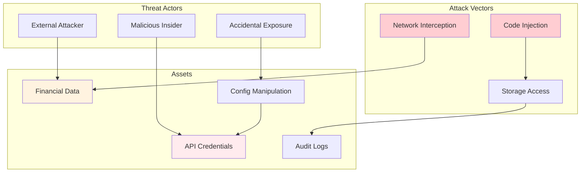
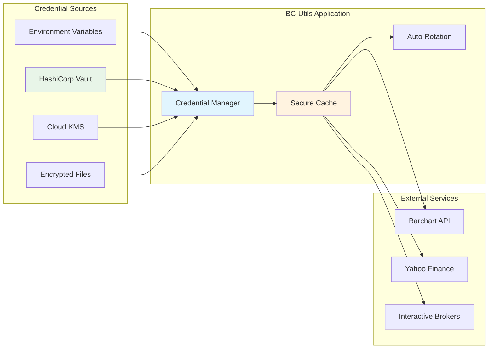

# BC-Utils Security Design

**Version:** 1.0  
**Date:** 2025-01-08  
**Related:** [System Overview](01-system-overview.md) | [Deployment Architecture](07-deployment-architecture.md)

## 1. Security Architecture Overview

### 1.1 Security Philosophy
BC-Utils implements defense-in-depth security with zero-trust principles. The design prioritizes credential protection, data integrity, and audit transparency while maintaining operational simplicity for legitimate use cases.

### 1.2 Security Objectives
- **Credential Protection:** No hardcoded secrets, secure credential management
- **Data Integrity:** Tamper detection and validation throughout pipeline
- **Audit Transparency:** Complete activity logging for compliance
- **Access Control:** Principle of least privilege for all operations
- **Network Security:** Encrypted communications and egress control

### 1.3 Threat Model


## 2. Credential Management

### 2.1 Credential Storage Strategy


### 2.2 Credential Manager Implementation
```python
from cryptography.fernet import Fernet
import keyring
import os
from typing import Dict, Optional
import logging

class CredentialManager:
    """Secure credential management with multiple backends"""
    
    def __init__(self, default_backend: str = "environment"):
        self.default_backend = default_backend
        self.backends = {
            "environment": EnvironmentCredentialBackend(),
            "keyring": KeyringCredentialBackend(), 
            "vault": VaultCredentialBackend(),
            "encrypted_file": EncryptedFileBackend()
        }
        self.credential_cache = {}
        self.encryption_key = self._get_or_create_encryption_key()
        self.logger = logging.getLogger(__name__)
        
    def get_credentials(self, provider: str) -> Dict[str, str]:
        """Get credentials for specified provider"""
        cache_key = f"creds_{provider}"
        
        # Check cache first
        if cache_key in self.credential_cache:
            cached_creds = self.credential_cache[cache_key]
            if not self._are_credentials_expired(cached_creds):
                return self._decrypt_credentials(cached_creds['encrypted_data'])
        
        # Load from backend
        credentials = self._load_credentials_from_backend(provider)
        
        if credentials:
            # Cache encrypted credentials
            encrypted_creds = self._encrypt_credentials(credentials)
            self.credential_cache[cache_key] = {
                'encrypted_data': encrypted_creds,
                'timestamp': time.time()
            }
            
            self.logger.info(f"Loaded credentials for provider: {provider}")
            return credentials
        else:
            raise CredentialError(f"No credentials found for provider: {provider}")
    
    def _load_credentials_from_backend(self, provider: str) -> Optional[Dict[str, str]]:
        """Load credentials from configured backend"""
        for backend_name, backend in self.backends.items():
            try:
                credentials = backend.get_credentials(provider)
                if credentials:
                    return credentials
            except Exception as e:
                self.logger.warning(f"Backend {backend_name} failed for {provider}: {e}")
                continue
        
        return None
    
    def _encrypt_credentials(self, credentials: Dict[str, str]) -> bytes:
        """Encrypt credentials for secure caching"""
        fernet = Fernet(self.encryption_key)
        credential_json = json.dumps(credentials)
        return fernet.encrypt(credential_json.encode())
    
    def _decrypt_credentials(self, encrypted_data: bytes) -> Dict[str, str]:
        """Decrypt cached credentials"""
        fernet = Fernet(self.encryption_key)
        decrypted_json = fernet.decrypt(encrypted_data).decode()
        return json.loads(decrypted_json)
    
    def _get_or_create_encryption_key(self) -> bytes:
        """Get or create encryption key for credential caching"""
        key_file = os.path.expanduser("~/.bcutils/encryption.key")
        
        if os.path.exists(key_file):
            with open(key_file, 'rb') as f:
                return f.read()
        else:
            # Create new key
            key = Fernet.generate_key()
            os.makedirs(os.path.dirname(key_file), exist_ok=True, mode=0o700)
            with open(key_file, 'wb') as f:
                f.write(key)
            os.chmod(key_file, 0o600)  # Read-only for owner
            return key
    
    def rotate_credentials(self, provider: str, new_credentials: Dict[str, str]):
        """Rotate credentials for a provider"""
        backend = self.backends[self.default_backend]
        
        try:
            # Store new credentials
            backend.store_credentials(provider, new_credentials)
            
            # Clear cache to force reload
            cache_key = f"creds_{provider}"
            if cache_key in self.credential_cache:
                del self.credential_cache[cache_key]
            
            self.logger.info(f"Rotated credentials for provider: {provider}")
            
        except Exception as e:
            self.logger.error(f"Failed to rotate credentials for {provider}: {e}")
            raise CredentialError(f"Credential rotation failed: {e}")
```

### 2.3 Environment Variable Backend
```python
class EnvironmentCredentialBackend:
    """Load credentials from environment variables"""
    
    CREDENTIAL_MAPPING = {
        'barchart': {
            'username': ['BCU_BARCHART_USERNAME', 'BARCHART_USER'],
            'password': ['BCU_BARCHART_PASSWORD', 'BARCHART_PASS']
        },
        'ibkr': {
            'host': ['BCU_IBKR_HOST', 'TWS_HOST'],
            'port': ['BCU_IBKR_PORT', 'TWS_PORT'],
            'client_id': ['BCU_IBKR_CLIENT_ID', 'TWS_CLIENT_ID']
        },
        'yahoo': {
            # Yahoo Finance doesn't require credentials
        }
    }
    
    def get_credentials(self, provider: str) -> Optional[Dict[str, str]]:
        """Get credentials from environment variables"""
        if provider not in self.CREDENTIAL_MAPPING:
            return None
        
        credentials = {}
        mapping = self.CREDENTIAL_MAPPING[provider]
        
        for cred_key, env_vars in mapping.items():
            value = None
            for env_var in env_vars:
                value = os.getenv(env_var)
                if value:
                    break
            
            if value:
                credentials[cred_key] = value
            else:
                # Some credentials may be optional
                if cred_key in ['username', 'password'] and provider == 'barchart':
                    return None  # Both required for Barchart
        
        return credentials if credentials else None
```

## 3. Data Security

### 3.1 Data Protection Pipeline
```mermaid
graph TB
    subgraph "Data Ingestion"
        Fetch[Data Fetch]
        Validate[Schema Validation]
        Sanitize[Data Sanitization]
    end
    
    subgraph "Data Processing"
        Transform[Data Transformation]
        Integrity[Integrity Check]
        Encrypt[Encryption (Optional)]
    end
    
    subgraph "Data Storage"
        Hash[Checksum Generation]
        Store[Secure Storage]
        Backup[Encrypted Backup]
    end
    
    Fetch --> Validate
    Validate --> Sanitize
    Sanitize --> Transform
    Transform --> Integrity
    Integrity --> Encrypt
    Encrypt --> Hash
    Hash --> Store
    Store --> Backup
    
    style Validate fill:#fff3e0
    style Integrity fill:#e1f5fe
    style Hash fill:#e8f5e8
```

### 3.2 Data Integrity Protection
```python
class DataIntegrityManager:
    """Ensure data integrity throughout the pipeline"""
    
    def __init__(self, hash_algorithm: str = 'sha256'):
        self.hash_algorithm = hash_algorithm
        self.integrity_checks = {}
        
    def calculate_data_hash(self, data: pd.DataFrame) -> str:
        """Calculate hash of DataFrame contents"""
        # Sort data deterministically
        sorted_data = data.sort_values(list(data.columns)).reset_index(drop=True)
        
        # Convert to bytes for hashing
        data_bytes = sorted_data.to_csv(index=False).encode('utf-8')
        
        # Calculate hash
        hasher = hashlib.new(self.hash_algorithm)
        hasher.update(data_bytes)
        return hasher.hexdigest()
    
    def verify_data_integrity(self, data: pd.DataFrame, 
                            expected_hash: str) -> bool:
        """Verify data has not been tampered with"""
        actual_hash = self.calculate_data_hash(data)
        return actual_hash == expected_hash
    
    def create_integrity_manifest(self, datasets: Dict[str, pd.DataFrame]) -> Dict[str, str]:
        """Create integrity manifest for multiple datasets"""
        manifest = {}
        for dataset_name, data in datasets.items():
            manifest[dataset_name] = {
                'hash': self.calculate_data_hash(data),
                'timestamp': datetime.utcnow().isoformat(),
                'row_count': len(data),
                'column_count': len(data.columns)
            }
        return manifest
    
    def validate_against_manifest(self, datasets: Dict[str, pd.DataFrame], 
                                manifest: Dict[str, str]) -> ValidationResult:
        """Validate datasets against integrity manifest"""
        results = {}
        
        for dataset_name, data in datasets.items():
            if dataset_name not in manifest:
                results[dataset_name] = False
                continue
            
            expected_info = manifest[dataset_name]
            actual_hash = self.calculate_data_hash(data)
            
            results[dataset_name] = (
                actual_hash == expected_info['hash'] and
                len(data) == expected_info['row_count'] and
                len(data.columns) == expected_info['column_count']
            )
        
        return ValidationResult(
            overall_valid=all(results.values()),
            dataset_results=results
        )
```

### 3.3 Data Sanitization
```python
class DataSanitizer:
    """Sanitize financial data to prevent injection attacks"""
    
    DANGEROUS_PATTERNS = [
        r'<script[^>]*>.*?</script>',  # Script tags
        r'javascript:',                # JavaScript URLs
        r'on\w+\s*=',                 # Event handlers
        r'data:',                     # Data URLs
        r'\${.*}',                    # Template injection
        r'{{.*}}',                    # Template expressions
    ]
    
    def __init__(self):
        self.compiled_patterns = [re.compile(pattern, re.IGNORECASE) 
                                for pattern in self.DANGEROUS_PATTERNS]
        
    def sanitize_dataframe(self, data: pd.DataFrame) -> pd.DataFrame:
        """Sanitize all string data in DataFrame"""
        sanitized_data = data.copy()
        
        # Sanitize string columns
        string_columns = sanitized_data.select_dtypes(include=['object', 'string']).columns
        
        for column in string_columns:
            sanitized_data[column] = sanitized_data[column].apply(
                self._sanitize_string_value
            )
        
        return sanitized_data
    
    def _sanitize_string_value(self, value: Any) -> str:
        """Sanitize individual string value"""
        if pd.isna(value):
            return value
        
        str_value = str(value)
        
        # Remove dangerous patterns
        for pattern in self.compiled_patterns:
            str_value = pattern.sub('', str_value)
        
        # Remove control characters except whitespace
        str_value = ''.join(char for char in str_value 
                           if ord(char) >= 32 or char in '\t\n\r')
        
        # Limit length to prevent DoS
        if len(str_value) > 1000:
            str_value = str_value[:1000]
            
        return str_value
    
    def detect_suspicious_content(self, data: pd.DataFrame) -> List[SuspiciousContent]:
        """Detect potentially malicious content in data"""
        suspicious_items = []
        
        string_columns = data.select_dtypes(include=['object', 'string']).columns
        
        for column in string_columns:
            for idx, value in data[column].items():
                if pd.isna(value):
                    continue
                    
                str_value = str(value)
                
                for pattern_idx, pattern in enumerate(self.compiled_patterns):
                    if pattern.search(str_value):
                        suspicious_items.append(SuspiciousContent(
                            row=idx,
                            column=column,
                            pattern_matched=self.DANGEROUS_PATTERNS[pattern_idx],
                            content_preview=str_value[:100]
                        ))
        
        return suspicious_items
```

## 4. Network Security

### 4.1 Secure Communication
```python
class SecureHTTPSession:
    """Enhanced HTTP session with security controls"""
    
    def __init__(self, verify_ssl: bool = True, timeout: int = 30):
        self.session = requests.Session()
        self.verify_ssl = verify_ssl
        self.timeout = timeout
        self._configure_security()
        
    def _configure_security(self):
        """Configure session security settings"""
        # SSL/TLS configuration
        self.session.verify = self.verify_ssl
        
        # Security headers
        self.session.headers.update({
            'User-Agent': 'BC-Utils/1.0 (Financial Data Client)',
            'Accept': 'application/json, text/csv, */*',
            'Accept-Encoding': 'gzip, deflate',
            'Connection': 'keep-alive',
            'DNT': '1',  # Do Not Track
        })
        
        # Configure SSL context
        if self.verify_ssl:
            adapter = HTTPAdapter(
                max_retries=Retry(
                    total=3,
                    backoff_factor=1,
                    status_forcelist=[500, 502, 503, 504]
                )
            )
            self.session.mount('https://', adapter)
    
    def secure_request(self, method: str, url: str, **kwargs) -> requests.Response:
        """Make secure HTTP request with additional validation"""
        
        # Validate URL
        if not self._is_safe_url(url):
            raise SecurityError(f"Unsafe URL detected: {url}")
        
        # Add timeout if not specified
        kwargs.setdefault('timeout', self.timeout)
        
        # Make request
        try:
            response = self.session.request(method, url, **kwargs)
            
            # Validate response
            self._validate_response(response)
            
            return response
            
        except requests.exceptions.SSLError as e:
            raise SecurityError(f"SSL verification failed: {e}")
        except requests.exceptions.Timeout as e:
            raise SecurityError(f"Request timeout: {e}")
    
    def _is_safe_url(self, url: str) -> bool:
        """Validate URL is safe to request"""
        parsed = urllib.parse.urlparse(url)
        
        # Must use HTTPS for external requests
        if parsed.scheme != 'https':
            return False
        
        # Check against allowlist of known providers
        allowed_domains = [
            'www.barchart.com',
            'query1.finance.yahoo.com',
            'query2.finance.yahoo.com'
        ]
        
        return parsed.netloc in allowed_domains
    
    def _validate_response(self, response: requests.Response):
        """Validate response for security issues"""
        # Check content type
        content_type = response.headers.get('content-type', '')
        
        allowed_types = [
            'text/csv',
            'application/json',
            'text/html',
            'application/octet-stream'
        ]
        
        if not any(allowed_type in content_type for allowed_type in allowed_types):
            raise SecurityError(f"Unexpected content type: {content_type}")
        
        # Check content length
        content_length = response.headers.get('content-length')
        if content_length and int(content_length) > 100 * 1024 * 1024:  # 100MB limit
            raise SecurityError("Response too large")
```

### 4.2 Certificate Pinning
```python
class CertificatePinner:
    """Certificate pinning for known providers"""
    
    PROVIDER_PINS = {
        'www.barchart.com': [
            # SHA256 fingerprints of expected certificates
            'a1b2c3d4e5f6...',  # Primary certificate
            'f6e5d4c3b2a1...',  # Backup certificate
        ],
        'query1.finance.yahoo.com': [
            'y1a2h3o4o5...',    # Yahoo primary
        ]
    }
    
    def verify_certificate(self, hostname: str, cert_der: bytes) -> bool:
        """Verify certificate matches pinned fingerprint"""
        if hostname not in self.PROVIDER_PINS:
            # Allow unpinned hosts for flexibility
            return True
        
        # Calculate certificate fingerprint
        cert_hash = hashlib.sha256(cert_der).hexdigest()
        
        # Check against pinned certificates
        return cert_hash in self.PROVIDER_PINS[hostname]
```

## 5. Access Control and Authorization

### 5.1 Role-Based Access Control
```python
class AccessControlManager:
    """Manage access control for BC-Utils operations"""
    
    def __init__(self):
        self.roles = {
            'admin': {
                'permissions': [
                    'read_config', 'write_config',
                    'read_data', 'write_data', 'delete_data',
                    'read_logs', 'read_credentials',
                    'system_control'
                ]
            },
            'operator': {
                'permissions': [
                    'read_config',
                    'read_data', 'write_data',
                    'read_logs'
                ]
            },
            'viewer': {
                'permissions': [
                    'read_config',
                    'read_data',
                    'read_logs'
                ]
            }
        }
        self.user_roles = {}
    
    def assign_role(self, user: str, role: str):
        """Assign role to user"""
        if role not in self.roles:
            raise ValueError(f"Unknown role: {role}")
        
        self.user_roles[user] = role
    
    def check_permission(self, user: str, permission: str) -> bool:
        """Check if user has specific permission"""
        user_role = self.user_roles.get(user)
        if not user_role:
            return False
        
        role_permissions = self.roles[user_role]['permissions']
        return permission in role_permissions
    
    def require_permission(self, user: str, permission: str):
        """Decorator to require specific permission"""
        def decorator(func):
            def wrapper(*args, **kwargs):
                if not self.check_permission(user, permission):
                    raise PermissionError(f"User {user} lacks permission: {permission}")
                return func(*args, **kwargs)
            return wrapper
        return decorator
```

### 5.2 File System Security
```python
class SecureFileManager:
    """Secure file operations with access control"""
    
    def __init__(self, base_directory: str):
        self.base_directory = Path(base_directory).resolve()
        self._ensure_secure_permissions()
    
    def _ensure_secure_permissions(self):
        """Ensure base directory has secure permissions"""
        if not self.base_directory.exists():
            self.base_directory.mkdir(parents=True, mode=0o750)
        else:
            # Update permissions if needed
            os.chmod(self.base_directory, 0o750)
    
    def secure_write(self, filepath: str, content: bytes, 
                    permissions: int = 0o640) -> bool:
        """Write file with secure permissions"""
        full_path = self._validate_path(filepath)
        
        # Create parent directories with secure permissions
        full_path.parent.mkdir(parents=True, mode=0o750, exist_ok=True)
        
        # Write to temporary file first
        temp_path = full_path.with_suffix(full_path.suffix + '.tmp')
        
        try:
            with open(temp_path, 'wb') as f:
                f.write(content)
            
            # Set secure permissions
            os.chmod(temp_path, permissions)
            
            # Atomic rename
            temp_path.rename(full_path)
            
            return True
            
        except Exception as e:
            # Clean up on failure
            if temp_path.exists():
                temp_path.unlink()
            raise SecurityError(f"Secure write failed: {e}")
    
    def _validate_path(self, filepath: str) -> Path:
        """Validate path is within allowed directory"""
        full_path = (self.base_directory / filepath).resolve()
        
        # Prevent directory traversal
        if not str(full_path).startswith(str(self.base_directory)):
            raise SecurityError(f"Path traversal detected: {filepath}")
        
        return full_path
```

## 6. Audit Logging and Monitoring

### 6.1 Security Event Logging
```python
class SecurityAuditLogger:
    """Comprehensive security event logging"""
    
    def __init__(self, log_level: str = 'INFO'):
        self.logger = self._setup_logger(log_level)
        self.event_types = {
            'AUTHENTICATION': 'auth',
            'AUTHORIZATION': 'authz', 
            'DATA_ACCESS': 'data',
            'CONFIGURATION': 'config',
            'SYSTEM': 'system',
            'SECURITY_VIOLATION': 'violation'
        }
    
    def log_security_event(self, event_type: str, user: str, 
                          action: str, resource: str = None,
                          success: bool = True, details: Dict = None):
        """Log security-relevant event"""
        
        event_data = {
            'timestamp': datetime.utcnow().isoformat(),
            'event_type': event_type,
            'user': user,
            'action': action,
            'resource': resource,
            'success': success,
            'source_ip': self._get_source_ip(),
            'session_id': self._get_session_id(),
            'details': details or {}
        }
        
        # Add contextual information
        event_data.update({
            'process_id': os.getpid(),
            'hostname': socket.gethostname(),
            'version': self._get_application_version()
        })
        
        if success:
            self.logger.info(json.dumps(event_data))
        else:
            self.logger.warning(json.dumps(event_data))
    
    def log_authentication_attempt(self, user: str, provider: str, 
                                 success: bool, failure_reason: str = None):
        """Log authentication attempt"""
        details = {'provider': provider}
        if not success and failure_reason:
            details['failure_reason'] = failure_reason
            
        self.log_security_event(
            'AUTHENTICATION', user, 'login', 
            provider, success, details
        )
    
    def log_data_access(self, user: str, operation: str, 
                       filepath: str, success: bool):
        """Log data access event"""
        self.log_security_event(
            'DATA_ACCESS', user, operation,
            filepath, success
        )
    
    def log_security_violation(self, violation_type: str, 
                             details: Dict, severity: str = 'high'):
        """Log security violation"""
        event_details = {'violation_type': violation_type, 'severity': severity}
        event_details.update(details)
        
        self.log_security_event(
            'SECURITY_VIOLATION', 'system', violation_type,
            None, False, event_details
        )
        
        # Also log to security team if severity is high
        if severity == 'high':
            self._alert_security_team(violation_type, event_details)
```

### 6.2 Anomaly Detection
```python
class SecurityAnomalyDetector:
    """Detect suspicious patterns in system behavior"""
    
    def __init__(self, baseline_window_hours: int = 24):
        self.baseline_window = baseline_window_hours
        self.event_history = deque(maxlen=10000)
        self.anomaly_thresholds = {
            'failed_auth_rate': 5,      # failures per hour
            'unusual_access_time': True, # outside business hours
            'large_data_download': 1024 * 1024 * 1024,  # 1GB
            'rapid_requests': 100       # requests per minute
        }
    
    def analyze_authentication_pattern(self, events: List[Dict]) -> List[Anomaly]:
        """Analyze authentication events for anomalies"""
        anomalies = []
        
        # Group by user and time window
        auth_failures = defaultdict(list)
        for event in events:
            if event['event_type'] == 'AUTHENTICATION' and not event['success']:
                user = event['user']
                timestamp = datetime.fromisoformat(event['timestamp'])
                auth_failures[user].append(timestamp)
        
        # Check for excessive failures
        for user, failures in auth_failures.items():
            recent_failures = [f for f in failures 
                             if (datetime.utcnow() - f).total_seconds() < 3600]
            
            if len(recent_failures) >= self.anomaly_thresholds['failed_auth_rate']:
                anomalies.append(Anomaly(
                    type='EXCESSIVE_AUTH_FAILURES',
                    user=user,
                    severity='HIGH',
                    description=f"User {user} has {len(recent_failures)} auth failures in past hour",
                    evidence={'failure_count': len(recent_failures)}
                ))
        
        return anomalies
    
    def analyze_data_access_pattern(self, events: List[Dict]) -> List[Anomaly]:
        """Analyze data access patterns for anomalies"""
        anomalies = []
        
        # Check for unusual access times
        for event in events:
            if event['event_type'] == 'DATA_ACCESS':
                timestamp = datetime.fromisoformat(event['timestamp'])
                
                # Check if access is outside business hours (9 AM - 6 PM UTC)
                if self.anomaly_thresholds['unusual_access_time']:
                    if timestamp.hour < 9 or timestamp.hour > 18:
                        anomalies.append(Anomaly(
                            type='UNUSUAL_ACCESS_TIME',
                            user=event['user'],
                            severity='MEDIUM',
                            description=f"Data access outside business hours: {timestamp}",
                            evidence={'access_time': timestamp.isoformat()}
                        ))
        
        return anomalies
```

## 7. Compliance and Governance

### 7.1 Data Governance Framework
```python
class DataGovernanceManager:
    """Manage data governance and compliance requirements"""
    
    def __init__(self):
        self.data_classifications = {
            'PUBLIC': {'encryption_required': False, 'retention_days': 365},
            'INTERNAL': {'encryption_required': True, 'retention_days': 2555},  # 7 years
            'CONFIDENTIAL': {'encryption_required': True, 'retention_days': 2555},
            'RESTRICTED': {'encryption_required': True, 'retention_days': 3650}  # 10 years
        }
        self.compliance_rules = []
    
    def classify_data(self, data: pd.DataFrame, source: str) -> str:
        """Classify data based on content and source"""
        # Financial data from authenticated sources is typically confidential
        if source in ['barchart', 'ibkr']:
            return 'CONFIDENTIAL'
        elif source == 'yahoo':
            return 'INTERNAL'  # Publicly available but internal use
        else:
            return 'PUBLIC'
    
    def apply_retention_policy(self, filepath: str, 
                             classification: str) -> RetentionPolicy:
        """Apply retention policy based on data classification"""
        policy_info = self.data_classifications[classification]
        
        return RetentionPolicy(
            filepath=filepath,
            classification=classification,
            retention_days=policy_info['retention_days'],
            encryption_required=policy_info['encryption_required'],
            delete_after=datetime.utcnow() + timedelta(days=policy_info['retention_days'])
        )
    
    def generate_compliance_report(self) -> ComplianceReport:
        """Generate compliance status report"""
        # This would integrate with actual storage and metadata systems
        return ComplianceReport(
            total_datasets=0,
            classified_datasets=0,
            encrypted_datasets=0,
            retention_compliant=0,
            violations=[]
        )
```

### 7.2 Regulatory Compliance
```python
class RegulatoryComplianceManager:
    """Handle various regulatory compliance requirements"""
    
    REGULATIONS = {
        'GDPR': {
            'data_subject_rights': True,
            'consent_required': False,  # Financial data exemption
            'breach_notification_hours': 72,
            'retention_limit_days': None  # No specific limit for financial data
        },
        'SOX': {
            'audit_trail_required': True,
            'change_approval_required': True,
            'segregation_of_duties': True
        },
        'MiFID_II': {
            'transaction_reporting': True,
            'data_quality_standards': True,
            'record_keeping_years': 5
        }
    }
    
    def check_gdpr_compliance(self, operation: str, 
                            personal_data: bool = False) -> ComplianceResult:
        """Check GDPR compliance for operation"""
        if not personal_data:
            # Financial market data typically doesn't contain personal data
            return ComplianceResult(compliant=True, regulation='GDPR')
        
        # If personal data is involved, additional checks needed
        requirements = []
        if operation == 'data_processing':
            requirements.append('Lawful basis for processing')
            requirements.append('Data subject notification')
        
        return ComplianceResult(
            compliant=False,
            regulation='GDPR',
            requirements=requirements
        )
    
    def generate_audit_trail(self, operation: str, user: str, 
                           data_affected: str) -> AuditTrailEntry:
        """Generate SOX-compliant audit trail entry"""
        return AuditTrailEntry(
            timestamp=datetime.utcnow(),
            operation=operation,
            user=user,
            data_affected=data_affected,
            approval_required=self.REGULATIONS['SOX']['change_approval_required'],
            digital_signature=self._generate_digital_signature(operation, user, data_affected)
        )
```

## Related Documents

- **[System Overview](01-system-overview.md)** - Overall security context
- **[Deployment Architecture](07-deployment-architecture.md)** - Production security implementation
- **[Integration Design](08-integration-design.md)** - External system security
- **[Data Requirements](../../requirements/prd/data-requirements.md)** - Security requirements

---

**Next Review:** 2025-02-08  
**Reviewers:** Security Architect, Compliance Officer, DevOps Lead