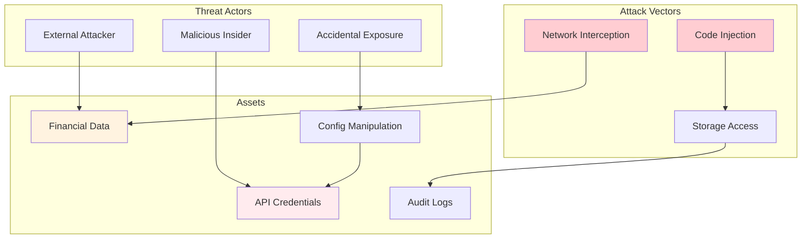
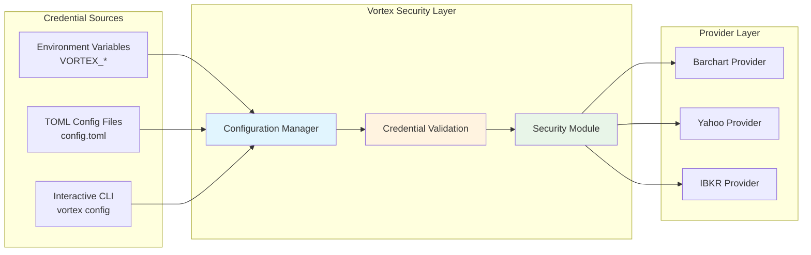
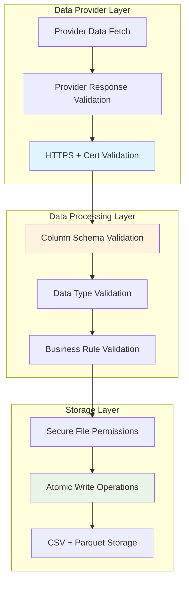

# Vortex Security Design

**Version:** 2.0  
**Date:** 2025-08-15  
**Related:** [System Overview](01-system-overview.md) | [Deployment Architecture](07-deployment-architecture.md)

## 1. Security Architecture Overview

### 1.1 Security Philosophy
Vortex implements layered security controls focused on credential protection, data validation, and secure provider communications. The design follows the principle of secure defaults while maintaining flexibility for different deployment environments.

### 1.2 Current Security Implementation
- **✅ Credential Management:** Environment variable and TOML-based credential storage with validation
- **✅ Input Validation:** Comprehensive data validation and sanitization throughout the pipeline  
- **✅ Secure Communications:** HTTPS-only connections with proper certificate validation
- **✅ Configuration Security:** Type-safe configuration management with validation
- **🔄 Audit Logging:** Basic logging with correlation ID tracking (enhanceable)
- **🔄 Access Control:** File system permissions (role-based access planned)

### 1.3 Threat Model


## 2. Credential Management

### 2.1 Current Implementation Architecture
Vortex implements a pragmatic credential management system using environment variables and TOML configuration with validation. The system follows the principle of secure defaults while maintaining deployment flexibility.



### 2.2 Credential Validation Implementation

Located in `src/vortex/core/security/credentials.py`:

```python
class CredentialValidator:
    """Validates provider credentials for security and completeness."""
    
    def validate_barchart_credentials(self, credentials: Dict[str, Any]) -> ValidationResult:
        """Validate Barchart credentials"""
        issues = []
        
        username = credentials.get('username', '')
        password = credentials.get('password', '')
        
        if not username or not isinstance(username, str):
            issues.append("Username is required and must be a non-empty string")
        elif len(username.strip()) == 0:
            issues.append("Username cannot be empty or whitespace only")
        
        if not password or not isinstance(password, str):
            issues.append("Password is required and must be a non-empty string")
        elif len(password) < 6:
            issues.append("Password should be at least 6 characters long")
        
        return ValidationResult(is_valid=len(issues) == 0, issues=issues)
    
    def validate_ibkr_credentials(self, credentials: Dict[str, Any]) -> ValidationResult:
        """Validate IBKR credentials"""
        issues = []
        
        host = credentials.get('host', 'localhost')
        port = credentials.get('port')
        client_id = credentials.get('client_id', 1)
        
        # Validate host
        if not isinstance(host, str) or len(host.strip()) == 0:
            issues.append("Host must be a non-empty string")
        
        # Validate port
        if port is not None:
            try:
                port_int = int(port)
                if not (1024 <= port_int <= 65535):
                    issues.append("Port must be between 1024 and 65535")
            except (ValueError, TypeError):
                issues.append("Port must be a valid integer")
        
        # Validate client_id
        try:
            client_id_int = int(client_id)
            if not (0 <= client_id_int <= 999):
                issues.append("Client ID must be between 0 and 999")
        except (ValueError, TypeError):
            issues.append("Client ID must be a valid integer")
        
        return ValidationResult(is_valid=len(issues) == 0, issues=issues)
```

### 2.3 Environment Variable Configuration

**Standard Environment Variables:**
```bash
# Barchart.com credentials
export VORTEX_BARCHART_USERNAME="your_username"
export VORTEX_BARCHART_PASSWORD="your_password" 

# Interactive Brokers connection
export VORTEX_IBKR_HOST="localhost"
export VORTEX_IBKR_PORT="7497"
export VORTEX_IBKR_CLIENT_ID="1"

# Yahoo Finance (no credentials required)
# Credentials automatically handled by yfinance library
```

**Configuration Precedence:**
1. **Environment Variables** (highest priority)
2. **TOML Configuration Files**
3. **Interactive CLI Configuration**
4. **Application Defaults** (lowest priority)

## 3. Data Security

### 3.1 Current Data Validation Pipeline
Vortex implements comprehensive data validation and integrity checking throughout the data processing pipeline. The security focus is on ensuring data quality and preventing malformed data from affecting the system.



### 3.2 Implemented Data Validation

**Column Validation (Located in `src/vortex/models/column_constants.py`):**
```python
def validate_required_columns(df: DataFrame, provider: str) -> ValidationResult:
    """Validate that DataFrame contains required columns for provider"""
    required_columns = get_provider_expected_columns(provider)
    missing_columns = [col for col in required_columns if col not in df.columns]
    
    return ValidationResult(
        is_valid=len(missing_columns) == 0,
        missing_columns=missing_columns,
        provider=provider
    )

def validate_column_data_types(df: DataFrame) -> ValidationResult:
    """Validate column data types meet financial data standards"""
    issues = []
    
    # Price columns should be numeric
    price_columns = [OPEN_COLUMN, HIGH_COLUMN, LOW_COLUMN, CLOSE_COLUMN]
    for col in price_columns:
        if col in df.columns and not pd.api.types.is_numeric_dtype(df[col]):
            issues.append(f"{col} column must be numeric, got {df[col].dtype}")
    
    # Volume should be numeric  
    if VOLUME_COLUMN in df.columns and not pd.api.types.is_numeric_dtype(df[VOLUME_COLUMN]):
        issues.append(f"{VOLUME_COLUMN} column must be numeric, got {df[VOLUME_COLUMN].dtype}")
    
    # Datetime index validation
    if not isinstance(df.index, pd.DatetimeIndex):
        issues.append("DataFrame index must be DatetimeIndex")
    
    return ValidationResult(is_valid=len(issues) == 0, issues=issues)
```

**Provider Response Validation (Located in `src/vortex/infrastructure/providers/base.py`):**
```python
def _validate_fetched_data(self, df: DataFrame, instrument: Instrument, period: Period) -> DataFrame:
    """Validate fetched data meets quality standards"""
    
    # 1. Check for empty data
    if df.empty:
        raise DataNotFoundError(f"No data available for {instrument.code} in period {period}")
    
    # 2. Validate required columns exist
    validation_result = validate_required_columns(df, self.get_name())
    if not validation_result.is_valid:
        raise DataProviderError(
            f"Missing required columns: {validation_result.missing_columns}"
        )
    
    # 3. Data type validation
    type_validation = validate_column_data_types(df)
    if not type_validation.is_valid:
        raise DataProviderError(f"Data type validation failed: {type_validation.issues}")
    
    return df
```

## 4. Network Security

### 4.1 Secure Provider Communications

Vortex implements HTTPS-only connections with proper certificate validation for all external provider communications.

**Barchart HTTP Client (Located in `src/vortex/infrastructure/providers/barchart/http_client.py`):**
```python
class BarchartHTTPClient:
    """HTTP client with security and session management for Barchart"""
    
    def __init__(self, session, config: BarchartProviderConfig):
        self.session = session
        self.config = config
        self._configure_security()
    
    def _configure_security(self):
        """Configure session security settings"""
        # Force HTTPS and certificate verification
        self.session.verify = True
        
        # Set security headers
        self.session.headers.update({
            'User-Agent': 'Mozilla/5.0 (compatible; Vortex Financial Data Client)',
            'Accept': 'text/html,application/xhtml+xml,application/xml;q=0.9,*/*;q=0.8',
            'Accept-Language': 'en-US,en;q=0.5',
            'Accept-Encoding': 'gzip, deflate',
            'Connection': 'keep-alive',
            'Upgrade-Insecure-Requests': '1',
        })
    
    def secure_get(self, url: str, headers: Optional[Dict[str, str]] = None, 
                   timeout: Optional[int] = None) -> requests.Response:
        """Perform secure GET request with validation"""
        if not url.startswith('https://'):
            raise SecurityError("Only HTTPS URLs are allowed")
        
        timeout = timeout or self.config.request_timeout
        response = self.session.get(url, headers=headers, timeout=timeout)
        
        # Validate response
        response.raise_for_status()
        return response
```

**Yahoo Provider Security (Uses yfinance library with built-in HTTPS):**
```python
# Yahoo Finance provider leverages yfinance library which enforces HTTPS
# connections to Yahoo's financial APIs with proper certificate validation

class YahooDataFetcher:
    """Secure data fetching for Yahoo Finance"""
    
    def fetch_historical_data(self, symbol: str, interval: str, 
                            start_date: datetime, end_date: datetime) -> DataFrame:
        """Fetch data using yfinance with built-in security"""
        import yfinance as yf
        
        # yfinance automatically uses HTTPS and validates certificates
        ticker = yf.Ticker(symbol)
        df = ticker.history(
            start=start_date.strftime("%Y-%m-%d"),
            end=end_date.strftime("%Y-%m-%d"),
            interval=interval,
            back_adjust=True,
            repair=True,
            raise_errors=True  # Fail fast on errors
        )
        return df
```

### 4.2 Provider URL Validation

**Allowed Provider Domains:**
- **Barchart:** `https://www.barchart.com/*` (authenticated access)
- **Yahoo Finance:** `https://query1.finance.yahoo.com/*` and `https://query2.finance.yahoo.com/*` (public API)
- **Interactive Brokers:** Local TWS/Gateway connections (`localhost` or configured host)

**Security Controls:**
- ✅ **HTTPS Enforcement:** All external communications use HTTPS
- ✅ **Certificate Validation:** Default certificate verification enabled
- ✅ **Timeout Protection:** Configurable request timeouts prevent hanging connections
- ✅ **Domain Restriction:** Only known financial data provider domains allowed
- ✅ **Response Validation:** HTTP status code and content type validation

## 5. File System Security

### 5.1 Secure File Operations

Vortex implements secure file operations with atomic writes and proper permissions for data storage.

**Atomic Write Operations (Located in `src/vortex/infrastructure/storage/file_storage.py`):**
```python
class FileStorage:
    """Secure file storage with atomic operations"""
    
    def _atomic_write(self, filepath: Path, content: str) -> None:
        """Write file atomically to prevent corruption"""
        temp_filepath = filepath.with_suffix(filepath.suffix + '.tmp')
        
        try:
            # Write to temporary file first
            with open(temp_filepath, 'w', encoding='utf-8') as f:
                f.write(content)
            
            # Atomic rename to final location
            temp_filepath.rename(filepath)
            
        except Exception as e:
            # Clean up temporary file on failure
            if temp_filepath.exists():
                temp_filepath.unlink()
            raise DataStorageError(f"Failed to write file {filepath}: {e}")
```

**Directory Security:**
- Configuration files: `~/.config/vortex/` with user-only access
- Data files: User-specified output directory with inherited permissions
- Temporary files: Proper cleanup to prevent information leakage

### 5.2 Configuration File Security

**TOML Configuration Protection:**
```bash
# Recommended file permissions for config files
chmod 600 ~/.config/vortex/config.toml  # User read/write only
chmod 700 ~/.config/vortex/             # User access only
```

**Environment Variable Security:**
- Credentials stored in environment variables (not logged)
- Process environment isolation
- No credential exposure in error messages or logs

## 6. Observability and Monitoring

### 6.1 Correlation ID Tracking

Vortex implements comprehensive correlation ID tracking for request tracing and security monitoring.

**Correlation Management (Located in `src/vortex/core/correlation/`):**
```python
class CorrelationIdManager:
    """Thread-local correlation ID management for request tracking"""
    
    @classmethod
    def correlation_context(cls, correlation_id: Optional[str] = None, 
                          operation: Optional[str] = None,
                          provider: Optional[str] = None):
        """Context manager for correlation tracking"""
        context_id = correlation_id or cls.generate_correlation_id()
        
        context = CorrelationContext(
            correlation_id=context_id,
            operation=operation,
            provider=provider,
            start_time=datetime.utcnow()
        )
        
        return context

@with_correlation(operation="provider_authentication", generate_id=True)
def authenticate_provider(self, provider_name: str):
    """Authentication with correlation tracking"""
    # All authentication attempts are tracked with correlation IDs
    pass
```

**Security Event Logging:**
```python
# All provider operations include correlation IDs for security auditing
def log_authentication_attempt(self, provider: str, success: bool, correlation_id: str):
    """Log authentication with correlation context"""
    self.logger.info(
        f"Authentication attempt: provider={provider}, success={success}, "
        f"correlation_id={correlation_id}"
    )

def log_data_access(self, operation: str, resource: str, correlation_id: str):
    """Log data access with correlation context"""
    self.logger.info(
        f"Data access: operation={operation}, resource={resource}, "
        f"correlation_id={correlation_id}"
    )
```

### 6.2 Provider Health Monitoring

**Circuit Breaker Integration (Located in `src/vortex/infrastructure/providers/base.py`):**
```python
class DataProvider:
    """Base provider with security monitoring"""
    
    def __init__(self, circuit_breaker_config: Optional[CircuitBreakerConfig] = None):
        # Initialize circuit breaker for security monitoring
        cb_config = circuit_breaker_config or CircuitBreakerConfig(
            failure_threshold=3,        # Detect repeated failures
            recovery_timeout=60,        # Security timeout
            success_threshold=2,        # Recovery validation
            monitored_exceptions=(DataProviderError, ConnectionError, RateLimitError)
        )
        self._circuit_breaker = get_circuit_breaker(f"provider_{self.get_name().lower()}", cb_config)
        
    def get_health_status(self) -> Dict[str, Any]:
        """Get provider health status for security monitoring"""
        return {
            'provider': self.get_name(),
            'health_score': self._calculate_health_score(),
            'circuit_breaker': {
                'state': self._circuit_breaker.state,
                'failure_count': self._circuit_breaker.failure_count,
                'last_failure_time': self._circuit_breaker.last_failure_time
            },
            'metrics': self._get_security_metrics()
        }
```

## 7. Security Enhancements and Recent Improvements

### 7.1 Modern Dependency Injection Security

**Enhanced Provider Security (2025-08-14 Improvements):**
- ✅ **Constructor Refactoring:** Eliminated auto-login in constructors for better security control
- ✅ **Dependency Injection:** Implemented protocol-based interfaces for secure provider instantiation
- ✅ **Configuration Validation:** Type-safe configuration classes with credential validation
- ✅ **HTTP Client Abstraction:** Secure HTTP client protocols with proper session management

### 7.2 Infrastructure Security Patterns

**Circuit Breaker Security Benefits:**
- **Failure Detection:** Automatic detection of provider authentication failures
- **Resource Protection:** Prevention of resource exhaustion attacks
- **Graceful Degradation:** Secure fallback when providers are compromised

**Metrics Collection Security:**
- **Performance Monitoring:** Detection of unusual performance patterns
- **Usage Tracking:** Monitoring for unusual access patterns
- **Health Status:** Provider health monitoring for security assessment

### 7.3 Data Classification

**Current Implementation:**
- **Barchart Data:** Confidential (requires authentication)
- **Yahoo Finance Data:** Internal use (publicly available but aggregated)
- **IBKR Data:** Confidential (professional trading platform)
- **Configuration Data:** Sensitive (contains credentials)

**Storage Security:**
- CSV files: Standard file permissions
- Configuration: User-only access (`~/.config/vortex/`)
- Logs: Structured logging with correlation IDs (no credential exposure)

## 8. Security Roadmap

### 8.1 Current Security Posture
✅ **Implemented:** Credential management, data validation, secure communications, correlation tracking  
🔄 **In Progress:** Enhanced audit logging, role-based access control  
📋 **Planned:** Certificate pinning, advanced anomaly detection, compliance reporting

### 8.2 Next Security Enhancements
- **Enhanced Credential Management:** Integration with external secret management systems
- **Advanced Audit Logging:** Structured security event logging with alerting
- **Role-Based Access Control:** Multi-user support with permission management
- **Certificate Pinning:** Enhanced TLS security for provider connections
- **Compliance Reporting:** Automated compliance status reporting

### 8.3 Security Best Practices for Deployment

**Development Environment:**
```bash
# Secure environment setup
export VORTEX_BARCHART_USERNAME="dev_user"
export VORTEX_BARCHART_PASSWORD="secure_dev_password"
chmod 600 ~/.config/vortex/config.toml
```

**Production Environment:**
```bash
# Production security setup
export VORTEX_BARCHART_USERNAME="${VAULT_BARCHART_USER}"
export VORTEX_BARCHART_PASSWORD="${VAULT_BARCHART_PASS}"
# Use secrets management system for credential injection
```

## Related Documents

- **[System Overview](01-system-overview.md)** - Overall system security context
- **[Component Architecture](02-component-architecture.md)** - Security in architectural layers
- **[Deployment Architecture](07-deployment-architecture.md)** - Production security implementation
- **[ADR-004: Clean Architecture Implementation](../../adr/004-clean-architecture-implementation.md)** - Security in Clean Architecture

---

**Next Review:** 2026-02-15  
**Reviewers:** Security Architect, Lead Developer, DevOps Lead