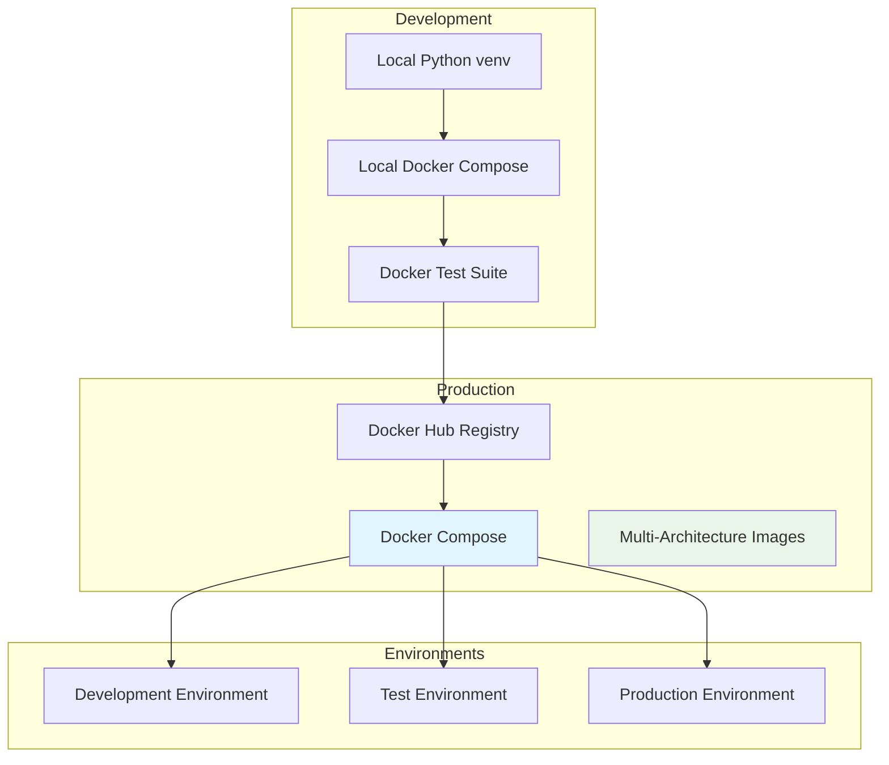
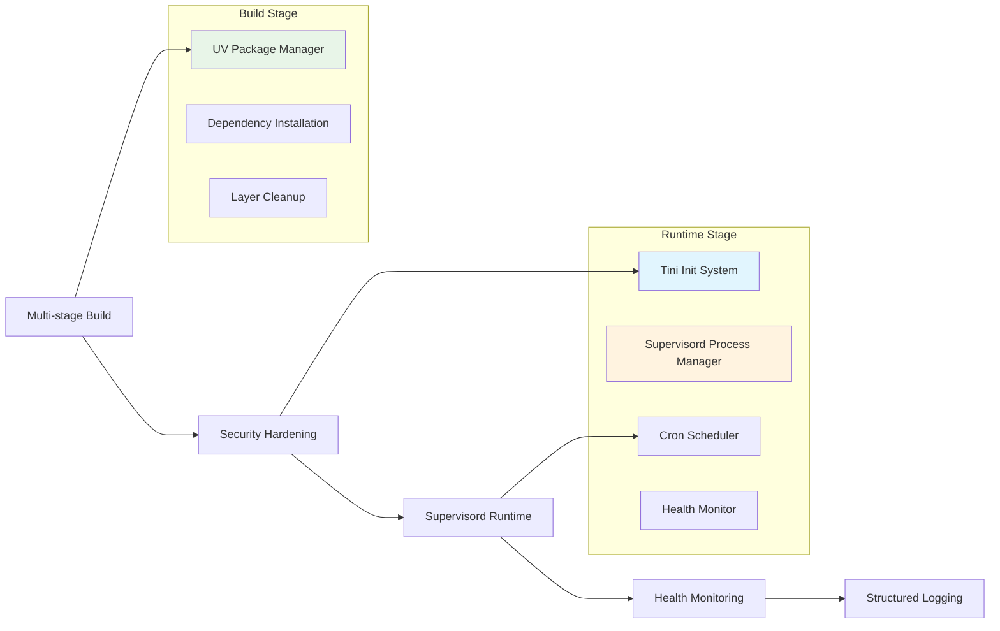
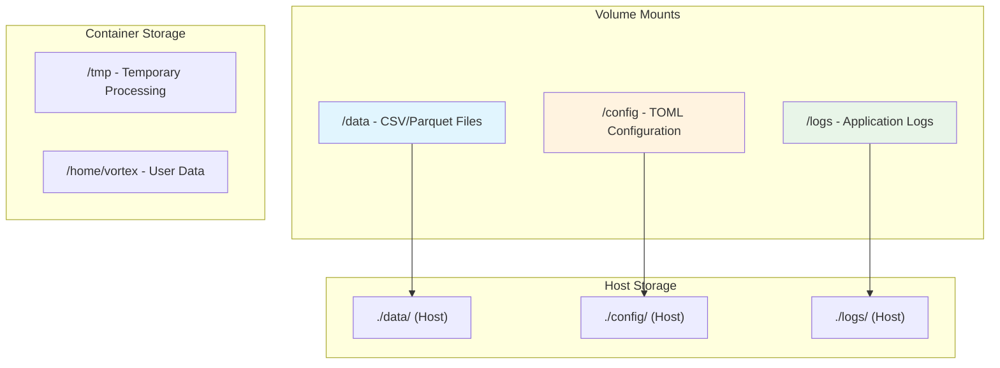
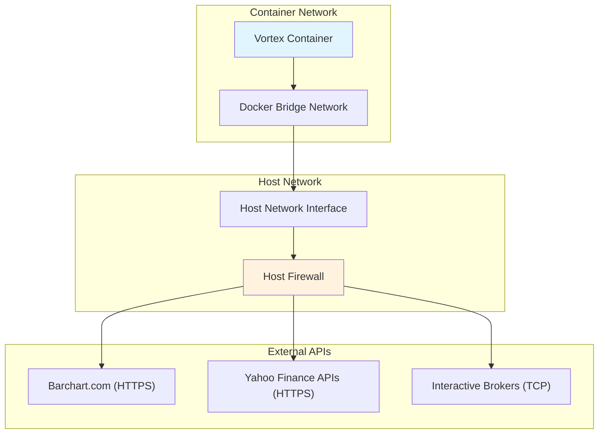
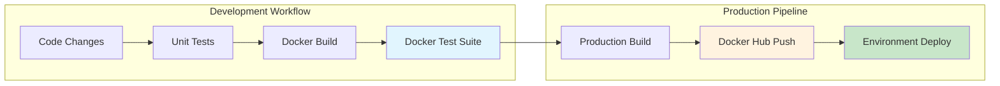

# Vortex Deployment Architecture

**Version:** 2.0  
**Date:** 2025-08-15  
**Related:** [System Overview](01-system-overview.md) | [Security Design](06-security-design.md)

## 1. Deployment Overview

Vortex implements a Docker-based deployment architecture with a focus on security, simplicity, and operational reliability. The current implementation emphasizes Docker Compose for production deployment with a sophisticated multi-environment structure.

### 1.1 Current Deployment Architecture


### 1.2 Deployment Characteristics
| Aspect | Local Development | Local Docker | Production Docker | 
|--------|-------------------|--------------|-------------------|
| **Setup** | `uv venv + pip install` | `docker compose up` | `makutaku/vortex:latest` |
| **Security** | User permissions | Non-root container | Rootless + security hardening |
| **Scalability** | Single user | Single container | Multi-environment orchestration |
| **Resource Usage** | Native performance | Containerized isolation | Optimized production images |
| **Use Case** | Development, Testing | Local testing, CI/CD | Production, Scheduled operations |

## 2. Container Architecture

### 2.1 Production Docker Implementation

**Multi-stage Security-Hardened Dockerfile (Located in `docker/Dockerfile`):**
```dockerfile
# Multi-stage build for secure root-less vortex image
FROM python:3.11-slim AS builder

# Install build dependencies with uv for faster builds
RUN apt-get update && apt-get install -y --no-install-recommends \
    build-essential \
    curl \
    && curl -LsSf https://astral.sh/uv/install.sh | sh \
    && rm -rf /var/lib/apt/lists/* \
    && apt-get purge -y --auto-remove curl

# Add uv to PATH for faster Python dependency management
ENV PATH="/root/.local/bin:${PATH}"

# Install dependencies and application with uv (10-100x faster than pip)
WORKDIR /app
COPY pyproject.toml setup.py README.md ./
COPY src/ ./src/
RUN uv pip install --system --no-cache-dir -e .

# Runtime stage - minimal security-hardened image
FROM python:3.11-slim

# Install runtime dependencies (supervisord for process management)
RUN apt-get update && apt-get install -y --no-install-recommends \
    supervisor \
    tini \
    && rm -rf /var/lib/apt/lists/* \
    && apt-get clean

# Create vortex user and directories (UID 1000 for compatibility)
RUN groupadd -g 1000 vortex \
    && useradd -u 1000 -g 1000 -m -r vortex \
    && mkdir -p /data /config /home/vortex/.config/vortex /home/vortex/logs \
    && chown -R vortex:vortex /data /config /home/vortex

# Copy installed packages and binaries from builder
COPY --from=builder /usr/local/lib/python3.11/site-packages /usr/local/lib/python3.11/site-packages
COPY --from=builder /usr/local/bin/vortex /usr/local/bin/

# Set working directory and copy application source
WORKDIR /app
USER vortex
COPY --from=builder --chown=vortex:vortex /app/src /app/src
COPY --from=builder --chown=vortex:vortex /app/pyproject.toml /app/setup.py /app/

# Copy runtime scripts and assets
COPY --chown=vortex:vortex docker/entrypoint.sh docker/ping.sh /app/
COPY --chown=vortex:vortex config/assets/ /app/config/assets/

# Make scripts executable (temporary root for chmod)
USER root
RUN chmod +x /app/entrypoint.sh /app/ping.sh
USER vortex

# Container configuration for modern Vortex
ENV VORTEX_DEFAULT_PROVIDER=yahoo \
    VORTEX_OUTPUT_DIR=/data \
    VORTEX_SCHEDULE="0 8 * * *" \
    VORTEX_RUN_ON_STARTUP=true \
    VORTEX_DOWNLOAD_ARGS="--yes" \
    VORTEX_LOG_LEVEL=INFO \
    HOME=/home/vortex

# Volume mounts for data and configuration
VOLUME ["/data", "/config"]

# Use tini as init system with custom entrypoint (supervisord-based)
ENTRYPOINT ["/usr/bin/tini", "--", "/app/entrypoint.sh"]
```

### 2.2 Production Docker Compose Configuration

**Production-Ready Compose (Located in `docker/docker-compose.yml`):**
```yaml
# Vortex Financial Data Automation - Root-less Docker Compose Configuration
services:
  vortex:
    build:
      context: ..
      dockerfile: docker/Dockerfile  # Multi-stage security-hardened build
    container_name: vortex
    restart: unless-stopped
    
    # Container runs as vortex user (UID 1000) - no root privileges
    # Security is built into Dockerfile USER directive
    
    environment:
      # Container runtime configuration
      VORTEX_OUTPUT_DIR: /data
      VORTEX_SCHEDULE: ${VORTEX_SCHEDULE:-0 8 * * *}  # Configurable cron
      VORTEX_RUN_ON_STARTUP: ${VORTEX_RUN_ON_STARTUP:-true}
      VORTEX_DOWNLOAD_ARGS: ${VORTEX_DOWNLOAD_ARGS:---yes}
      
      # Application configuration (RECOMMENDED: Use config/config.toml instead)
      # Provider credentials via environment variables or TOML files
    
    volumes:
      # Data output directory - where CSV/Parquet files are stored
      - ${DATA_DIR:-./data}:/data
      
      # Configuration directory - TOML configs and credentials
      - ${CONFIG_DIR:-./config}:/home/vortex/.config/vortex
      
      # Optional: Custom assets file mounting
      # - ./my-assets.json:/app/config/assets/custom.json:ro
    
    # Health check using modern CLI (non-root)
    healthcheck:
      test: ["CMD-SHELL", "vortex config --show > /dev/null || exit 1"]
      interval: 1h
      timeout: 30s
      retries: 3
      start_period: 30s
    
    # Resource limits for production
    deploy:
      resources:
        limits:
          cpus: '1'
          memory: 1G
        reservations:
          cpus: '0.5'
          memory: 512M
```

**Configuration Options:**
1. **TOML Configuration (Recommended):** Create `config/config.toml` with provider settings
2. **Environment Variables:** Use `.env` file with `VORTEX_*` variables  
3. **Custom Assets:** Mount custom instrument definitions

### 2.3 Container Security Implementation

**Security Features:**
- ✅ **Non-root execution:** Container runs as `vortex` user (UID 1000)
- ✅ **Multi-stage builds:** Minimal runtime image with no build tools
- ✅ **Dependency optimization:** Using `uv` for faster, more secure builds
- ✅ **Process management:** `supervisord` instead of system cron for better isolation
- ✅ **Init system:** `tini` for proper signal handling and zombie reaping
- ✅ **Minimal base:** Python 3.11 slim with only required runtime dependencies

**Container Lifecycle Management:**


## 3. Production Build and Registry Management

### 3.1 Automated Build Pipeline

**Production Build Script (Located in `scripts/build-production.sh`):**
```bash
#!/bin/bash
# Production Docker Build Script for Vortex
# Builds and pushes multi-architecture images to Docker Hub

# Configuration
DEFAULT_REGISTRY="docker.io"
DEFAULT_USERNAME="makutaku"
IMAGE_NAME="vortex"
DOCKERFILE="docker/Dockerfile"

# Build versioned and latest images
BUILD_CMD="docker build $BUILD_ARGS -t $LOCAL_TAG -f $DOCKERFILE ."
TAG_CMD="docker tag $LOCAL_TAG $REGISTRY_TAG"

# Multi-architecture support for production deployment
PUSH_CMD="docker push $REGISTRY_TAG"

# Example usage:
# ./scripts/build-production.sh v1.0.0 --push
# ./scripts/build-production.sh --test --no-cache latest
```

**Docker Hub Registry Structure:**
- **Production Images:** `makutaku/vortex:v1.0.0`, `makutaku/vortex:latest`
- **Development Images:** `makutaku/vortex:dev`, `makutaku/vortex:latest` 
- **Security:** Multi-stage builds with minimal attack surface
- **Performance:** Optimized layers with uv package manager

### 3.2 Environment-Specific Deployment Structure

**Production Environment Organization:**
```
vortex-share/environments/
├── dev/                    # Development environments (latest image)
│   ├── yahoo/              # Yahoo Finance provider setup
│   ├── barchart/           # Barchart.com provider setup  
│   └── ibkr/               # Interactive Brokers setup
├── test/                   # Testing environments (latest image)
│   ├── yahoo/
│   ├── barchart/
│   └── ibkr/
└── prod/                   # Production environments (versioned image)
    ├── yahoo/              # Production Yahoo Finance
    ├── barchart/           # Production Barchart.com
    └── ibkr/               # Production Interactive Brokers
```

**Provider-Specific Configuration:**
Each environment contains:
- `docker-compose.yml` - Provider-specific container configuration
- `config/config.toml` - TOML-based provider settings
- `config/assets.json` - Provider-specific instrument definitions
- `data/` - Volume-mapped data output directory
- `logs/` - Application logs with rotation

### 3.3 Health Monitoring and Observability

**Container Health Checks:**
```yaml
# Built into docker-compose.yml
healthcheck:
  test: ["CMD-SHELL", "vortex config --show > /dev/null || exit 1"]
  interval: 1h
  timeout: 30s
  retries: 3
  start_period: 30s
```

**Monitoring Commands:**
```bash
# Container status monitoring
docker compose ps
docker compose logs -f vortex

# Health validation
docker compose exec vortex vortex config --show
docker compose exec vortex vortex providers --list

# Resource monitoring  
docker stats vortex
```

**Log Management:**
- **Application Logs:** Structured logging with correlation IDs
- **Container Logs:** Docker logging driver with rotation
- **Health Logs:** Supervisord process monitoring
- **Scheduler Logs:** Cron execution logs with timestamps

## 4. Deployment Best Practices

### 4.1 Environment Management

**Development Deployment:**
```bash
# Quick development setup
git clone <vortex-repo>
cd vortex

# Method 1: Local Python development (fastest)
uv venv .venv
source .venv/bin/activate
uv pip install -e .
vortex download --provider yahoo --symbol AAPL --yes

# Method 2: Local Docker development (containerized)
cd docker
docker compose up -d
docker compose logs -f vortex
```

**Production Deployment:**
```bash
# Production environment setup
mkdir -p ~/vortex-share/environments/prod/yahoo
cd ~/vortex-share/environments/prod/yahoo

# Create production docker-compose.yml
cat > docker-compose.yml << EOF
services:
  vortex:
    image: makutaku/vortex:v1.0.0  # Use versioned image for stability
    container_name: vortex-prod-yahoo
    restart: unless-stopped
    environment:
      VORTEX_DEFAULT_PROVIDER: yahoo
      VORTEX_SCHEDULE: "30 6 * * *"  # 6:30 AM daily
      VORTEX_RUN_ON_STARTUP: true
    volumes:
      - ./data:/data
      - ./config:/home/vortex/.config/vortex
      - ./logs:/home/vortex/logs
EOF

# Deploy production environment
docker compose up -d
```

### 4.2 Configuration Management

**Provider-Specific TOML Configuration:**
```toml
# config/config.toml for Barchart production
[general]
output_directory = "/data"
backup_enabled = true
default_provider = "barchart"

[general.logging]
level = "INFO"
format = "json"
output = ["file", "console"]

[providers.barchart]
username = "production_user@company.com"
password = "secure_production_password"
daily_limit = 200

[date_range]
start_year = 2020
backfill_enabled = true
```

**Environment Variable Override:**
```bash
# .env file for sensitive production data
VORTEX_BARCHART_USERNAME=prod_user@company.com
VORTEX_BARCHART_PASSWORD=highly_secure_password
VORTEX_LOG_LEVEL=INFO
VORTEX_SCHEDULE="0 7 * * 1-5"  # 7 AM weekdays only
```

### 4.3 Deployment Validation

**Pre-deployment Checklist:**
```bash
# 1. Validate configuration
docker run --rm -v $(pwd)/config:/home/vortex/.config/vortex \
  makutaku/vortex:latest vortex config --show

# 2. Test provider connectivity
docker run --rm -v $(pwd)/config:/home/vortex/.config/vortex \
  makutaku/vortex:latest vortex providers --test

# 3. Dry run download
docker run --rm -v $(pwd)/config:/home/vortex/.config/vortex \
  makutaku/vortex:latest vortex download --dry-run --yes

# 4. Health check validation
docker run --rm makutaku/vortex:latest vortex --help
```

**Post-deployment Monitoring:**
```bash
# Monitor container health
docker compose ps
docker compose logs --tail=50 vortex

# Validate scheduled operations
ls -la data/  # Check for downloaded files
tail -f logs/vortex-scheduler.out.log  # Monitor cron execution
```

## 5. Infrastructure Requirements

### 5.1 Current Resource Specifications
| Environment | CPU | Memory | Storage | Network | Container Limits |
|-------------|-----|--------|---------|---------|------------------|
| **Development** | 0.5 cores | 512MB | 10GB | Broadband | `cpus: '0.5'`, `memory: 512M` |
| **Production Docker** | 1 core | 1GB | 100GB | 100Mbps | `cpus: '1'`, `memory: 1G` |
| **Multi-Provider** | 1-2 cores | 2GB | 500GB | 100Mbps | Per-provider limits |
| **High-Volume** | 2+ cores | 4GB+ | 1TB+ | 1Gbps | Scaled container resources |

### 5.2 Storage Architecture

**Current Storage Implementation:**


**Storage Characteristics:**
- ✅ **Data Persistence:** Volume-mounted for data durability
- ✅ **Configuration Management:** TOML files with external mounting
- ✅ **Log Retention:** Structured logging with rotation
- ✅ **Security:** Non-root file permissions (UID 1000)
- ✅ **Backup Strategy:** Dual format storage (CSV + Parquet)

### 5.3 Network Security Implementation

**Current Network Architecture:**


**Network Security Features:**
- ✅ **HTTPS Enforcement:** All external provider communications use HTTPS
- ✅ **Certificate Validation:** Built-in SSL/TLS verification
- ✅ **Port Isolation:** Container network isolation via Docker
- ✅ **Provider Restrictions:** Only known financial data provider domains
- ✅ **No Ingress Ports:** Container doesn't expose external ports

## 6. Operational Procedures

### 6.1 Docker Test Suite Integration

**Comprehensive Testing Pipeline:**


**Operational Commands:**
```bash
# Development testing workflow
./run-all-tests.sh --fast                    # Unit + Integration tests
./tests/docker/test-docker-build.sh          # Full Docker test suite
./scripts/build-production.sh --test v1.0.0  # Production build with tests

# Test specific Docker functionality
./tests/docker/test-docker-build.sh 5 12     # Critical Docker tests
./tests/docker/test-docker-build.sh --quiet  # Silent test execution
```

### 6.2 Health Monitoring Implementation

**Built-in Health Checks:**
```bash
# CLI-based health validation (runs in container as vortex user)
healthcheck:
  test: ["CMD-SHELL", "vortex config --show > /dev/null || exit 1"]
  interval: 1h
  timeout: 30s
  retries: 3
  start_period: 30s
```

**Manual Health Validation:**
```bash
# Container health status
docker compose ps                    # Container status
docker compose exec vortex vortex config --show     # Configuration validation
docker compose exec vortex vortex providers --list  # Provider availability

# Application functionality testing
docker compose exec vortex vortex download --dry-run --yes
docker compose exec vortex vortex validate --path /data

# Resource monitoring
docker stats vortex                 # Real-time resource usage
docker compose logs --tail=100 vortex  # Recent application logs
```

### 6.3 Backup and Recovery Procedures

**Data Backup Strategy:**
```bash
#!/bin/bash
# Simple backup script for Vortex data
DATE=$(date +%Y%m%d_%H%M%S)
BACKUP_DIR="./backups/$DATE"

# Create backup directory
mkdir -p "$BACKUP_DIR"

# Backup data files (CSV/Parquet)
cp -r ./data/ "$BACKUP_DIR/data/"

# Backup configuration
cp -r ./config/ "$BACKUP_DIR/config/"

# Backup application logs
cp -r ./logs/ "$BACKUP_DIR/logs/"

# Create archive
tar -czf "vortex-backup-$DATE.tar.gz" -C ./backups "$DATE"

echo "Backup completed: vortex-backup-$DATE.tar.gz"
```

**Disaster Recovery:**
```bash
# Container failure recovery
docker compose down
docker compose pull    # Get latest image
docker compose up -d

# Data corruption recovery
docker compose down
tar -xzf vortex-backup-YYYYMMDD_HHMMSS.tar.gz
cp -r YYYYMMDD_HHMMSS/data/* ./data/
docker compose up -d

# Configuration recovery
cp backup-config.toml ./config/config.toml
docker compose restart vortex
```

## 7. Production Deployment Summary

### 7.1 Current Implementation Status

**✅ Implemented Features:**
- **Rootless Containers:** UID 1000 vortex user for security
- **Multi-stage Builds:** Optimized production images
- **Modern Package Management:** UV for 10-100x faster builds
- **Process Management:** Supervisord for reliable process control
- **Health Monitoring:** CLI-based health checks
- **Volume Management:** Persistent data with proper permissions
- **Environment Isolation:** Provider-specific deployment environments

### 7.2 Deployment Maturity

**Production-Ready Components:**
- ✅ **Security:** Non-root execution, minimal attack surface
- ✅ **Reliability:** Supervisord process management, health checks
- ✅ **Observability:** Structured logging, correlation tracking
- ✅ **Scalability:** Multi-environment support
- ✅ **Maintainability:** Docker Compose configuration management

**Future Enhancements:**
- 🔄 **Orchestration:** Kubernetes deployment options
- 🔄 **Secrets Management:** External secret stores integration
- 🔄 **Monitoring:** Prometheus metrics collection
- 🔄 **Backup Automation:** Automated backup scheduling
- 🔄 **Multi-Region:** Cross-region deployment support

### 7.3 Operational Excellence

**Best Practices Implemented:**
- **Infrastructure as Code:** Docker Compose configurations
- **Environment Parity:** Consistent dev/test/prod environments
- **Security Hardening:** Minimal runtime dependencies
- **Testing Integration:** Comprehensive Docker test suite
- **Documentation:** Complete deployment procedures

**Recommended Deployment Strategy:**
1. **Start Simple:** Use Docker Compose for initial deployment
2. **Scale Gradually:** Add provider-specific environments as needed
3. **Monitor Actively:** Use built-in health checks and logging
4. **Backup Regularly:** Implement data backup procedures
5. **Update Safely:** Use versioned images for production stability

## Related Documents

- **[System Overview](01-system-overview.md)** - Overall system architecture context
- **[Security Design](06-security-design.md)** - Container security implementation
- **[Integration Design](08-integration-design.md)** - Provider integration patterns
- **[Component Architecture](02-component-architecture.md)** - Clean Architecture in containers
- **[Docker Documentation](../../DOCKER.md)** - Docker-specific implementation details

---

**Next Review:** 2026-02-15  
**Reviewers:** DevOps Lead, Lead Developer, Infrastructure Team