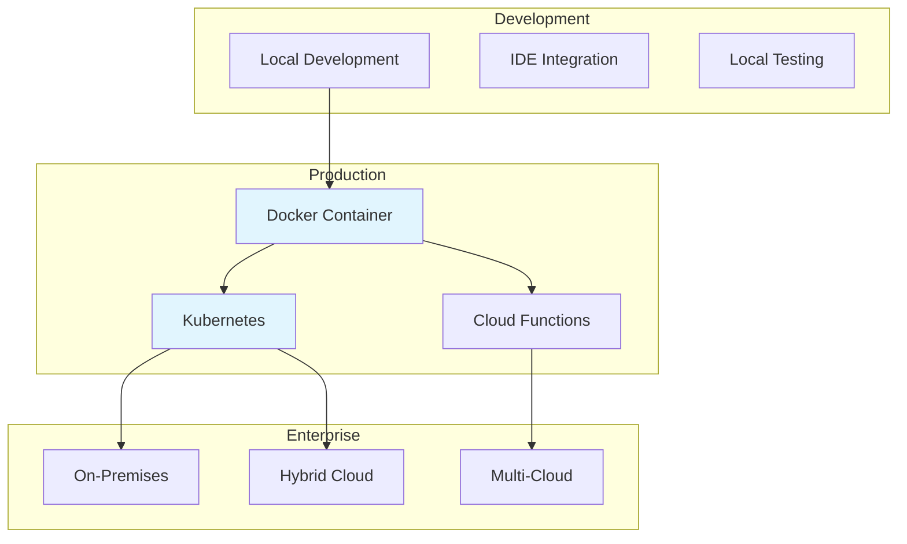
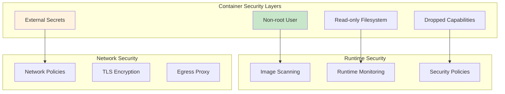
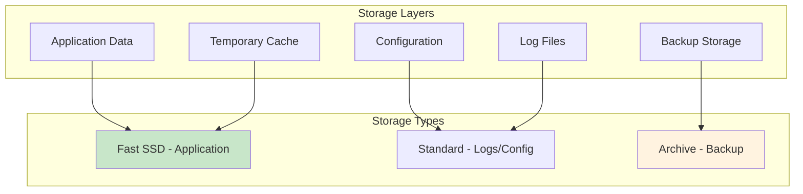
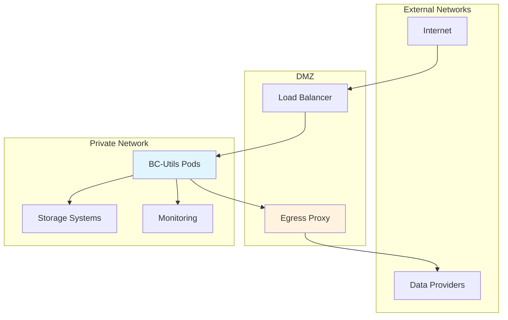
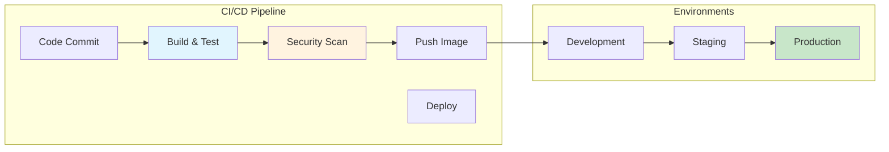
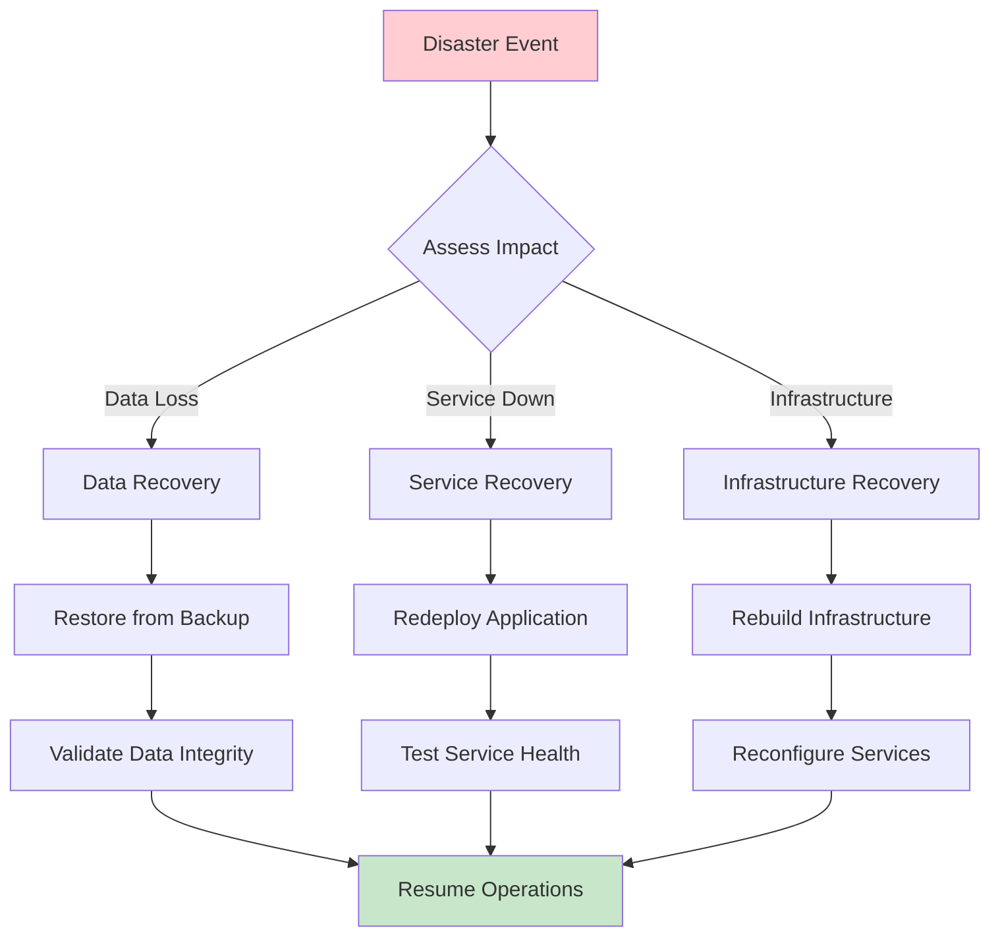

# BC-Utils Deployment Architecture

**Version:** 1.0  
**Date:** 2025-01-08  
**Related:** [System Overview](01-system-overview.md) | [Security Design](06-security-design.md)

## 1. Deployment Overview

BC-Utils supports multiple deployment scenarios from individual development workstations to enterprise-scale container orchestration platforms. The deployment architecture emphasizes simplicity, security, and operational reliability.

### 1.1 Deployment Scenarios


### 1.2 Deployment Characteristics
| Aspect | Local Dev | Container | Kubernetes | Cloud Function |
|--------|-----------|-----------|------------|----------------|
| **Complexity** | Low | Medium | High | Medium |
| **Scalability** | Single user | Multi-instance | Auto-scaling | Serverless |
| **Resource Control** | Full | Isolated | Orchestrated | Managed |
| **Cost** | Development only | Infrastructure | Platform + Ops | Usage-based |
| **Use Case** | Development, Testing | Production, CI/CD | Enterprise, Scale | Event-driven |

## 2. Container Architecture

### 2.1 Docker Container Design
```dockerfile
# Multi-stage build for production efficiency
FROM python:3.11-slim as builder

# Install build dependencies
RUN apt-get update && apt-get install -y \
    build-essential \
    curl \
    && rm -rf /var/lib/apt/lists/*

# Create application user
RUN useradd --create-home --shell /bin/bash bcutils

# Set up Python environment
COPY requirements.txt /tmp/
RUN pip install --user --no-cache-dir -r /tmp/requirements.txt

# Production stage
FROM python:3.11-slim

# Copy Python packages from builder
COPY --from=builder /home/bcutils/.local /home/bcutils/.local

# Create application user in production image
RUN useradd --create-home --shell /bin/bash bcutils

# Set up application directory
WORKDIR /app
COPY --chown=bcutils:bcutils src/bcutils ./bcutils/
COPY --chown=bcutils:bcutils docker/ ./

# Create data directory with proper permissions
RUN mkdir -p /data && chown bcutils:bcutils /data

# Switch to non-root user
USER bcutils

# Set Python path
ENV PATH=/home/bcutils/.local/bin:$PATH
ENV PYTHONPATH=/app

# Health check
HEALTHCHECK --interval=30s --timeout=10s --start-period=5s --retries=3 \
    CMD python -c "import bcutils; print('OK')" || exit 1

# Default command
CMD ["./entrypoint.sh"]
```

### 2.2 Container Configuration
```yaml
# docker-compose.yml for development
version: '3.8'

services:
  bc-utils:
    build: .
    environment:
      - BCU_OUTPUT_DIR=/data
      - BCU_LOGGING_LEVEL=INFO
      - BCU_DRY_RUN=false
    env_file:
      - .env.local
    volumes:
      - ./data:/data
      - ./config:/app/config:ro
    restart: unless-stopped
    healthcheck:
      test: ["CMD", "python", "-c", "import bcutils; print('OK')"]
      interval: 30s
      timeout: 10s
      retries: 3
      start_period: 40s
```

### 2.3 Container Security


**Security Implementation:**
```dockerfile
# Security hardening
USER bcutils:bcutils
COPY --chown=bcutils:bcutils . .

# Read-only root filesystem
VOLUME ["/tmp", "/data"]

# Drop all capabilities
--cap-drop=ALL

# No new privileges
--security-opt=no-new-privileges:true

# AppArmor/SELinux profiles
--security-opt=apparmor:bc-utils-profile
```

## 3. Kubernetes Deployment

### 3.1 Kubernetes Resources
```yaml
# namespace.yaml
apiVersion: v1
kind: Namespace
metadata:
  name: bc-utils
  labels:
    app.kubernetes.io/name: bc-utils
    app.kubernetes.io/version: "1.0"

---
# configmap.yaml
apiVersion: v1
kind: ConfigMap
metadata:
  name: bc-utils-config
  namespace: bc-utils
data:
  config.json: |
    {
      "futures": {
        "GOLD": {"code": "GC", "cycle": "GJMQVZ"}
      }
    }
  BCU_OUTPUT_DIR: "/data"
  BCU_LOGGING_LEVEL: "INFO"
  BCU_BACKUP_DATA: "true"

---
# secret.yaml
apiVersion: v1
kind: Secret
metadata:
  name: bc-utils-secrets
  namespace: bc-utils
type: Opaque
data:
  BCU_USERNAME: <base64-encoded-username>
  BCU_PASSWORD: <base64-encoded-password>

---
# pvc.yaml
apiVersion: v1
kind: PersistentVolumeClaim
metadata:
  name: bc-utils-data
  namespace: bc-utils
spec:
  accessModes:
    - ReadWriteOnce
  resources:
    requests:
      storage: 100Gi
  storageClassName: fast-ssd
```

### 3.2 CronJob Deployment
```yaml
# cronjob.yaml
apiVersion: batch/v1
kind: CronJob
metadata:
  name: bc-utils-daily
  namespace: bc-utils
spec:
  schedule: "0 6 * * 1-5"  # 6 AM weekdays
  timeZone: "America/New_York"
  concurrencyPolicy: Forbid
  failedJobsHistoryLimit: 3
  successfulJobsHistoryLimit: 3
  jobTemplate:
    spec:
      template:
        metadata:
          labels:
            app.kubernetes.io/name: bc-utils
            app.kubernetes.io/component: data-download
        spec:
          restartPolicy: OnFailure
          securityContext:
            runAsNonRoot: true
            runAsUser: 1000
            runAsGroup: 1000
            fsGroup: 1000
          containers:
          - name: bc-utils
            image: bc-utils:1.0
            imagePullPolicy: IfNotPresent
            env:
            - name: BCU_OUTPUT_DIR
              value: "/data"
            envFrom:
            - configMapRef:
                name: bc-utils-config
            - secretRef:
                name: bc-utils-secrets
            resources:
              requests:
                memory: "512Mi"
                cpu: "250m"
              limits:
                memory: "1Gi"
                cpu: "500m"
            volumeMounts:
            - name: data
              mountPath: /data
            - name: config
              mountPath: /app/config
              readOnly: true
          volumes:
          - name: data
            persistentVolumeClaim:
              claimName: bc-utils-data
          - name: config
            configMap:
              name: bc-utils-config
```

### 3.3 Monitoring and Observability
```yaml
# servicemonitor.yaml (Prometheus)
apiVersion: monitoring.coreos.com/v1
kind: ServiceMonitor
metadata:
  name: bc-utils-metrics
  namespace: bc-utils
spec:
  selector:
    matchLabels:
      app.kubernetes.io/name: bc-utils
  endpoints:
  - port: metrics
    interval: 30s
    path: /metrics

---
# networkpolicy.yaml
apiVersion: networking.k8s.io/v1
kind: NetworkPolicy
metadata:
  name: bc-utils-netpol
  namespace: bc-utils
spec:
  podSelector:
    matchLabels:
      app.kubernetes.io/name: bc-utils
  policyTypes:
  - Ingress
  - Egress
  egress:
  - to: []  # Allow all egress for data provider APIs
    ports:
    - protocol: TCP
      port: 443
  - to:
    - namespaceSelector:
        matchLabels:
          name: kube-system
    ports:
    - protocol: UDP
      port: 53  # DNS
```

## 4. Cloud-Native Deployments

### 4.1 AWS Deployment
```yaml
# CloudFormation template excerpt
Resources:
  BCUtilsTaskDefinition:
    Type: AWS::ECS::TaskDefinition
    Properties:
      Family: bc-utils
      NetworkMode: awsvpc
      RequiresCompatibilities:
        - FARGATE
      Cpu: 512
      Memory: 1024
      ExecutionRoleArn: !Ref BCUtilsExecutionRole
      TaskRoleArn: !Ref BCUtilsTaskRole
      ContainerDefinitions:
        - Name: bc-utils
          Image: !Sub "${AWS::AccountId}.dkr.ecr.${AWS::Region}.amazonaws.com/bc-utils:latest"
          Environment:
            - Name: BCU_OUTPUT_DIR
              Value: /data
          Secrets:
            - Name: BCU_USERNAME
              ValueFrom: !Ref BCUtilsUserSecret
            - Name: BCU_PASSWORD
              ValueFrom: !Ref BCUtilsPasswordSecret
          MountPoints:
            - SourceVolume: data
              ContainerPath: /data
          LogConfiguration:
            LogDriver: awslogs
            Options:
              awslogs-group: !Ref BCUtilsLogGroup
              awslogs-region: !Ref AWS::Region
              awslogs-stream-prefix: bc-utils
      Volumes:
        - Name: data
          EFSVolumeConfiguration:
            FileSystemId: !Ref BCUtilsEFS
            
  BCUtilsScheduledTask:
    Type: AWS::Events::Rule
    Properties:
      ScheduleExpression: "cron(0 6 ? * MON-FRI *)"
      State: ENABLED
      Targets:
        - Arn: !GetAtt BCUtilsCluster.Arn
          Id: BCUtilsTarget
          RoleArn: !GetAtt BCUtilsEventRole.Arn
          EcsParameters:
            TaskDefinitionArn: !Ref BCUtilsTaskDefinition
            LaunchType: FARGATE
            NetworkConfiguration:
              AwsVpcConfiguration:
                SecurityGroups:
                  - !Ref BCUtilsSecurityGroup
                Subnets:
                  - !Ref PrivateSubnet1
                  - !Ref PrivateSubnet2
```

### 4.2 Google Cloud Deployment
```yaml
# Cloud Run service
apiVersion: serving.knative.dev/v1
kind: Service
metadata:
  name: bc-utils
  namespace: default
  annotations:
    run.googleapis.com/cpu-throttling: "false"
    run.googleapis.com/execution-environment: gen2
spec:
  template:
    metadata:
      annotations:
        autoscaling.knative.dev/maxScale: "1"
        run.googleapis.com/execution-environment: gen2
    spec:
      containerConcurrency: 1
      timeoutSeconds: 3600
      containers:
      - image: gcr.io/project-id/bc-utils:latest
        resources:
          limits:
            cpu: "1"
            memory: "2Gi"
        env:
        - name: BCU_OUTPUT_DIR
          value: "/data"
        - name: BCU_USERNAME
          valueFrom:
            secretKeyRef:
              name: bc-utils-secrets
              key: username
        - name: BCU_PASSWORD
          valueFrom:
            secretKeyRef:
              name: bc-utils-secrets
              key: password
        volumeMounts:
        - name: data
          mountPath: /data
      volumes:
      - name: data
        persistentVolumeClaim:
          claimName: bc-utils-data
```

### 4.3 Azure Deployment
```yaml
# Azure Container Instances
apiVersion: 2019-12-01
location: eastus
name: bc-utils-container-group
properties:
  containers:
  - name: bc-utils
    properties:
      image: bcutils.azurecr.io/bc-utils:latest
      resources:
        requests:
          cpu: 0.5
          memoryInGb: 1
      environmentVariables:
      - name: BCU_OUTPUT_DIR
        value: /data
      - name: BCU_USERNAME
        secureValue: <from-key-vault>
      - name: BCU_PASSWORD
        secureValue: <from-key-vault>
      volumeMounts:
      - name: data-volume
        mountPath: /data
  osType: Linux
  restartPolicy: Never
  volumes:
  - name: data-volume
    azureFile:
      shareName: bc-utils-data
      storageAccountName: bcutilsstorage
      storageAccountKey: <storage-key>
```

## 5. Infrastructure Requirements

### 5.1 Resource Specifications
| Component | CPU | Memory | Storage | Network |
|-----------|-----|--------|---------|---------|
| **Development** | 0.5 cores | 512MB | 10GB | Broadband |
| **Production Single** | 1 core | 1GB | 100GB | 100Mbps |
| **Production Scaled** | 2-4 cores | 2-4GB | 500GB+ | 1Gbps |
| **Enterprise** | 4+ cores | 8GB+ | 1TB+ | 10Gbps |

### 5.2 Storage Requirements


**Storage Allocation:**
- **Application Data:** 80% of total storage (CSV/Parquet files)
- **Configuration:** 1% (JSON configs, instrument definitions)
- **Logs:** 10% (operational logs with rotation)
- **Temporary Cache:** 5% (download buffers, processing temp)
- **Backup Reserve:** 4% (metadata, recovery data)

### 5.3 Network Architecture


**Network Requirements:**
- **Ingress:** Health checks, monitoring endpoints
- **Egress:** HTTPS to data provider APIs
- **Internal:** Pod-to-pod communication, storage access
- **Security:** Network policies, TLS encryption

## 6. Operational Procedures

### 6.1 Deployment Pipeline


**Pipeline Stages:**
1. **Build & Test:** Unit tests, integration tests, linting
2. **Security Scan:** Container image vulnerability scanning
3. **Push Image:** Tag and push to registry
4. **Deploy Development:** Automated deployment to dev environment
5. **Deploy Staging:** Manual approval for staging deployment
6. **Deploy Production:** Manual approval with rollback capability

### 6.2 Health Checks and Monitoring
```python
# Health check endpoint
@app.route('/health')
def health_check():
    checks = {
        'status': 'healthy',
        'timestamp': datetime.utcnow().isoformat(),
        'checks': {
            'filesystem': check_filesystem_access(),
            'providers': check_provider_connectivity(),
            'configuration': check_configuration_validity(),
            'dependencies': check_dependency_versions()
        }
    }
    
    if all(checks['checks'].values()):
        return jsonify(checks), 200
    else:
        return jsonify(checks), 503

# Readiness check
@app.route('/ready')
def readiness_check():
    # Check if application is ready to accept traffic
    return jsonify({'status': 'ready'}), 200

# Liveness check  
@app.route('/live')
def liveness_check():
    # Check if application is alive (not deadlocked)
    return jsonify({'status': 'alive'}), 200
```

### 6.3 Backup and Recovery
```bash
#!/bin/bash
# Backup script for BC-Utils data

BACKUP_DIR="/backup/bc-utils"
DATA_DIR="/data"
DATE=$(date +%Y%m%d_%H%M%S)

# Create backup directory
mkdir -p "$BACKUP_DIR/$DATE"

# Backup data files
tar -czf "$BACKUP_DIR/$DATE/data.tar.gz" \
    --exclude="*.tmp" \
    --exclude="*.log" \
    "$DATA_DIR"

# Backup configuration
kubectl get configmap bc-utils-config -o yaml > "$BACKUP_DIR/$DATE/config.yaml"

# Upload to cloud storage
aws s3 cp "$BACKUP_DIR/$DATE/" s3://bc-utils-backups/$DATE/ --recursive

# Retention policy (keep 30 days)
find "$BACKUP_DIR" -type d -mtime +30 -exec rm -rf {} \;
```

## 7. Security Considerations

### 7.1 Runtime Security
```yaml
# Pod Security Standards
apiVersion: v1
kind: Pod
metadata:
  name: bc-utils
spec:
  securityContext:
    runAsNonRoot: true
    runAsUser: 1000
    runAsGroup: 1000
    fsGroup: 1000
    seccompProfile:
      type: RuntimeDefault
  containers:
  - name: bc-utils
    securityContext:
      allowPrivilegeEscalation: false
      readOnlyRootFilesystem: true
      capabilities:
        drop:
        - ALL
```

### 7.2 Secret Management
```yaml
# External Secrets Operator
apiVersion: external-secrets.io/v1beta1
kind: SecretStore
metadata:
  name: vault-backend
spec:
  provider:
    vault:
      server: "https://vault.company.com"
      path: "secret"
      version: "v2"
      auth:
        kubernetes:
          mountPath: "kubernetes"
          role: "bc-utils"

---
apiVersion: external-secrets.io/v1beta1
kind: ExternalSecret
metadata:
  name: bc-utils-credentials
spec:
  refreshInterval: 15s
  secretStoreRef:
    name: vault-backend
    kind: SecretStore
  target:
    name: bc-utils-secrets
    creationPolicy: Owner
  data:
  - secretKey: BCU_USERNAME
    remoteRef:
      key: bc-utils/credentials
      property: username
  - secretKey: BCU_PASSWORD
    remoteRef:
      key: bc-utils/credentials
      property: password
```

## 8. Disaster Recovery

### 8.1 Recovery Procedures


### 8.2 Recovery Time Objectives
| Scenario | RTO | RPO | Procedure |
|----------|-----|-----|-----------|
| **Application Crash** | 5 minutes | 0 | Container restart |
| **Data Corruption** | 1 hour | 1 day | Restore from backup |
| **Infrastructure Failure** | 4 hours | 1 day | Rebuild and restore |
| **Region Outage** | 8 hours | 1 day | Failover to secondary region |

### 8.3 Business Continuity
- **Multi-Region Deployment:** Active-passive configuration
- **Data Replication:** Cross-region backup storage
- **Provider Failover:** Multiple data source redundancy
- **Documentation:** Runbooks for common failure scenarios

## Related Documents

- **[System Overview](01-system-overview.md)** - Overall system architecture
- **[Security Design](06-security-design.md)** - Security implementation details
- **[Integration Design](08-integration-design.md)** - External system interfaces
- **[Product Requirements](../../requirements/prd/product-requirements.md)** - Business requirements

---

**Next Review:** 2025-02-08  
**Reviewers:** DevOps Lead, Security Architect, Infrastructure Team