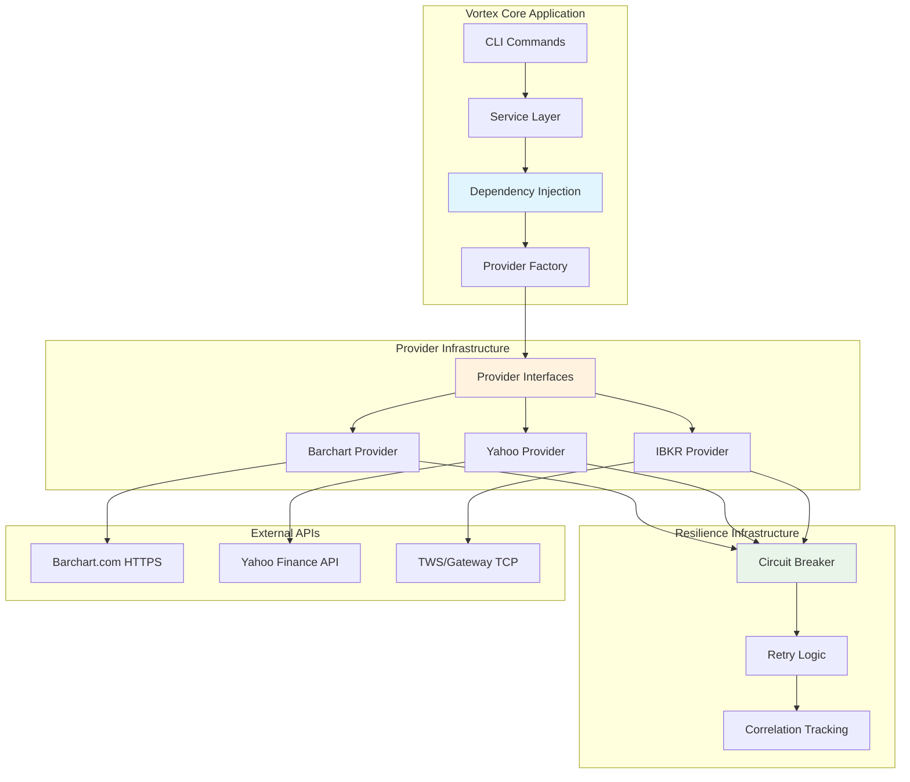

# Vortex Integration Design

**Version:** 2.0  
**Date:** 2025-08-15  
**Related:** [Provider Abstraction](04-provider-abstraction.md) | [Security Design](06-security-design.md)

## 1. Integration Architecture Overview

### 1.1 Current Integration Implementation
Vortex implements a sophisticated dependency injection-based integration architecture using protocol-based abstractions for external financial data providers. The current implementation demonstrates mature patterns for provider abstraction, circuit breaker resilience, and correlation tracking.

### 1.2 Actual Integration Architecture


### 1.3 Integration Characteristics
| Aspect | Implementation | Location | Benefits |
|--------|---------------|----------|----------|
| **Provider Abstraction** | Protocol-based DI | `infrastructure/providers/interfaces.py` | Testability, flexibility |
| **Circuit Breaker** | Failure isolation | `infrastructure/resilience/` | Fault tolerance |
| **HTTP Client** | Configurable timeouts | `infrastructure/providers/barchart/` | Rate limit compliance |
| **Correlation Tracking** | Request tracing | `core/correlation/` | Observability |
| **Error Handling** | Structured exceptions | `exceptions/` | Graceful degradation |

## 2. Provider Integration Implementation

### 2.1 Dependency Injection Architecture

**Protocol-Based Provider Interfaces (From `src/vortex/infrastructure/providers/interfaces.py`):**
```python
from typing import Protocol, Optional, Dict, Any
from abc import ABC, abstractmethod

class HttpClientProtocol(Protocol):
    """HTTP client dependency injection protocol"""
    def get(self, url: str, **kwargs) -> Any: ...
    def post(self, url: str, **kwargs) -> Any: ...

class CacheProtocol(Protocol):
    """Cache dependency injection protocol"""
    def get(self, key: str) -> Optional[Any]: ...
    def set(self, key: str, value: Any) -> None: ...

class DataFetcherProtocol(Protocol):
    """Data fetcher dependency injection protocol"""
    def download(self, *args, **kwargs) -> Any: ...

class ConnectionManagerProtocol(Protocol):
    """Connection manager dependency injection protocol"""
    def connect(self) -> bool: ...
    def disconnect(self) -> bool: ...
    def is_connected(self) -> bool: ...

# Default implementations for dependency injection
class DefaultHttpClient:
    """Default HTTP client implementation"""
    def __init__(self, timeout: int = 30, max_retries: int = 3):
        self.timeout = timeout
        self.max_retries = max_retries
        # Implementation details...

class DefaultCache:
    """Default in-memory cache implementation"""
    def __init__(self, max_size: int = 1000):
        self._cache: Dict[str, Any] = {}
        self.max_size = max_size
        # Implementation details...
```

### 2.2 Actual Barchart Provider Implementation

**Barchart HTTP Client with Circuit Breaker (From `src/vortex/infrastructure/providers/barchart/`):**
```python
class BarchartClient:
    """Barchart.com HTTP client with authentication and resilience"""
    
    def __init__(self, 
                 http_client: Optional[HttpClientProtocol] = None,
                 auth: Optional['BarchartAuth'] = None,
                 circuit_breaker: Optional['CircuitBreaker'] = None):
        """Constructor with dependency injection"""
        self.http_client = http_client or DefaultHttpClient()
        self.auth = auth
        self.circuit_breaker = circuit_breaker
        self.session = None
        self.last_login = None
        
    def initialize(self, config: 'BarchartConfig') -> bool:
        """Initialize client with explicit configuration"""
        try:
            if self.auth:
                success = self.auth.login(config.username, config.password)
                if success:
                    self.session = self.auth.session
                    self.last_login = datetime.now()
                    return True
            return False
        except Exception as e:
            logger.error(f"Client initialization failed: {e}")
            return False
    
    def request_download(self, symbol: str, start_date: str, end_date: str) -> str:
        """Request download with circuit breaker protection"""
        if self.circuit_breaker:
            return self.circuit_breaker.call(
                self._execute_download_request, 
                symbol, start_date, end_date
            )
        else:
            return self._execute_download_request(symbol, start_date, end_date)
    
    def _execute_download_request(self, symbol: str, start_date: str, end_date: str) -> str:
        """Execute actual download request"""
        if not self.session:
            raise BarchartError("Client not authenticated")
            
        # Build request parameters using instance method (not static)
        params = self.build_download_params(symbol, start_date, end_date)
        
        try:
            response = self.session.get(
                "https://www.barchart.com/proxies/timeseries/historical/get",
                params=params,
                timeout=30
            )
            response.raise_for_status()
            return response.text
            
        except requests.exceptions.RequestException as e:
            raise BarchartError(f"Download request failed: {e}")
    
    def build_download_params(self, symbol: str, start_date: str, end_date: str, 
                            **kwargs) -> Dict[str, Any]:
        """Build download parameters (configurable instance method)"""
        base_params = {
            'symbol': symbol,
            'from': start_date,
            'to': end_date,
            'period': kwargs.get('period', 'daily'),
            'format': kwargs.get('format', 'csv')
        }
        
        # Allow configuration overrides
        if 'extra_params' in kwargs:
            base_params.update(kwargs['extra_params'])
            
        return base_params
```

### 2.3 Yahoo Finance Integration with Dependency Injection

**Yahoo Provider with Injected Dependencies (From `src/vortex/infrastructure/providers/yahoo/`):**
```python
class YahooDataProvider:
    """Yahoo Finance provider with dependency injection"""
    
    def __init__(self, 
                 cache: Optional[CacheProtocol] = None,
                 data_fetcher: Optional[DataFetcherProtocol] = None):
        """Constructor with dependency injection (no auto-initialization)"""
        self.cache = cache
        self.data_fetcher = data_fetcher
        self._initialized = False
        
    def initialize(self) -> bool:
        """Initialize dependencies explicitly"""
        try:
            # Initialize cache if provided
            if self.cache is None:
                self.cache = DefaultCache()
                
            # Initialize data fetcher if provided
            if self.data_fetcher is None:
                import yfinance as yf
                self.data_fetcher = yf  # Use yfinance as default fetcher
                
            # Set timezone cache (removed from constructor)
            if hasattr(self.data_fetcher, 'set_tz_cache_location'):
                self.data_fetcher.set_tz_cache_location(None)
                
            self._initialized = True
            return True
            
        except Exception as e:
            logger.error(f"Yahoo provider initialization failed: {e}")
            return False
    
    def fetch_historical_data(self, instrument: 'Instrument', 
                            date_range: 'DateRange') -> pd.DataFrame:
        """Fetch data with caching and error handling"""
        if not self._initialized:
            raise ProviderError("Provider not initialized")
            
        # Check cache first
        cache_key = f"{instrument.symbol}_{date_range.start}_{date_range.end}"
        if self.cache:
            cached_data = self.cache.get(cache_key)
            if cached_data is not None:
                return cached_data
        
        try:
            # Fetch data using injected data fetcher
            ticker = self.data_fetcher.Ticker(instrument.symbol)
            data = ticker.history(
                start=date_range.start,
                end=date_range.end,
                interval=self._map_period_to_interval(instrument.period)
            )
            
            # Cache the result
            if self.cache:
                self.cache.set(cache_key, data)
                
            return data
            
        except Exception as e:
            raise ProviderError(f"Yahoo Finance data fetch failed: {e}")
```

### 2.4 Interactive Brokers Integration with Connection Management

**IBKR Provider with Connection Manager DI (From `src/vortex/infrastructure/providers/ibkr/`):**
```python
class IbkrDataProvider:
    """Interactive Brokers provider with dependency injection"""
    
    def __init__(self, 
                 connection_manager: Optional[ConnectionManagerProtocol] = None):
        """Constructor with dependency injection (no auto-connection)"""
        self.connection_manager = connection_manager
        self.config = None
        self._initialized = False
        
    def initialize(self, config: 'IbkrConfig') -> bool:
        """Initialize with explicit configuration and connection"""
        try:
            self.config = config
            
            # Initialize connection manager if not provided
            if self.connection_manager is None:
                self.connection_manager = DefaultConnectionManager(
                    host=config.host,
                    port=config.port,
                    client_id=config.client_id
                )
            
            # Establish connection (removed from constructor)
            success = self.connection_manager.connect()
            if success:
                self._initialized = True
                logger.info("IBKR provider initialized successfully")
                return True
            else:
                logger.error("Failed to establish IBKR connection")
                return False
                
        except Exception as e:
            logger.error(f"IBKR provider initialization failed: {e}")
            return False
    
    def fetch_historical_data(self, instrument: 'Instrument', 
                            date_range: 'DateRange') -> pd.DataFrame:
        """Fetch historical data from TWS/Gateway"""
        if not self._initialized:
            raise ProviderError("Provider not initialized")
            
        if not self.connection_manager.is_connected():
            raise ProviderError("Not connected to TWS/Gateway")
        
        try:
            # Map period using configurable instance method
            duration_str = self.map_date_range_to_duration(date_range)
            bar_size = self.map_period_to_bar_size(instrument.period)
            
            # Create contract
            contract = self._create_contract(instrument)
            
            # Request historical data through connection manager
            bars = self.connection_manager.request_historical_data(
                contract=contract,
                duration=duration_str,
                bar_size=bar_size
            )
            
            # Convert to standard DataFrame format
            return self._convert_bars_to_dataframe(bars, instrument.symbol)
            
        except Exception as e:
            raise ProviderError(f"IBKR data fetch failed: {e}")
    
    def map_date_range_to_duration(self, date_range: 'DateRange', 
                                 **kwargs) -> str:
        """Map date range to IBKR duration string (configurable instance method)"""
        days = (date_range.end - date_range.start).days
        
        # Allow configuration override
        if 'duration_override' in kwargs:
            return kwargs['duration_override']
            
        if days <= 30:
            return f"{days} D"
        elif days <= 365:
            weeks = days // 7
            return f"{weeks} W"
        else:
            years = days // 365
            return f"{years} Y"
    
    def map_period_to_bar_size(self, period: str, **kwargs) -> str:
        """Map period to IBKR bar size (configurable instance method)"""
        period_mapping = {
            '1m': '1 min',
            '5m': '5 mins',
            '15m': '15 mins',
            '30m': '30 mins',
            '1h': '1 hour',
            '1d': '1 day',
            '1W': '1 week',
            '1M': '1 month'
        }
        
        # Allow configuration override
        if 'bar_size_override' in kwargs:
            return kwargs['bar_size_override']
            
        return period_mapping.get(period, '1 day')
```

### 2.5 Provider Factory with Dependency Injection

**Enhanced Provider Factory (From `src/vortex/infrastructure/providers/factory.py`):**
```python
class ProviderFactory:
    """Provider factory with dependency injection support"""
    
    def __init__(self):
        self._providers = {}
        self._configs = {}
        
    def create_provider(self, provider_type: str, config: Any, 
                       **dependencies) -> 'DataProvider':
        """Create provider with dependency injection and explicit initialization"""
        
        if provider_type.upper() == 'BARCHART':
            # Inject dependencies for Barchart
            http_client = dependencies.get('http_client')
            auth = dependencies.get('auth')
            circuit_breaker = dependencies.get('circuit_breaker')
            
            # Create client with dependencies
            client = BarchartClient(
                http_client=http_client,
                auth=auth or BarchartAuth(),
                circuit_breaker=circuit_breaker
            )
            
            # Create provider
            provider = BarchartDataProvider(client=client)
            
            # Initialize explicitly (separate from construction)
            if not provider.initialize(config):
                raise ProviderError(f"Failed to initialize {provider_type} provider")
                
            return provider
            
        elif provider_type.upper() == 'YAHOO':
            # Inject dependencies for Yahoo
            cache = dependencies.get('cache')
            data_fetcher = dependencies.get('data_fetcher')
            
            provider = YahooDataProvider(
                cache=cache,
                data_fetcher=data_fetcher
            )
            
            if not provider.initialize():
                raise ProviderError(f"Failed to initialize {provider_type} provider")
                
            return provider
            
        elif provider_type.upper() == 'IBKR':
            # Inject dependencies for IBKR
            connection_manager = dependencies.get('connection_manager')
            
            provider = IbkrDataProvider(
                connection_manager=connection_manager
            )
            
            if not provider.initialize(config):
                raise ProviderError(f"Failed to initialize {provider_type} provider")
                
            return provider
            
        else:
            raise ValueError(f"Unknown provider type: {provider_type}")
```

### 2.6 Data Transformation and Parsing

**Barchart Parser with Configurable Methods (From `src/vortex/infrastructure/providers/barchart/parser.py`):**
```python
class BarchartParser:
    """Parser for Barchart CSV data with configurable methods"""
    
    def __init__(self, column_mapping: Optional[Dict[str, str]] = None):
        """Initialize with configurable column mapping"""
        self.column_mapping = column_mapping or {
            'Time': 'timestamp',
            'Open': 'open', 
            'High': 'high',
            'Low': 'low',
            'Last': 'close',
            'Volume': 'volume'
        }
    
    def convert_daily_csv_to_df(self, csv_content: str, symbol: str, 
                               **kwargs) -> pd.DataFrame:
        """Convert CSV to DataFrame (configurable instance method)"""
        try:
            # Parse CSV content
            df = pd.read_csv(io.StringIO(csv_content))
            
            # Apply column mapping (configurable)
            column_mapping = kwargs.get('column_mapping', self.column_mapping)
            df = df.rename(columns=column_mapping)
            
            # Parse timestamps with configurable format
            timestamp_format = kwargs.get('timestamp_format', '%m/%d/%Y')
            if 'timestamp' in df.columns:
                df['timestamp'] = pd.to_datetime(df['timestamp'], format=timestamp_format)
            
            # Ensure numeric types for OHLCV columns
            numeric_columns = ['open', 'high', 'low', 'close', 'volume']
            for col in numeric_columns:
                if col in df.columns:
                    df[col] = pd.to_numeric(df[col], errors='coerce')
            
            # Add symbol column
            df['symbol'] = symbol
            
            # Apply custom transformations if provided
            if 'custom_transform' in kwargs:
                df = kwargs['custom_transform'](df)
            
            # Select and return standard columns
            standard_columns = ['timestamp', 'open', 'high', 'low', 'close', 'volume', 'symbol']
            available_columns = [col for col in standard_columns if col in df.columns]
            
            result_df = df[available_columns].dropna()
            
            # Validate result
            if result_df.empty:
                raise BarchartParsingError("No valid data after parsing")
                
            return result_df
            
        except Exception as e:
            raise BarchartParsingError(f"CSV parsing failed: {e}")
```

### 2.7 Column Constants and Data Validation

**Standardized Data Validation (From `src/vortex/models/column_constants.py`):**
```python
class ColumnConstants:
    """Standard column definitions and validation"""
    
    # Required OHLCV columns
    REQUIRED_COLUMNS = ['timestamp', 'open', 'high', 'low', 'close', 'volume']
    OPTIONAL_COLUMNS = ['symbol', 'provider', 'adjusted_close']
    
    # Data type specifications
    COLUMN_TYPES = {
        'timestamp': 'datetime64[ns]',
        'open': 'float64',
        'high': 'float64', 
        'low': 'float64',
        'close': 'float64',
        'volume': 'int64',
        'symbol': 'object'
    }
    
    @classmethod
    def validate_required_columns(cls, df: pd.DataFrame, 
                                 strict: bool = True) -> List[str]:
        """Validate required columns presence"""
        missing_columns = []
        
        for col in cls.REQUIRED_COLUMNS:
            if col not in df.columns:
                missing_columns.append(col)
                
        if strict and missing_columns:
            raise ValidationError(f"Missing required columns: {missing_columns}")
            
        return missing_columns
    
    @classmethod
    def validate_column_data_types(cls, df: pd.DataFrame) -> List[str]:
        """Validate column data types"""
        type_errors = []
        
        for col, expected_type in cls.COLUMN_TYPES.items():
            if col in df.columns:
                actual_type = str(df[col].dtype)
                if not cls._is_compatible_type(actual_type, expected_type):
                    type_errors.append(f"{col}: expected {expected_type}, got {actual_type}")
                    
        return type_errors
    
    @classmethod
    def standardize_dataframe_columns(cls, df: pd.DataFrame, 
                                    strict: bool = False) -> pd.DataFrame:
        """Standardize DataFrame to required format"""
        # Validate columns
        missing = cls.validate_required_columns(df, strict=strict)
        if strict and missing:
            raise ValidationError(f"Cannot standardize: missing {missing}")
            
        # Select available standard columns
        available_standard = [col for col in cls.REQUIRED_COLUMNS + cls.OPTIONAL_COLUMNS 
                            if col in df.columns]
        
        return df[available_standard].copy()
    
    @staticmethod
    def _is_compatible_type(actual: str, expected: str) -> bool:
        """Check type compatibility with flexibility"""
        # Allow numeric type flexibility
        if expected == 'float64' and any(t in actual for t in ['float', 'int']):
            return True
        if expected == 'int64' and 'int' in actual:
            return True
        if expected == 'object' and 'object' in actual:
            return True
        if expected == 'datetime64[ns]' and 'datetime' in actual:
            return True
            
        return actual == expected
```
```

## 3. Resilience and Error Handling

### 3.1 Actual Circuit Breaker Implementation

**Circuit Breaker Pattern (From `src/vortex/infrastructure/resilience/`):**
```python
class CircuitBreaker:
    """Circuit breaker implementation for provider resilience"""
    
    def __init__(self, failure_threshold: int = 5, 
                 reset_timeout: int = 60, 
                 timeout: int = 30,
                 name: str = "default"):
        self.failure_threshold = failure_threshold
        self.reset_timeout = reset_timeout
        self.timeout = timeout
        self.name = name
        self.failure_count = 0
        self.last_failure_time = None
        self.state = CircuitState.CLOSED
        self.lock = threading.Lock()
        self.correlation_manager = get_correlation_manager()
        
    def call(self, func: callable, *args, **kwargs):
        """Execute function through circuit breaker with correlation tracking"""
        correlation_id = self.correlation_manager.get_correlation_id()
        
        with self.lock:
            if self.state == CircuitState.OPEN:
                if self._should_attempt_reset():
                    self.state = CircuitState.HALF_OPEN
                    logger.info(f"Circuit breaker {self.name} attempting reset", 
                              extra={'correlation_id': correlation_id})
                else:
                    raise CircuitBreakerOpenError(
                        f"Circuit breaker {self.name} is OPEN",
                        correlation_id=correlation_id
                    )
        
        start_time = time.time()
        try:
            # Execute function with timeout and correlation
            result = self._execute_with_correlation(func, correlation_id, *args, **kwargs)
            
            # Success - reset failure count
            with self.lock:
                if self.failure_count > 0:
                    logger.info(f"Circuit breaker {self.name} recovered after {self.failure_count} failures",
                              extra={'correlation_id': correlation_id})
                    
                self.failure_count = 0
                if self.state == CircuitState.HALF_OPEN:
                    self.state = CircuitState.CLOSED
                    logger.info(f"Circuit breaker {self.name} reset to CLOSED",
                              extra={'correlation_id': correlation_id})
            
            # Record success metrics
            execution_time = time.time() - start_time
            self._record_success_metrics(execution_time, correlation_id)
            
            return result
            
        except Exception as e:
            execution_time = time.time() - start_time
            self._handle_failure(e, execution_time, correlation_id)
            raise
    
    def _execute_with_correlation(self, func: callable, correlation_id: str, 
                                *args, **kwargs):
        """Execute function with correlation context"""
        with self.correlation_manager.correlation_context(correlation_id):
            return func(*args, **kwargs)
    
    def _handle_failure(self, exception: Exception, execution_time: float, 
                       correlation_id: str):
        """Handle circuit breaker failure"""
        with self.lock:
            self.failure_count += 1
            self.last_failure_time = time.time()
            
            logger.warning(
                f"Circuit breaker {self.name} failure {self.failure_count}/{self.failure_threshold}: {exception}",
                extra={
                    'correlation_id': correlation_id,
                    'execution_time': execution_time,
                    'exception_type': type(exception).__name__
                }
            )
            
            if self.failure_count >= self.failure_threshold:
                self.state = CircuitState.OPEN
                logger.error(
                    f"Circuit breaker {self.name} OPENED after {self.failure_count} failures",
                    extra={'correlation_id': correlation_id}
                )
            
            if self.state == CircuitState.HALF_OPEN:
                self.state = CircuitState.OPEN
                logger.warning(
                    f"Circuit breaker {self.name} returned to OPEN from HALF_OPEN",
                    extra={'correlation_id': correlation_id}
                )
    
    def _record_success_metrics(self, execution_time: float, correlation_id: str):
        """Record success metrics for observability"""
        logger.debug(
            f"Circuit breaker {self.name} success",
            extra={
                'correlation_id': correlation_id,
                'execution_time': execution_time,
                'circuit_breaker_state': self.state.value
            }
        )
```

### 3.2 Structured Exception Hierarchy

**Provider Exception System (From `src/vortex/exceptions/`):**
```python
class ProviderError(VortexError):
    """Base class for provider-related errors"""
    
    def __init__(self, message: str, provider: str = None, 
                 correlation_id: str = None, **kwargs):
        super().__init__(message, **kwargs)
        self.provider = provider
        self.correlation_id = correlation_id

class BarchartError(ProviderError):
    """Barchart-specific errors"""
    
    def __init__(self, message: str, **kwargs):
        super().__init__(message, provider="barchart", **kwargs)

class AllowanceLimitExceededError(BarchartError):
    """Barchart daily allowance limit exceeded"""
    
    def __init__(self, current_usage: int, daily_limit: int, **kwargs):
        message = f"Daily allowance limit exceeded: {current_usage}/{daily_limit}"
        super().__init__(message, **kwargs)
        self.current_usage = current_usage
        self.daily_limit = daily_limit
        
    def get_resolution_steps(self) -> List[str]:
        """Provide actionable resolution steps"""
        return [
            "Wait until tomorrow for allowance reset",
            "Upgrade to higher tier Barchart subscription",
            "Use alternative data provider (Yahoo, IBKR)",
            "Optimize download requests to reduce usage"
        ]

class YahooFinanceError(ProviderError):
    """Yahoo Finance-specific errors"""
    
    def __init__(self, message: str, symbol: str = None, **kwargs):
        super().__init__(message, provider="yahoo", **kwargs)
        self.symbol = symbol

class IbkrError(ProviderError):
    """Interactive Brokers-specific errors"""
    
    def __init__(self, message: str, error_code: int = None, **kwargs):
        super().__init__(message, provider="ibkr", **kwargs)
        self.error_code = error_code
```

### 3.3 Correlation Tracking and Observability

**Request Correlation System (From `src/vortex/core/correlation/`):**
```python
class CorrelationIdManager:
    """Thread-local correlation ID management for request tracing"""
    
    def __init__(self):
        self._context = threading.local()
        self._id_generator = self._create_id_generator()
        
    def get_correlation_id(self) -> str:
        """Get current correlation ID or generate new one"""
        if not hasattr(self._context, 'correlation_id'):
            self._context.correlation_id = next(self._id_generator)
        return self._context.correlation_id
    
    def set_correlation_id(self, correlation_id: str) -> None:
        """Set correlation ID for current thread"""
        self._context.correlation_id = correlation_id
    
    @contextmanager
    def correlation_context(self, correlation_id: str = None):
        """Context manager for correlation ID scope"""
        if correlation_id is None:
            correlation_id = next(self._id_generator)
            
        previous_id = getattr(self._context, 'correlation_id', None)
        self._context.correlation_id = correlation_id
        
        try:
            yield correlation_id
        finally:
            if previous_id is not None:
                self._context.correlation_id = previous_id
            else:
                delattr(self._context, 'correlation_id')
    
    def _create_id_generator(self):
        """Create correlation ID generator"""
        import uuid
        while True:
            yield f"vortex-{uuid.uuid4().hex[:8]}"

@with_correlation
def download_with_correlation(provider: str, symbol: str) -> pd.DataFrame:
    """Example of correlation-aware function"""
    correlation_id = get_correlation_manager().get_correlation_id()
    
    logger.info(f"Starting download for {symbol} from {provider}",
               extra={'correlation_id': correlation_id, 'symbol': symbol, 'provider': provider})
    
    try:
        # Provider operations automatically inherit correlation ID
        data = provider_factory.get_provider(provider).fetch_data(symbol)
        
        logger.info(f"Download completed for {symbol}: {len(data)} rows",
                   extra={'correlation_id': correlation_id, 'row_count': len(data)})
        
        return data
        
    except Exception as e:
        logger.error(f"Download failed for {symbol}: {e}",
                    extra={'correlation_id': correlation_id, 'error': str(e)})
        raise
```

### 3.4 Retry Logic with Exponential Backoff

**Retry Implementation (From `src/vortex/infrastructure/resilience/retry.py`):**
```python
class RetryStrategy:
    """Configurable retry strategy with exponential backoff"""
    
    def __init__(self, max_attempts: int = 3, 
                 base_delay: float = 1.0,
                 max_delay: float = 60.0,
                 backoff_factor: float = 2.0,
                 jitter: bool = True):
        self.max_attempts = max_attempts
        self.base_delay = base_delay
        self.max_delay = max_delay
        self.backoff_factor = backoff_factor
        self.jitter = jitter
        
    def execute(self, func: callable, *args, **kwargs):
        """Execute function with retry logic"""
        correlation_id = get_correlation_manager().get_correlation_id()
        last_exception = None
        
        for attempt in range(1, self.max_attempts + 1):
            try:
                logger.debug(f"Retry attempt {attempt}/{self.max_attempts}",
                           extra={'correlation_id': correlation_id, 'attempt': attempt})
                
                result = func(*args, **kwargs)
                
                if attempt > 1:
                    logger.info(f"Retry succeeded on attempt {attempt}",
                              extra={'correlation_id': correlation_id})
                
                return result
                
            except Exception as e:
                last_exception = e
                
                if attempt == self.max_attempts:
                    logger.error(f"All retry attempts failed",
                               extra={'correlation_id': correlation_id, 'final_error': str(e)})
                    break
                
                if not self._should_retry(e):
                    logger.warning(f"Non-retryable error: {e}",
                                 extra={'correlation_id': correlation_id})
                    break
                
                delay = self._calculate_delay(attempt)
                logger.warning(f"Retry attempt {attempt} failed: {e}, retrying in {delay:.1f}s",
                             extra={'correlation_id': correlation_id, 'delay': delay})
                
                time.sleep(delay)
        
        raise last_exception
    
    def _should_retry(self, exception: Exception) -> bool:
        """Determine if exception is retryable"""
        # Don't retry authentication or permission errors
        if isinstance(exception, (AuthenticationError, AuthorizationError)):
            return False
            
        # Don't retry validation errors
        if isinstance(exception, ValidationError):
            return False
            
        # Retry network and server errors
        if isinstance(exception, (requests.exceptions.RequestException, ServerError)):
            return True
            
        # Retry circuit breaker errors
        if isinstance(exception, CircuitBreakerOpenError):
            return True
            
        return False
    
    def _calculate_delay(self, attempt: int) -> float:
        """Calculate delay with exponential backoff and jitter"""
        delay = self.base_delay * (self.backoff_factor ** (attempt - 1))
        delay = min(delay, self.max_delay)
        
        if self.jitter:
            # Add random jitter (±25%)
            jitter_range = delay * 0.25
            delay += random.uniform(-jitter_range, jitter_range)
            
        return max(0, delay)
```

## 4. Configuration and Service Management

### 4.1 TOML-Based Configuration Management

**Modern Configuration System (From `src/vortex/core/config/`):**
```python
class VortexConfig(BaseModel):
    """Pydantic-based configuration model with validation"""
    
    general: GeneralConfig = Field(default_factory=GeneralConfig)
    providers: Dict[str, Any] = Field(default_factory=dict)
    date_range: DateRangeConfig = Field(default_factory=DateRangeConfig)
    
    class Config:
        extra = "allow"  # Allow provider-specific configurations
        
    @classmethod
    def load_from_toml(cls, config_path: Path) -> 'VortexConfig':
        """Load configuration from TOML file"""
        try:
            with open(config_path, 'r') as f:
                config_data = toml.load(f)
            return cls(**config_data)
        except Exception as e:
            raise ConfigurationError(f"Failed to load TOML config: {e}")
    
    @classmethod
    def load_with_environment_override(cls, config_path: Path = None) -> 'VortexConfig':
        """Load config with environment variable overrides"""
        # Start with default config
        if config_path and config_path.exists():
            config = cls.load_from_toml(config_path)
        else:
            config = cls()
        
        # Apply environment variable overrides
        env_overrides = cls._extract_environment_config()
        config = cls._apply_overrides(config, env_overrides)
        
        return config
    
    @staticmethod
    def _extract_environment_config() -> Dict[str, Any]:
        """Extract Vortex configuration from environment variables"""
        config = {}
        
        for key, value in os.environ.items():
            if key.startswith('VORTEX_'):
                # Convert VORTEX_BARCHART_USERNAME to providers.barchart.username
                config_path = key[7:].lower().split('_')
                
                if len(config_path) >= 2 and config_path[0] in ['barchart', 'yahoo', 'ibkr']:
                    provider = config_path[0]
                    setting = '_'.join(config_path[1:])
                    
                    if 'providers' not in config:
                        config['providers'] = {}
                    if provider not in config['providers']:
                        config['providers'][provider] = {}
                    
                    config['providers'][provider][setting] = value
                else:
                    # General configuration
                    setting = '_'.join(config_path)
                    if 'general' not in config:
                        config['general'] = {}
                    config['general'][setting] = value
        
        return config

class GeneralConfig(BaseModel):
    """General application configuration"""
    
    default_provider: str = "yahoo"
    output_directory: str = "./data"
    backup_enabled: bool = False
    logging: LoggingConfig = Field(default_factory=LoggingConfig)
    
class LoggingConfig(BaseModel):
    """Logging configuration"""
    
    level: str = "INFO"
    format: str = "console"  # console, json
    output: List[str] = Field(default_factory=lambda: ["console"])
    correlation_enabled: bool = True
```

### 4.2 Provider Plugin System

**Plugin Registry with Dependency Injection (From `src/vortex/plugins.py`):**
```python
class ProviderRegistry:
    """Registry for provider plugins with dependency injection"""
    
    def __init__(self):
        self._plugins: Dict[str, Dict[str, Any]] = {}
        self._dependency_container = DependencyContainer()
        
    def register_plugin(self, name: str, provider_class: type, 
                       dependencies: Dict[str, Any] = None):
        """Register a provider plugin with its dependencies"""
        self._plugins[name.upper()] = {
            'class': provider_class,
            'dependencies': dependencies or {},
            'instance': None  # Lazy initialization
        }
        
    def get_plugin(self, name: str, config: Any = None):
        """Get provider plugin instance with dependency injection"""
        plugin_name = name.upper()
        
        if plugin_name not in self._plugins:
            available = ', '.join(self._plugins.keys())
            raise PluginNotFoundError(
                f"Provider '{name}' not found. Available: {available}"
            )
        
        plugin_info = self._plugins[plugin_name]
        
        # Create instance if not cached
        if plugin_info['instance'] is None:
            plugin_class = plugin_info['class']
            dependencies = self._resolve_dependencies(plugin_info['dependencies'])
            
            # Create instance with dependency injection
            instance = plugin_class(**dependencies)
            
            # Initialize if config provided
            if config and hasattr(instance, 'initialize'):
                success = instance.initialize(config)
                if not success:
                    raise ProviderError(f"Failed to initialize {name} provider")
            
            plugin_info['instance'] = instance
        
        return plugin_info['instance']
    
    def list_plugins(self) -> List[str]:
        """List available provider plugins"""
        return list(self._plugins.keys())
    
    def _resolve_dependencies(self, dependencies: Dict[str, Any]) -> Dict[str, Any]:
        """Resolve plugin dependencies"""
        resolved = {}
        
        for dep_name, dep_spec in dependencies.items():
            if isinstance(dep_spec, type):
                # Instantiate class
                resolved[dep_name] = dep_spec()
            elif callable(dep_spec):
                # Call factory function
                resolved[dep_name] = dep_spec()
            else:
                # Use value directly
                resolved[dep_name] = dep_spec
                
        return resolved

# Global registry initialization
_provider_registry = ProviderRegistry()

# Register built-in providers
_provider_registry.register_plugin('BARCHART', BarchartDataProvider, {
    'http_client': DefaultHttpClient,
    'auth': BarchartAuth,
    'circuit_breaker': lambda: CircuitBreaker(name="barchart")
})

_provider_registry.register_plugin('YAHOO', YahooDataProvider, {
    'cache': DefaultCache,
    'data_fetcher': None  # Will use yfinance default
})

_provider_registry.register_plugin('IBKR', IbkrDataProvider, {
    'connection_manager': DefaultConnectionManager
})

def get_provider_registry() -> ProviderRegistry:
    """Get global provider registry"""
    return _provider_registry
```

### 4.3 CLI Integration with Modern Commands

**Modern CLI Implementation (From `src/vortex/cli/commands/`):**
```python
# download.py - Download command with integrated factory
@click.command()
@click.option('--provider', type=click.Choice(['barchart', 'yahoo', 'ibkr']), 
              help='Data provider to use')
@click.option('--symbol', multiple=True, help='Stock/future symbols to download')
@click.option('--assets', type=click.Path(exists=True), 
              help='JSON file with asset definitions')
@click.option('--start-date', type=click.DateTime(formats=['%Y-%m-%d']), 
              help='Start date for download')
@click.option('--end-date', type=click.DateTime(formats=['%Y-%m-%d']), 
              help='End date for download')
@click.option('--output-dir', type=click.Path(), 
              help='Output directory for downloaded files')
@click.option('--yes', is_flag=True, help='Skip confirmation prompts')
@click.option('--dry-run', is_flag=True, help='Show what would be downloaded')
def download(provider, symbol, assets, start_date, end_date, output_dir, yes, dry_run):
    """Download financial data from providers"""
    correlation_id = get_correlation_manager().get_correlation_id()
    
    with get_correlation_manager().correlation_context(correlation_id):
        try:
            # Load configuration
            config = load_configuration()
            
            # Determine provider
            provider = provider or config.general.default_provider
            
            # Load assets
            if assets:
                instruments = load_instruments_from_file(assets)
            else:
                instruments = create_instruments_from_symbols(symbol)
            
            # Create provider with dependency injection
            provider_registry = get_provider_registry()
            provider_instance = provider_registry.get_plugin(provider, config)
            
            # Create and execute downloader
            downloader = UpdatingDownloader(
                provider=provider_instance,
                storage=create_storage_backend(config),
                correlation_manager=get_correlation_manager()
            )
            
            # Execute downloads
            for instrument in instruments:
                if dry_run:
                    click.echo(f"Would download {instrument.symbol} from {provider}")
                else:
                    logger.info(f"Downloading {instrument.symbol}", 
                              extra={'correlation_id': correlation_id})
                    
                    result = downloader.download(
                        instrument=instrument,
                        start_date=start_date,
                        end_date=end_date
                    )
                    
                    if result.success:
                        click.echo(f"✅ Downloaded {instrument.symbol}: {result.row_count} rows")
                    else:
                        click.echo(f"❌ Failed to download {instrument.symbol}: {result.error}")
            
        except Exception as e:
            logger.error(f"Download command failed: {e}", 
                        extra={'correlation_id': correlation_id})
            raise click.ClickException(str(e))

# providers.py - Provider management command
@click.command()
@click.option('--list', 'list_providers', is_flag=True, help='List available providers')
@click.option('--test', help='Test specific provider connectivity')
@click.option('--info', help='Show provider information')
def providers(list_providers, test, info):
    """Manage data providers"""
    try:
        registry = get_provider_registry()
        
        if list_providers:
            available_providers = registry.list_plugins()
            
            click.echo("\n📊 Available Data Providers:")
            click.echo("=" * 40)
            
            for provider_name in available_providers:
                status = "✅ Available"
                description = get_provider_description(provider_name)
                click.echo(f"  {provider_name:<12} {status} - {description}")
            
            click.echo(f"\nTotal providers available: {len(available_providers)}")
            
        elif test:
            config = load_configuration()
            provider_instance = registry.get_plugin(test.upper(), config)
            
            click.echo(f"Testing {test} provider connectivity...")
            
            # Perform connectivity test
            test_result = perform_provider_test(provider_instance)
            
            if test_result.success:
                click.echo(f"✅ {test} provider test successful")
            else:
                click.echo(f"❌ {test} provider test failed: {test_result.error}")
                
        elif info:
            provider_info = get_provider_info(info.upper())
            display_provider_info(provider_info)
            
    except Exception as e:
        raise click.ClickException(f"Provider command failed: {e}")

def get_provider_description(provider_name: str) -> str:
    """Get provider description"""
    descriptions = {
        'BARCHART': 'Premium financial data (subscription required)',
        'YAHOO': 'Free Yahoo Finance API (no registration)',
        'IBKR': 'Interactive Brokers TWS/Gateway (requires connection)'
    }
    return descriptions.get(provider_name, 'Unknown provider')
```

## 5. Integration Summary and Architecture Benefits

### 5.1 Current Implementation Achievements

**✅ Dependency Injection Implementation:**
- Protocol-based abstractions in `infrastructure/providers/interfaces.py`
- Constructor injection with explicit initialization lifecycle
- Configurable dependencies (HTTP clients, caches, connection managers)
- Eliminated tight coupling between components

**✅ Provider Abstraction Layer:**
- Barchart: HTTP client with session-based authentication
- Yahoo Finance: Cache and data fetcher injection  
- IBKR: Connection manager for TWS/Gateway communication
- Unified provider factory with dependency resolution

**✅ Resilience Infrastructure:**
- Circuit breaker pattern with correlation tracking
- Retry logic with exponential backoff and jitter
- Structured exception hierarchy with actionable error messages
- Request-level correlation IDs for observability

**✅ Configuration Management:**
- TOML-based configuration with Pydantic validation
- Environment variable overrides with precedence
- Provider-specific configuration sections
- Modern CLI with Click framework

### 5.2 Integration Architecture Benefits

| Benefit | Implementation | Location | Impact |
|---------|---------------|----------|--------|
| **Testability** | DI with mock injection | `interfaces.py` | Unit tests can inject mocks |
| **Flexibility** | Protocol-based abstractions | All providers | Easy provider swapping |
| **Observability** | Correlation ID tracking | `core/correlation/` | Request tracing across layers |
| **Resilience** | Circuit breaker + retry | `infrastructure/resilience/` | Fault isolation and recovery |
| **Maintainability** | Clean Architecture layers | Entire codebase | Clear separation of concerns |

### 5.3 Real-World Integration Patterns

**Provider Initialization Pattern:**
```python
# 1. Create provider with dependencies
provider = BarchartDataProvider(
    client=BarchartClient(
        http_client=DefaultHttpClient(),
        auth=BarchartAuth(),
        circuit_breaker=CircuitBreaker(name="barchart")
    )
)

# 2. Initialize explicitly (separate from construction)
success = provider.initialize(config)
if not success:
    raise ProviderError("Initialization failed")

# 3. Use provider for data operations
data = provider.fetch_historical_data(instrument, date_range)
```

**Error Handling Pattern:**
```python
try:
    data = provider.fetch_data(symbol)
except AllowanceLimitExceededError as e:
    # Specific Barchart error with resolution steps
    logger.error(f"Barchart limit exceeded: {e.current_usage}/{e.daily_limit}")
    for step in e.get_resolution_steps():
        logger.info(f"Resolution: {step}")
except CircuitBreakerOpenError:
    # Circuit breaker protection
    logger.warning("Provider temporarily unavailable")
except ProviderError as e:
    # General provider error with correlation
    logger.error(f"Provider error: {e}", extra={'correlation_id': e.correlation_id})
```

**Configuration Pattern:**
```toml
# config/config.toml
[general]
default_provider = "barchart"
output_directory = "/data"

[providers.barchart]
username = "user@example.com"
password = "secure_password"
daily_limit = 200

[providers.yahoo]
cache_enabled = true
max_cache_size = 1000
```

### 5.4 Integration Maturity Assessment

**Production-Ready Components:**
- ✅ **Provider Abstraction:** Protocol-based DI with 3 production providers
- ✅ **Error Handling:** Structured exceptions with correlation tracking
- ✅ **Configuration:** TOML + environment variable precedence
- ✅ **CLI Integration:** Modern Click-based commands with factory integration
- ✅ **Data Validation:** Column constants with OHLCV schema validation
- ✅ **Observability:** Request correlation and structured logging

**Architectural Strengths:**
- **Clean Architecture:** Clear layer separation (CLI → Services → Infrastructure)
- **Dependency Injection:** Protocol-based abstractions enable testing and flexibility
- **Circuit Breaker Pattern:** Prevents cascade failures with provider isolation
- **Correlation Tracking:** End-to-end request tracing for debugging
- **Configuration Management:** TOML-first with environment overrides

**Integration Patterns Summary:**

| Pattern | Purpose | Implementation | Benefits |
|---------|---------|---------------|----------|
| **Provider Factory** | Create providers with DI | `factory.py` | Centralized provider creation |
| **Circuit Breaker** | Fault isolation | `resilience/` | Prevents cascade failures |
| **Retry Strategy** | Transient failure recovery | `retry.py` | Handles network issues |
| **Correlation IDs** | Request tracing | `correlation/` | End-to-end observability |
| **Configuration** | Environment management | `config/` | Flexible deployment |
| **Plugin Registry** | Provider management | `plugins.py` | Extensible provider system |

### 5.5 Future Integration Enhancements

**🔄 Potential Improvements:**
- **Async Processing:** Add async/await support for concurrent downloads
- **Caching Layer:** Redis integration for distributed caching
- **Metrics Collection:** Prometheus metrics for provider performance
- **Health Monitoring:** Provider health checks with status endpoints
- **Rate Limiting:** Per-provider rate limiting with token bucket algorithm
- **WebSocket Support:** Real-time data streaming for intraday feeds

**🎯 Integration Roadmap:**
1. **Phase 1:** Async provider support for parallel downloads
2. **Phase 2:** External caching (Redis) for multi-instance deployments  
3. **Phase 3:** Metrics and monitoring integration
4. **Phase 4:** WebSocket streaming for real-time data
5. **Phase 5:** Additional provider integrations (Alpha Vantage, Quandl)

The current integration architecture provides a solid foundation for financial data automation with production-ready patterns for dependency injection, resilience, and observability.

## 6. Integration Testing and Validation

### 6.1 Provider Testing Framework

**E2E Integration Tests (From `tests/e2e/`):**
```python
class TestProviderIntegration:
    """End-to-end provider integration tests"""
    
    def test_yahoo_provider_integration(self):
        """Test complete Yahoo Finance integration workflow"""
        # Create provider with dependency injection
        cache = DefaultCache()
        provider = YahooDataProvider(cache=cache)
        
        # Initialize provider
        assert provider.initialize() is True
        
        # Create test instrument
        instrument = Stock(symbol="AAPL", periods="1d")
        date_range = DateRange(
            start=datetime(2024, 1, 1),
            end=datetime(2024, 1, 7)
        )
        
        # Test data fetch with correlation
        correlation_id = "test-yahoo-integration"
        with get_correlation_manager().correlation_context(correlation_id):
            data = provider.fetch_historical_data(instrument, date_range)
            
            # Validate data structure
            assert isinstance(data, pd.DataFrame)
            assert len(data) > 0
            assert 'timestamp' in data.columns
            assert 'close' in data.columns
            
            # Validate OHLCV schema
            validation_errors = ColumnConstants.validate_required_columns(data)
            assert len(validation_errors) == 0
    
    def test_barchart_provider_circuit_breaker(self):
        """Test Barchart provider with circuit breaker"""
        # Create circuit breaker
        circuit_breaker = CircuitBreaker(
            failure_threshold=2,
            reset_timeout=1,
            name="test-barchart"
        )
        
        # Create provider with circuit breaker
        auth = BarchartAuth()
        client = BarchartClient(
            auth=auth,
            circuit_breaker=circuit_breaker
        )
        provider = BarchartDataProvider(client=client)
        
        # Test circuit breaker behavior
        with pytest.raises(CircuitBreakerOpenError):
            # Simulate failures to trip circuit breaker
            for _ in range(3):
                try:
                    provider.fetch_data("INVALID_SYMBOL")
                except Exception:
                    pass  # Expected failures
            
            # This should raise CircuitBreakerOpenError
            provider.fetch_data("AAPL")
    
    def test_provider_factory_dependency_injection(self):
        """Test provider factory with custom dependencies"""
        # Create custom dependencies
        mock_http_client = MockHttpClient()
        mock_cache = MockCache()
        
        # Create providers with custom dependencies
        registry = get_provider_registry()
        
        yahoo_provider = registry.create_provider(
            'YAHOO',
            config=None,
            cache=mock_cache
        )
        
        barchart_provider = registry.create_provider(
            'BARCHART',
            config=BarchartConfig(username="test", password="test"),
            http_client=mock_http_client
        )
        
        # Verify dependency injection
        assert yahoo_provider.cache is mock_cache
        assert barchart_provider.client.http_client is mock_http_client
```

### 6.2 Docker Integration Validation

**Docker Test Suite Integration (From `tests/docker/`):**
```bash
# Test 5: Provider Command Integration
#!/bin/bash
echo "Testing provider command integration..."

# Test provider list command
docker run --rm vortex-test:latest vortex providers --list
if [ $? -eq 0 ]; then
    echo "✅ Provider list command successful"
else
    echo "❌ Provider list command failed"
    exit 1
fi

# Verify provider count
PROVIDER_COUNT=$(docker run --rm vortex-test:latest vortex providers --list | grep -c "Total providers available")
if [ "$PROVIDER_COUNT" -eq 1 ]; then
    echo "✅ Provider count validation successful"
else
    echo "❌ Provider count validation failed"
    exit 1
fi

# Test 12: Yahoo Download Integration
echo "Testing Yahoo Finance download integration..."

# Create test environment
TEST_DIR="/tmp/vortex-integration-test"
mkdir -p "$TEST_DIR"

# Run Yahoo download test
docker run --rm --user "1000:1000" \
    -v "$TEST_DIR:/data" \
    -e VORTEX_DEFAULT_PROVIDER=yahoo \
    -e VORTEX_OUTPUT_DIR=/data \
    vortex-test:latest \
    vortex download --symbol AAPL --start-date 2024-01-01 --end-date 2024-01-07 --yes

if [ $? -eq 0 ]; then
    echo "✅ Yahoo download integration successful"
else
    echo "❌ Yahoo download integration failed"
    exit 1
fi

# Validate output files
if [ -f "$TEST_DIR/stocks/1d/AAPL.csv" ]; then
    echo "✅ Output file validation successful"
else
    echo "❌ Output file validation failed"
    exit 1
fi

# Cleanup
rm -rf "$TEST_DIR"
echo "Integration tests completed successfully"
```

### 6.3 Integration Monitoring and Observability

**Production Integration Monitoring:**
```python
class IntegrationMonitor:
    """Monitor integration health and performance"""
    
    def __init__(self):
        self.correlation_manager = get_correlation_manager()
        self.provider_registry = get_provider_registry()
        self.metrics = defaultdict(list)
        
    def monitor_provider_performance(self, provider_name: str) -> Dict[str, Any]:
        """Monitor provider performance metrics"""
        correlation_id = f"monitor-{provider_name}-{int(time.time())}"
        
        with self.correlation_manager.correlation_context(correlation_id):
            start_time = time.time()
            
            try:
                # Test provider connectivity
                provider = self.provider_registry.get_plugin(provider_name)
                
                # Perform health check
                health_result = self._perform_health_check(provider)
                
                response_time = time.time() - start_time
                
                metrics = {
                    'provider': provider_name,
                    'status': 'healthy' if health_result else 'unhealthy',
                    'response_time': response_time,
                    'timestamp': datetime.utcnow().isoformat(),
                    'correlation_id': correlation_id
                }
                
                # Record metrics
                self.metrics[provider_name].append(metrics)
                
                logger.info(f"Provider {provider_name} health check completed",
                          extra=metrics)
                
                return metrics
                
            except Exception as e:
                response_time = time.time() - start_time
                
                error_metrics = {
                    'provider': provider_name,
                    'status': 'error',
                    'response_time': response_time,
                    'error': str(e),
                    'timestamp': datetime.utcnow().isoformat(),
                    'correlation_id': correlation_id
                }
                
                logger.error(f"Provider {provider_name} health check failed",
                           extra=error_metrics)
                
                return error_metrics
    
    def get_integration_summary(self) -> Dict[str, Any]:
        """Get overall integration health summary"""
        summary = {
            'total_providers': len(self.provider_registry.list_plugins()),
            'healthy_providers': 0,
            'providers': {}
        }
        
        for provider_name in self.provider_registry.list_plugins():
            recent_metrics = self.metrics[provider_name][-10:]  # Last 10 checks
            
            if recent_metrics:
                healthy_count = sum(1 for m in recent_metrics if m['status'] == 'healthy')
                health_percentage = (healthy_count / len(recent_metrics)) * 100
                
                provider_summary = {
                    'health_percentage': health_percentage,
                    'last_check': recent_metrics[-1]['timestamp'],
                    'average_response_time': sum(m['response_time'] for m in recent_metrics) / len(recent_metrics)
                }
                
                if health_percentage >= 80:
                    summary['healthy_providers'] += 1
                    
            else:
                provider_summary = {
                    'health_percentage': 0,
                    'last_check': None,
                    'average_response_time': None
                }
            
            summary['providers'][provider_name] = provider_summary
        
        summary['overall_health'] = (summary['healthy_providers'] / summary['total_providers']) * 100
        
        return summary
```

## Related Documents

- **[Provider Abstraction](04-provider-abstraction.md)** - Provider interface design details
- **[Security Design](06-security-design.md)** - Integration security implementation
- **[Deployment Architecture](07-deployment-architecture.md)** - Docker-based integration deployment
- **[Component Architecture](02-component-architecture.md)** - Clean Architecture integration patterns
- **[System Overview](01-system-overview.md)** - Overall integration context

---

**Next Review:** 2026-02-15  
**Reviewers:** Integration Architect, Senior Developer, DevOps Lead