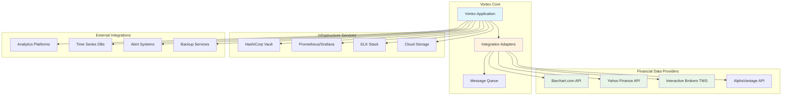

# Vortex Integration Design

**Version:** 1.0  
**Date:** 2025-01-08  
**Related:** [Provider Abstraction](04-provider-abstraction.md) | [Security Design](06-security-design.md)

## 1. Integration Architecture Overview

### 1.1 Integration Philosophy
Vortex follows an adapter-based integration pattern that isolates external system dependencies behind well-defined interfaces. This approach ensures system resilience, testability, and flexibility when provider APIs change or new data sources are added.

### 1.2 Integration Objectives
- **Provider Independence:** Abstract away provider-specific implementation details
- **Fault Tolerance:** Graceful degradation when external systems fail
- **Rate Limit Compliance:** Respect all provider rate limits and terms of service
- **Protocol Flexibility:** Support REST APIs, WebSocket streams, and binary protocols
- **Data Consistency:** Maintain uniform data quality across all providers

### 1.3 Integration Landscape


## 2. Provider Integration Patterns

### 2.1 HTTP REST API Integration
```python
class RestApiAdapter:
    """Generic REST API integration adapter"""
    
    def __init__(self, base_url: str, auth_config: Dict[str, Any]):
        self.base_url = base_url
        self.auth_config = auth_config
        self.session = self._create_session()
        self.rate_limiter = None
        self.retry_strategy = RetryStrategy()
        
    def _create_session(self) -> requests.Session:
        """Create configured HTTP session"""
        session = requests.Session()
        
        # Configure timeouts
        session.timeout = (10, 60)  # (connect, read) timeouts
        
        # Configure retries
        retry_strategy = Retry(
            total=3,
            backoff_factor=1,
            status_forcelist=[429, 500, 502, 503, 504],
        )
        adapter = HTTPAdapter(max_retries=retry_strategy)
        session.mount("https://", adapter)
        session.mount("http://", adapter)
        
        # Set headers
        session.headers.update({
            'User-Agent': 'Vortex/1.0',
            'Accept': 'application/json',
            'Accept-Encoding': 'gzip, deflate'
        })
        
        return session
    
    def authenticate(self) -> bool:
        """Authenticate with the API"""
        auth_type = self.auth_config.get('type', 'none')
        
        if auth_type == 'basic':
            return self._authenticate_basic()
        elif auth_type == 'oauth2':
            return self._authenticate_oauth2()
        elif auth_type == 'api_key':
            return self._authenticate_api_key()
        elif auth_type == 'session':
            return self._authenticate_session()
        else:
            return True  # No authentication required
    
    def make_request(self, method: str, endpoint: str, 
                    params: Dict = None, data: Dict = None) -> ApiResponse:
        """Make authenticated API request with error handling"""
        
        # Check rate limits
        if self.rate_limiter and not self.rate_limiter.can_make_request():
            wait_time = self.rate_limiter.get_wait_time()
            if wait_time > 0:
                time.sleep(wait_time)
        
        url = f"{self.base_url.rstrip('/')}/{endpoint.lstrip('/')}"
        
        try:
            response = self.session.request(
                method=method,
                url=url,
                params=params,
                json=data if method in ['POST', 'PUT', 'PATCH'] else None
            )
            
            # Record request for rate limiting
            if self.rate_limiter:
                self.rate_limiter.record_request()
            
            # Handle API-specific error codes
            self._handle_response_errors(response)
            
            return ApiResponse(
                status_code=response.status_code,
                headers=dict(response.headers),
                data=response.json() if response.content else None,
                raw_content=response.content
            )
            
        except requests.exceptions.RequestException as e:
            raise IntegrationError(f"API request failed: {e}")
    
    def _handle_response_errors(self, response: requests.Response):
        """Handle API-specific error responses"""
        if response.status_code == 429:
            # Rate limit exceeded
            retry_after = response.headers.get('Retry-After', '60')
            raise RateLimitError(f"Rate limit exceeded, retry after {retry_after} seconds")
        
        elif response.status_code == 401:
            # Authentication failed
            raise AuthenticationError("API authentication failed")
        
        elif response.status_code == 403:
            # Forbidden - permissions issue
            raise AuthorizationError("API access forbidden")
        
        elif response.status_code >= 500:
            # Server error
            raise ServerError(f"API server error: {response.status_code}")
        
        elif 400 <= response.status_code < 500:
            # Client error
            try:
                error_data = response.json()
                error_message = error_data.get('message', 'Unknown client error')
            except:
                error_message = response.text or 'Unknown client error'
            raise ClientError(f"API client error: {error_message}")
```

### 2.2 WebSocket Integration
```python
class WebSocketAdapter:
    """WebSocket integration for real-time data streams"""
    
    def __init__(self, ws_url: str, auth_config: Dict[str, Any]):
        self.ws_url = ws_url
        self.auth_config = auth_config
        self.ws = None
        self.message_handlers = {}
        self.is_connected = False
        self.reconnect_attempts = 0
        self.max_reconnect_attempts = 5
        
    async def connect(self) -> bool:
        """Establish WebSocket connection"""
        try:
            # Create connection with authentication headers
            headers = self._get_auth_headers()
            
            self.ws = await websockets.connect(
                self.ws_url,
                extra_headers=headers,
                ping_interval=30,
                ping_timeout=10,
                close_timeout=10
            )
            
            self.is_connected = True
            self.reconnect_attempts = 0
            
            # Start message handling loop
            asyncio.create_task(self._message_loop())
            
            logger.info(f"WebSocket connected to {self.ws_url}")
            return True
            
        except Exception as e:
            logger.error(f"WebSocket connection failed: {e}")
            return False
    
    async def subscribe(self, channel: str, symbol: str = None):
        """Subscribe to data channel"""
        if not self.is_connected:
            raise ConnectionError("WebSocket not connected")
        
        subscribe_message = {
            "action": "subscribe",
            "channel": channel,
            "symbol": symbol
        }
        
        await self.ws.send(json.dumps(subscribe_message))
        logger.info(f"Subscribed to {channel}" + (f" for {symbol}" if symbol else ""))
    
    async def _message_loop(self):
        """Handle incoming WebSocket messages"""
        try:
            async for message in self.ws:
                try:
                    data = json.loads(message)
                    await self._process_message(data)
                except json.JSONDecodeError:
                    logger.warning(f"Invalid JSON message: {message}")
                except Exception as e:
                    logger.error(f"Error processing message: {e}")
                    
        except websockets.exceptions.ConnectionClosed:
            logger.warning("WebSocket connection closed")
            self.is_connected = False
            await self._attempt_reconnect()
        except Exception as e:
            logger.error(f"WebSocket message loop error: {e}")
            self.is_connected = False
    
    async def _attempt_reconnect(self):
        """Attempt to reconnect with exponential backoff"""
        if self.reconnect_attempts >= self.max_reconnect_attempts:
            logger.error("Max reconnection attempts reached")
            return
        
        self.reconnect_attempts += 1
        backoff_time = min(300, 2 ** self.reconnect_attempts)  # Max 5 minutes
        
        logger.info(f"Attempting reconnection in {backoff_time} seconds...")
        await asyncio.sleep(backoff_time)
        
        success = await self.connect()
        if not success:
            await self._attempt_reconnect()
```

### 2.3 Binary Protocol Integration (IBKR TWS)
```python
class TwsProtocolAdapter:
    """Interactive Brokers TWS API protocol adapter"""
    
    def __init__(self, host: str = "127.0.0.1", port: int = 7497, client_id: int = 1):
        self.host = host
        self.port = port
        self.client_id = client_id
        self.ib_client = None
        self.connection_state = ConnectionState.DISCONNECTED
        self.market_data_subscriptions = {}
        
    def connect(self) -> bool:
        """Connect to TWS/IB Gateway"""
        try:
            from ib_insync import IB, util
            
            # Enable logging for debugging
            util.startLoop()
            
            self.ib_client = IB()
            
            # Set up event handlers
            self.ib_client.connectedEvent += self._on_connected
            self.ib_client.disconnectedEvent += self._on_disconnected
            self.ib_client.errorEvent += self._on_error
            
            # Connect to TWS
            self.ib_client.connect(
                host=self.host,
                port=self.port,
                clientId=self.client_id,
                timeout=20
            )
            
            if self.ib_client.isConnected():
                self.connection_state = ConnectionState.CONNECTED
                logger.info(f"Connected to TWS at {self.host}:{self.port}")
                return True
            else:
                self.connection_state = ConnectionState.FAILED
                return False
                
        except Exception as e:
            logger.error(f"TWS connection failed: {e}")
            self.connection_state = ConnectionState.ERROR
            return False
    
    def request_historical_data(self, contract: Contract, 
                              duration: str, bar_size: str) -> pd.DataFrame:
        """Request historical data from TWS"""
        if not self.ib_client or not self.ib_client.isConnected():
            raise ConnectionError("Not connected to TWS")
        
        try:
            # Request data
            bars = self.ib_client.reqHistoricalData(
                contract=contract,
                endDateTime='',  # Current time
                durationStr=duration,
                barSizeSetting=bar_size,
                whatToShow='TRADES',
                useRTH=True,  # Regular trading hours
                formatDate=1  # UTC timestamps
            )
            
            # Convert to DataFrame
            if bars:
                data = []
                for bar in bars:
                    data.append({
                        'timestamp': bar.date,
                        'open': float(bar.open),
                        'high': float(bar.high),
                        'low': float(bar.low),
                        'close': float(bar.close),
                        'volume': int(bar.volume),
                        'average': float(bar.average),
                        'barCount': int(bar.barCount)
                    })
                
                return pd.DataFrame(data)
            else:
                return pd.DataFrame()
                
        except Exception as e:
            raise IntegrationError(f"Historical data request failed: {e}")
    
    def subscribe_market_data(self, contract: Contract, 
                            callback: callable) -> int:
        """Subscribe to real-time market data"""
        if not self.ib_client or not self.ib_client.isConnected():
            raise ConnectionError("Not connected to TWS")
        
        try:
            # Request market data
            ticker = self.ib_client.reqMktData(contract)
            
            # Set up data handler
            def handle_ticker_update(ticker):
                if ticker.last and ticker.time:
                    market_data = MarketData(
                        symbol=contract.symbol,
                        price=ticker.last,
                        bid=ticker.bid,
                        ask=ticker.ask,
                        volume=ticker.volume,
                        timestamp=ticker.time
                    )
                    callback(market_data)
            
            ticker.updateEvent += handle_ticker_update
            
            # Store subscription
            req_id = id(ticker)
            self.market_data_subscriptions[req_id] = {
                'contract': contract,
                'ticker': ticker,
                'callback': callback
            }
            
            return req_id
            
        except Exception as e:
            raise IntegrationError(f"Market data subscription failed: {e}")
    
    def _on_connected(self):
        """Handle connection established event"""
        logger.info("TWS connection established")
        self.connection_state = ConnectionState.CONNECTED
    
    def _on_disconnected(self):
        """Handle connection lost event"""
        logger.warning("TWS connection lost")
        self.connection_state = ConnectionState.DISCONNECTED
        
        # Clear subscriptions
        self.market_data_subscriptions.clear()
    
    def _on_error(self, reqId: int, errorCode: int, errorString: str):
        """Handle TWS error events"""
        logger.error(f"TWS Error {errorCode}: {errorString} (Request: {reqId})")
        
        # Handle specific error codes
        if errorCode in [502, 503, 504]:  # Connection errors
            self.connection_state = ConnectionState.ERROR
        elif errorCode == 200:  # No security definition found
            logger.warning(f"Contract not found for request {reqId}")
        elif errorCode in [162, 163]:  # Historical data service error
            logger.error(f"Historical data service error: {errorString}")
```

## 3. Circuit Breaker Pattern

### 3.1 Circuit Breaker Implementation
```python
class CircuitBreaker:
    """Circuit breaker for external service integration"""
    
    def __init__(self, failure_threshold: int = 5, 
                 reset_timeout: int = 60, timeout: int = 30):
        self.failure_threshold = failure_threshold
        self.reset_timeout = reset_timeout
        self.timeout = timeout
        self.failure_count = 0
        self.last_failure_time = None
        self.state = CircuitState.CLOSED
        self.lock = threading.Lock()
    
    def call(self, func: callable, *args, **kwargs):
        """Execute function through circuit breaker"""
        with self.lock:
            if self.state == CircuitState.OPEN:
                if self._should_attempt_reset():
                    self.state = CircuitState.HALF_OPEN
                else:
                    raise CircuitBreakerError("Circuit breaker is OPEN")
        
        try:
            # Execute function with timeout
            result = self._execute_with_timeout(func, *args, **kwargs)
            
            # Success - reset failure count
            with self.lock:
                self.failure_count = 0
                if self.state == CircuitState.HALF_OPEN:
                    self.state = CircuitState.CLOSED
                    logger.info("Circuit breaker reset to CLOSED")
            
            return result
            
        except Exception as e:
            with self.lock:
                self.failure_count += 1
                self.last_failure_time = time.time()
                
                if self.failure_count >= self.failure_threshold:
                    self.state = CircuitState.OPEN
                    logger.error(f"Circuit breaker tripped to OPEN state after {self.failure_count} failures")
                
                if self.state == CircuitState.HALF_OPEN:
                    self.state = CircuitState.OPEN
                    logger.warning("Circuit breaker returned to OPEN from HALF_OPEN")
            
            raise e
    
    def _should_attempt_reset(self) -> bool:
        """Check if enough time has passed to attempt reset"""
        if self.last_failure_time is None:
            return True
        
        return (time.time() - self.last_failure_time) >= self.reset_timeout
    
    def _execute_with_timeout(self, func: callable, *args, **kwargs):
        """Execute function with timeout"""
        def target(result_queue, exception_queue):
            try:
                result = func(*args, **kwargs)
                result_queue.put(result)
            except Exception as e:
                exception_queue.put(e)
        
        result_queue = queue.Queue()
        exception_queue = queue.Queue()
        
        thread = threading.Thread(target=target, args=(result_queue, exception_queue))
        thread.daemon = True
        thread.start()
        thread.join(timeout=self.timeout)
        
        if thread.is_alive():
            # Timeout occurred
            raise TimeoutError(f"Function execution timed out after {self.timeout} seconds")
        
        if not exception_queue.empty():
            raise exception_queue.get()
        
        if not result_queue.empty():
            return result_queue.get()
        
        raise RuntimeError("Function execution failed without exception")
```

### 3.2 Service Health Monitoring
```python
class ServiceHealthMonitor:
    """Monitor health of external services"""
    
    def __init__(self, check_interval: int = 60):
        self.check_interval = check_interval
        self.services = {}
        self.health_history = defaultdict(list)
        self.is_monitoring = False
        
    def register_service(self, name: str, health_check: callable, 
                        critical: bool = True):
        """Register a service for health monitoring"""
        self.services[name] = {
            'health_check': health_check,
            'critical': critical,
            'last_check': None,
            'status': ServiceStatus.UNKNOWN,
            'consecutive_failures': 0
        }
    
    def start_monitoring(self):
        """Start health monitoring loop"""
        self.is_monitoring = True
        threading.Thread(target=self._monitoring_loop, daemon=True).start()
        logger.info("Service health monitoring started")
    
    def _monitoring_loop(self):
        """Main monitoring loop"""
        while self.is_monitoring:
            for service_name in self.services.keys():
                try:
                    self._check_service_health(service_name)
                except Exception as e:
                    logger.error(f"Health check error for {service_name}: {e}")
                    
            time.sleep(self.check_interval)
    
    def _check_service_health(self, service_name: str):
        """Check health of individual service"""
        service = self.services[service_name]
        start_time = time.time()
        
        try:
            # Execute health check
            health_result = service['health_check']()
            check_duration = time.time() - start_time
            
            # Update service status
            if health_result:
                service['status'] = ServiceStatus.HEALTHY
                service['consecutive_failures'] = 0
            else:
                service['status'] = ServiceStatus.UNHEALTHY
                service['consecutive_failures'] += 1
            
            # Record health history
            health_record = HealthRecord(
                timestamp=datetime.utcnow(),
                service=service_name,
                status=service['status'],
                response_time=check_duration,
                details=health_result if isinstance(health_result, dict) else {}
            )
            
            self.health_history[service_name].append(health_record)
            
            # Trim history to last 1000 records
            if len(self.health_history[service_name]) > 1000:
                self.health_history[service_name].pop(0)
            
            # Alert on critical service failures
            if (service['critical'] and 
                service['consecutive_failures'] >= 3):
                self._alert_service_failure(service_name, service)
            
        except Exception as e:
            service['status'] = ServiceStatus.ERROR
            service['consecutive_failures'] += 1
            logger.error(f"Health check failed for {service_name}: {e}")
    
    def get_overall_health(self) -> SystemHealth:
        """Get overall system health status"""
        healthy_services = 0
        critical_unhealthy = 0
        
        for service_name, service in self.services.items():
            if service['status'] == ServiceStatus.HEALTHY:
                healthy_services += 1
            elif service['critical'] and service['status'] != ServiceStatus.HEALTHY:
                critical_unhealthy += 1
        
        total_services = len(self.services)
        health_percentage = (healthy_services / total_services) * 100 if total_services > 0 else 0
        
        if critical_unhealthy > 0:
            overall_status = SystemStatus.DEGRADED
        elif health_percentage >= 90:
            overall_status = SystemStatus.HEALTHY
        elif health_percentage >= 70:
            overall_status = SystemStatus.DEGRADED
        else:
            overall_status = SystemStatus.UNHEALTHY
        
        return SystemHealth(
            overall_status=overall_status,
            healthy_services=healthy_services,
            total_services=total_services,
            health_percentage=health_percentage,
            critical_failures=critical_unhealthy
        )
```

## 4. Data Transformation and Mapping

### 4.1 Provider Data Mapping
```python
class DataTransformationEngine:
    """Transform provider-specific data to common format"""
    
    def __init__(self):
        self.transformers = {
            'barchart': BarchartTransformer(),
            'yahoo': YahooTransformer(),
            'ibkr': IbkrTransformer(),
            'alphavantage': AlphaVantageTransformer()
        }
        self.target_schema = StandardOHLCVSchema()
    
    def transform_data(self, provider: str, raw_data: Any, 
                      instrument: Instrument) -> pd.DataFrame:
        """Transform provider data to standard format"""
        if provider not in self.transformers:
            raise ValueError(f"No transformer available for provider: {provider}")
        
        transformer = self.transformers[provider]
        
        # Transform to standard format
        standardized_data = transformer.transform(raw_data, instrument)
        
        # Validate against target schema
        validation_result = self.target_schema.validate(standardized_data)
        if not validation_result.is_valid:
            raise DataValidationError(f"Transformed data invalid: {validation_result.errors}")
        
        # Add metadata
        standardized_data['provider'] = provider
        standardized_data['transform_timestamp'] = datetime.utcnow()
        
        return standardized_data

class BarchartTransformer:
    """Transform Barchart CSV data to standard format"""
    
    COLUMN_MAPPING = {
        'Time': 'timestamp',
        'Open': 'open',
        'High': 'high',
        'Low': 'low',
        'Last': 'close',
        'Volume': 'volume'
    }
    
    def transform(self, csv_content: str, instrument: Instrument) -> pd.DataFrame:
        """Transform Barchart CSV to DataFrame"""
        try:
            # Parse CSV
            df = pd.read_csv(io.StringIO(csv_content))
            
            # Apply column mapping
            df = df.rename(columns=self.COLUMN_MAPPING)
            
            # Parse timestamps
            df['timestamp'] = pd.to_datetime(df['timestamp'], format='%m/%d/%Y')
            
            # Ensure numeric types
            numeric_columns = ['open', 'high', 'low', 'close', 'volume']
            for col in numeric_columns:
                df[col] = pd.to_numeric(df[col], errors='coerce')
            
            # Add symbol
            df['symbol'] = instrument.symbol
            
            # Select standard columns
            standard_columns = ['timestamp', 'open', 'high', 'low', 'close', 'volume', 'symbol']
            return df[standard_columns].dropna()
            
        except Exception as e:
            raise DataTransformationError(f"Barchart transformation failed: {e}")

class YahooTransformer:
    """Transform Yahoo Finance JSON data to standard format"""
    
    def transform(self, json_data: Dict, instrument: Instrument) -> pd.DataFrame:
        """Transform Yahoo JSON to DataFrame"""
        try:
            result = json_data['chart']['result'][0]
            
            # Extract timestamps and quotes
            timestamps = result['timestamp']
            quotes = result['indicators']['quote'][0]
            
            # Build DataFrame
            df = pd.DataFrame({
                'timestamp': pd.to_datetime(timestamps, unit='s', utc=True),
                'open': quotes['open'],
                'high': quotes['high'],
                'low': quotes['low'],
                'close': quotes['close'],
                'volume': quotes['volume'],
                'symbol': instrument.symbol
            })
            
            # Remove any rows with NaN values
            return df.dropna()
            
        except Exception as e:
            raise DataTransformationError(f"Yahoo transformation failed: {e}")
```

### 4.2 Schema Validation
```python
class StandardOHLCVSchema:
    """Standard OHLCV data schema definition and validation"""
    
    REQUIRED_COLUMNS = ['timestamp', 'open', 'high', 'low', 'close', 'volume', 'symbol']
    
    COLUMN_TYPES = {
        'timestamp': 'datetime64[ns]',
        'open': 'float64',
        'high': 'float64',
        'low': 'float64',
        'close': 'float64',
        'volume': 'int64',
        'symbol': 'object'
    }
    
    def validate(self, data: pd.DataFrame) -> ValidationResult:
        """Validate DataFrame against OHLCV schema"""
        errors = []
        warnings = []
        
        # Check required columns
        missing_columns = set(self.REQUIRED_COLUMNS) - set(data.columns)
        if missing_columns:
            errors.append(f"Missing required columns: {missing_columns}")
        
        # Check data types
        for column, expected_type in self.COLUMN_TYPES.items():
            if column in data.columns:
                actual_type = str(data[column].dtype)
                if not self._types_compatible(actual_type, expected_type):
                    warnings.append(f"Column {column} type mismatch: expected {expected_type}, got {actual_type}")
        
        # Business logic validation
        if all(col in data.columns for col in ['open', 'high', 'low', 'close']):
            # High should be >= max(open, close)
            invalid_highs = data[data['high'] < data[['open', 'close']].max(axis=1)]
            if len(invalid_highs) > 0:
                errors.append(f"Invalid high values in {len(invalid_highs)} rows")
            
            # Low should be <= min(open, close)
            invalid_lows = data[data['low'] > data[['open', 'close']].min(axis=1)]
            if len(invalid_lows) > 0:
                errors.append(f"Invalid low values in {len(invalid_lows)} rows")
        
        # Volume should be non-negative
        if 'volume' in data.columns:
            negative_volume = data[data['volume'] < 0]
            if len(negative_volume) > 0:
                errors.append(f"Negative volume in {len(negative_volume)} rows")
        
        return ValidationResult(
            is_valid=len(errors) == 0,
            errors=errors,
            warnings=warnings
        )
    
    def _types_compatible(self, actual: str, expected: str) -> bool:
        """Check if data types are compatible"""
        # Allow some flexibility in numeric types
        if expected == 'float64' and actual in ['float32', 'float64', 'int64', 'int32']:
            return True
        if expected == 'int64' and actual in ['int32', 'int64', 'uint32', 'uint64']:
            return True
        if expected == 'object' and 'object' in actual:
            return True
        if expected == 'datetime64[ns]' and 'datetime64' in actual:
            return True
        
        return actual == expected
```

## 5. Event-Driven Integration

### 5.1 Event Publishing
```python
class IntegrationEventBus:
    """Event bus for integration-related events"""
    
    def __init__(self):
        self.subscribers = defaultdict(list)
        self.event_history = deque(maxlen=10000)
        
    def subscribe(self, event_type: str, handler: callable):
        """Subscribe to integration events"""
        self.subscribers[event_type].append(handler)
        logger.info(f"Subscribed handler to {event_type}")
    
    def publish(self, event: IntegrationEvent):
        """Publish integration event"""
        # Record event
        self.event_history.append(event)
        
        # Notify subscribers
        for handler in self.subscribers[event.type]:
            try:
                handler(event)
            except Exception as e:
                logger.error(f"Event handler failed for {event.type}: {e}")
    
    def publish_provider_event(self, provider: str, event_type: str, 
                             data: Dict = None):
        """Publish provider-specific event"""
        event = IntegrationEvent(
            type=f"provider.{provider}.{event_type}",
            timestamp=datetime.utcnow(),
            source=provider,
            data=data or {}
        )
        self.publish(event)

# Event types
class IntegrationEventType:
    PROVIDER_CONNECTED = "provider.connected"
    PROVIDER_DISCONNECTED = "provider.disconnected"
    PROVIDER_ERROR = "provider.error"
    DATA_RECEIVED = "data.received"
    DATA_TRANSFORMED = "data.transformed"
    RATE_LIMIT_HIT = "rate_limit.hit"
    CIRCUIT_BREAKER_OPEN = "circuit_breaker.open"
    HEALTH_CHECK_FAILED = "health_check.failed"
```

### 5.2 Asynchronous Processing
```python
class AsyncIntegrationProcessor:
    """Asynchronous processing for integration tasks"""
    
    def __init__(self, max_workers: int = 10):
        self.max_workers = max_workers
        self.executor = ThreadPoolExecutor(max_workers=max_workers)
        self.task_queue = asyncio.Queue()
        self.active_tasks = {}
        
    async def process_provider_data(self, provider: str, 
                                  data_request: DataRequest) -> Future:
        """Process provider data request asynchronously"""
        task_id = str(uuid.uuid4())
        
        # Create task
        future = self.executor.submit(
            self._execute_data_request,
            provider, data_request, task_id
        )
        
        self.active_tasks[task_id] = {
            'provider': provider,
            'request': data_request,
            'future': future,
            'started': datetime.utcnow()
        }
        
        return future
    
    def _execute_data_request(self, provider: str, 
                            request: DataRequest, task_id: str) -> DataResponse:
        """Execute data request in thread pool"""
        try:
            # Get provider adapter
            adapter = self._get_provider_adapter(provider)
            
            # Execute request
            raw_data = adapter.get_data(request.instrument, request.date_range)
            
            # Transform data
            transformer = DataTransformationEngine()
            transformed_data = transformer.transform_data(
                provider, raw_data, request.instrument
            )
            
            # Create response
            response = DataResponse(
                task_id=task_id,
                provider=provider,
                instrument=request.instrument,
                data=transformed_data,
                success=True,
                metadata={
                    'request_time': request.timestamp,
                    'response_time': datetime.utcnow(),
                    'row_count': len(transformed_data)
                }
            )
            
            # Clean up task
            if task_id in self.active_tasks:
                del self.active_tasks[task_id]
            
            return response
            
        except Exception as e:
            # Create error response
            response = DataResponse(
                task_id=task_id,
                provider=provider,
                instrument=request.instrument,
                data=None,
                success=False,
                error=str(e),
                metadata={'error_time': datetime.utcnow()}
            )
            
            # Clean up task
            if task_id in self.active_tasks:
                del self.active_tasks[task_id]
            
            return response
```

## 6. Configuration and Discovery

### 6.1 Service Discovery
```python
class ServiceDiscovery:
    """Discover and manage external service endpoints"""
    
    def __init__(self, discovery_backends: List[str] = None):
        self.discovery_backends = discovery_backends or ['static', 'consul', 'k8s']
        self.service_registry = {}
        self.health_monitor = ServiceHealthMonitor()
        
    def register_service(self, name: str, config: ServiceConfig):
        """Register a service with discovery"""
        self.service_registry[name] = {
            'config': config,
            'status': ServiceStatus.UNKNOWN,
            'last_seen': None,
            'endpoints': []
        }
        
        # Start health monitoring
        self.health_monitor.register_service(
            name,
            lambda: self._health_check_service(name),
            critical=config.critical
        )
    
    def discover_services(self) -> Dict[str, List[ServiceEndpoint]]:
        """Discover available services"""
        discovered_services = {}
        
        for backend in self.discovery_backends:
            try:
                backend_services = self._discover_from_backend(backend)
                
                # Merge with existing discoveries
                for service_name, endpoints in backend_services.items():
                    if service_name not in discovered_services:
                        discovered_services[service_name] = []
                    discovered_services[service_name].extend(endpoints)
                    
            except Exception as e:
                logger.warning(f"Service discovery failed for backend {backend}: {e}")
        
        return discovered_services
    
    def get_service_endpoint(self, service_name: str) -> Optional[ServiceEndpoint]:
        """Get healthy endpoint for service"""
        if service_name not in self.service_registry:
            return None
        
        service = self.service_registry[service_name]
        
        # Filter healthy endpoints
        healthy_endpoints = [
            ep for ep in service['endpoints']
            if ep.status == EndpointStatus.HEALTHY
        ]
        
        if not healthy_endpoints:
            return None
        
        # Return endpoint using load balancing strategy
        return self._select_endpoint(healthy_endpoints, service['config'].load_balancing)
    
    def _discover_from_backend(self, backend: str) -> Dict[str, List[ServiceEndpoint]]:
        """Discover services from specific backend"""
        if backend == 'static':
            return self._discover_static()
        elif backend == 'consul':
            return self._discover_consul()
        elif backend == 'k8s':
            return self._discover_kubernetes()
        else:
            raise ValueError(f"Unknown discovery backend: {backend}")
    
    def _discover_static(self) -> Dict[str, List[ServiceEndpoint]]:
        """Static service discovery from configuration"""
        return {
            'barchart': [ServiceEndpoint('https://www.barchart.com', EndpointStatus.UNKNOWN)],
            'yahoo': [ServiceEndpoint('https://query1.finance.yahoo.com', EndpointStatus.UNKNOWN)],
            'ibkr': [ServiceEndpoint('127.0.0.1:7497', EndpointStatus.UNKNOWN)]
        }
```

## Related Documents

- **[Provider Abstraction](04-provider-abstraction.md)** - Provider interface design details
- **[Security Design](06-security-design.md)** - Integration security considerations
- **[Deployment Architecture](07-deployment-architecture.md)** - Production integration deployment
- **[Data Requirements](../../requirements/prd/data-requirements.md)** - Integration data specifications

---

**Next Review:** 2025-02-08  
**Reviewers:** Integration Architect, Senior Developer, DevOps Lead