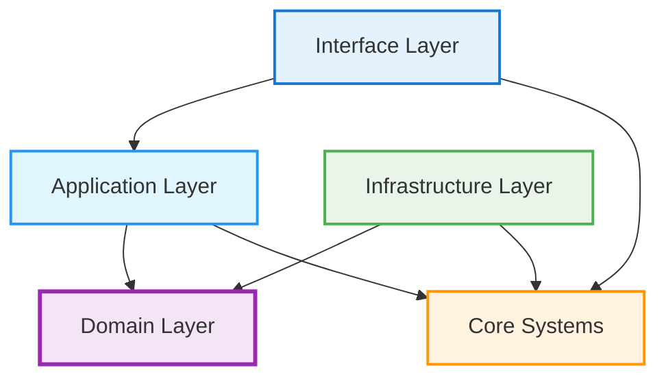

# Vortex Architecture

## Overview

Vortex implements Clean Architecture with strict layer separation and dependency inversion:

```
src/vortex/
├── cli/              # Interface Layer - User interaction
├── services/         # Application Layer - Business use cases
├── models/           # Domain Layer - Core business entities
├── infrastructure/   # Infrastructure Layer - External integrations
│   ├── providers/    # Data provider implementations
│   ├── storage/      # Storage system implementations
│   └── resilience/   # Circuit breakers, retry logic
├── core/             # Core Systems - Cross-cutting concerns
│   ├── config/       # Configuration management
│   ├── correlation/  # Request tracking & observability
│   └── __init__.py
├── exceptions/       # Exception hierarchy
├── logging/          # Structured logging
└── utils/           # Shared utilities
```

## Clean Architecture Layers

### Interface Layer (`cli/`)
**Purpose**: User interaction and command handling
- Click-based CLI with rich terminal output
- Command implementations and argument parsing
- Interactive wizards and configuration management
- **Dependencies**: Application Layer only

### Application Layer (`services/`)
**Purpose**: Business use case orchestration
- `UpdatingDownloader`: Incremental data downloads with duplicate detection
- `BackfillDownloader`: Historical data range processing
- Workflow coordination between domain and infrastructure
- **Dependencies**: Domain Layer and Core Systems

### Domain Layer (`models/`)
**Purpose**: Core business entities and rules
- `Instrument`: Base class for tradeable instruments
- `Future`, `Stock`, `Forex`: Specialized instrument types
- `PriceSeries`: Time series data with validation
- `Period`: Time intervals and frequency management
- **Dependencies**: None (pure business logic)

### Infrastructure Layer (`infrastructure/`)
**Purpose**: External system integrations
- **Providers**: Barchart, Yahoo Finance, Interactive Brokers
- **Storage**: CSV/Parquet dual-format persistence
- **Resilience**: Circuit breakers, retry mechanisms, error recovery
- **Dependencies**: Domain Layer and Core Systems

### Core Systems (`core/`)
**Purpose**: Cross-cutting concerns and shared functionality
- **Configuration**: Pydantic-based validation with TOML support
- **Correlation**: Request tracking and performance monitoring
- Dependency injection and plugin management
- **Dependencies**: Domain Layer only

## Dependency Flow

The architecture enforces Clean Architecture dependency rules:



**Key Principles:**
- Dependencies point inward only (Dependency Rule)
- Domain layer has no external dependencies
- Infrastructure implements interfaces defined by inner layers
- Core systems support all layers without creating circular dependencies

## Data Flow

1. **CLI Layer** receives user commands and validates input
2. **Configuration** loaded from TOML files with environment overrides
3. **Application Services** orchestrate business workflows
4. **Domain Models** validate business rules and constraints
5. **Infrastructure Providers** fetch data from external sources
6. **Infrastructure Storage** persists data in dual formats (CSV/Parquet)
7. **Correlation System** tracks requests across all operations

## Key Benefits

- **Maintainability**: Clear separation makes changes predictable and isolated
- **Testability**: Each layer can be tested independently with mock injection
- **Extensibility**: New providers, commands, and storage formats can be added easily
- **Code Quality**: Eliminated duplication and enforced consistent patterns